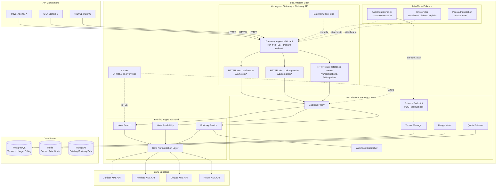
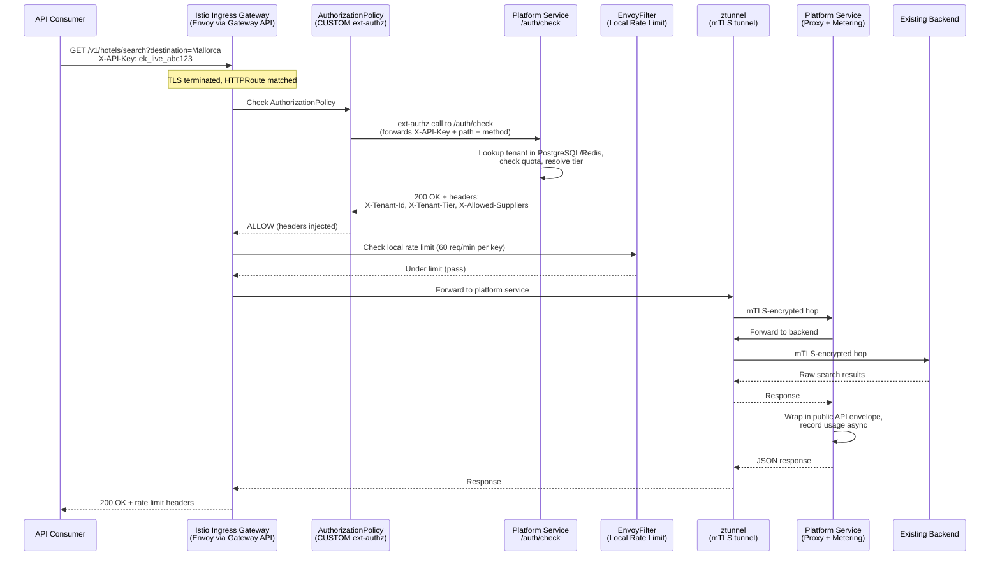
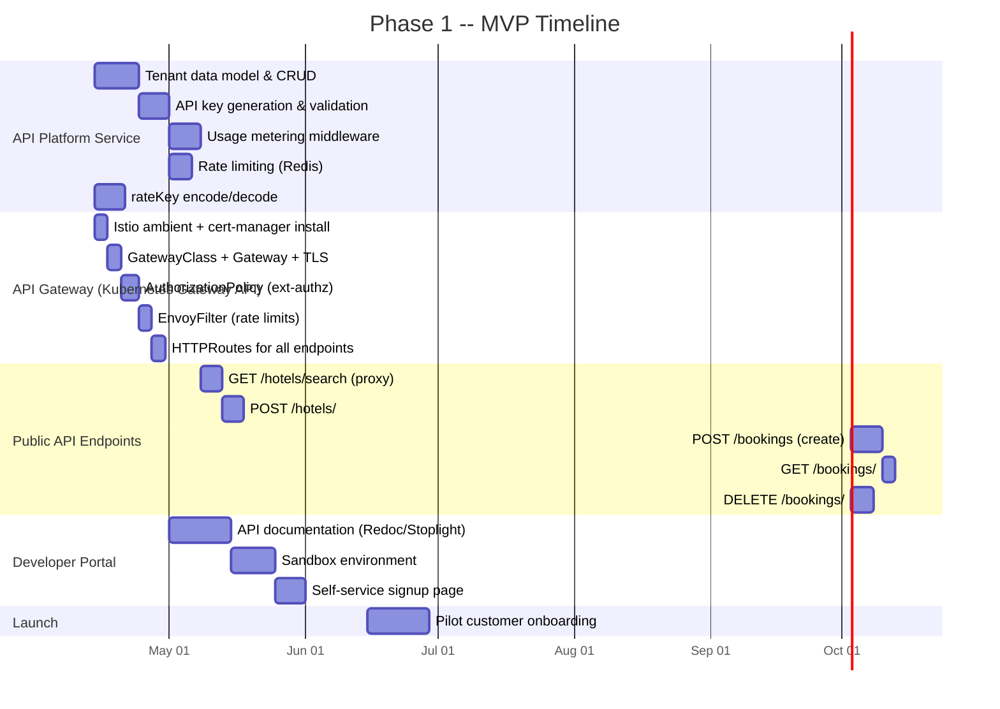
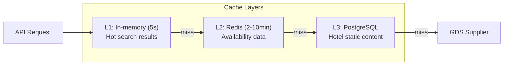
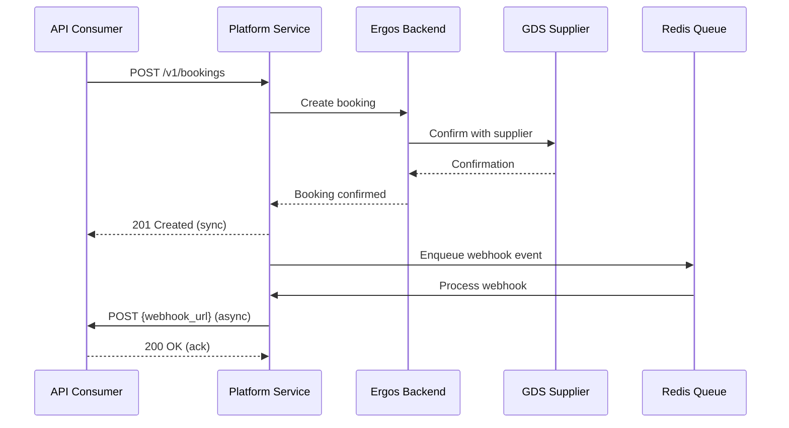
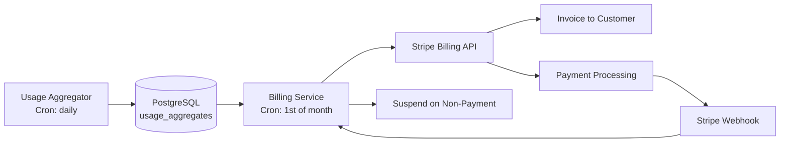
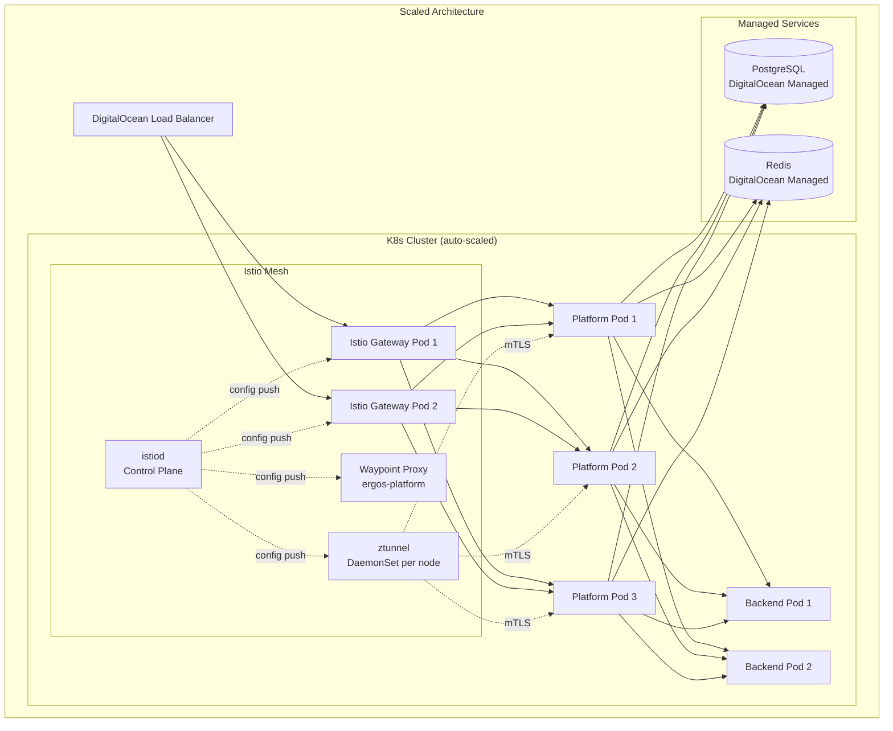
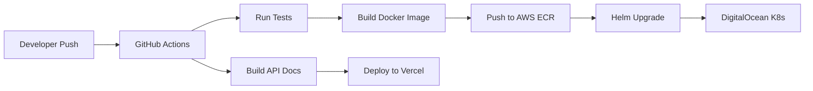

# Ergos Continental -- GDS Aggregator API Platform
## Business & Technical Implementation Plan

**Version**: 1.2 (Istio Ambient Mesh Update)
**Date**: April 2026
**Status**: Draft for Review
**Changelog**:
- v1.2 -- Replaced Envoy Gateway with Istio ambient mesh mode. Sidecar-less architecture (ztunnel + waypoint proxies). Single-layer ext-authz for API key validation. EnvoyFilter for rate limiting. Automatic mTLS for all pod-to-pod traffic. Added Kiali/Jaeger observability stack. Updated all deployment, scaling, monitoring, and security sections.
- v1.1 -- Replaced Kong OSS with Kubernetes Gateway API (Envoy Gateway). Added full YAML manifests, implementation evaluation matrix, migration path from nginx Ingress, resource budget analysis, and two-layer auth architecture.
- v1.0 -- Initial plan with Kong OSS gateway.

---

## Table of Contents

1. [Executive Summary](#1-executive-summary)
2. [Business Plan](#2-business-plan)
3. [Technical Architecture Overview](#3-technical-architecture-overview)
4. [API Design](#4-api-design)
5. [Phase 1: MVP (Months 1-3)](#5-phase-1-mvp)
6. [Phase 2: Growth (Months 4-8)](#6-phase-2-growth)
7. [Phase 3: Scale (Months 9-14)](#7-phase-3-scale)
8. [Infrastructure & Deployment](#8-infrastructure--deployment)
9. [Cost Projections](#9-cost-projections)
10. [Risks & Mitigations](#10-risks--mitigations)
11. [Appendix: OpenAPI Specification](#11-appendix-openapi-specification)

---

## 1. Executive Summary

Ergos Continental has built working integrations with four GDS suppliers (Juniper, Hoteltec, Dingus, Restel/Hotelbeds) for its own travel agency platform. This plan outlines how to monetize those integrations by exposing them as a unified REST API that other travel businesses can consume.

**The core value proposition**: Companies that would otherwise spend 3-6 months and EUR 30-80K integrating with each GDS individually can instead consume a single REST API from Ergos Continental, getting access to all four GDS suppliers through one integration in days rather than months.

**Current state**: The existing backend (running on Kubernetes with Helm charts) already normalizes multi-GDS responses into a common format, as evidenced by the unified hotel search, availability, booking, modification, and cancellation endpoints. The `x-vendor` and `x-provider` header pattern is already in place. This is a significant head start -- the hard normalization work is done.

**What needs to be built**: An API management layer on top of the existing backend that handles tenant isolation, API key management, usage metering, rate limiting, billing, and a developer portal.

---

## 2. Business Plan

### 2.1 Revenue Model

**Recommended approach: Hybrid Transaction Fee + Monthly Subscription**

Pure per-call pricing is confusing for travel (a single booking involves search, availability, pre-book, and confirm calls). Pure subscription undercharges heavy users. The travel API market has converged on a hybrid model.

| Component | How It Works | Rationale |
|-----------|-------------|-----------|
| **Monthly base fee** | Fixed monthly subscription per tier | Covers platform access, support, SLA guarantees. Provides predictable revenue. |
| **Per-booking fee** | EUR 0.50-2.00 per confirmed booking | Aligns Ergos revenue with customer success. Only charges on value-generating transactions. |
| **Search/availability calls** | Included in tier quota, overage at EUR 0.001-0.005 per call | Prevents abuse while keeping friction low for legitimate use. |

Why NOT pure revenue-share: Revenue share requires visibility into the customer's sell price, which B2B API consumers will resist. Per-booking fees are simpler and verifiable.

### 2.2 API Product Tiers

| Feature | **Sandbox** (Free) | **Starter** (EUR 99/mo) | **Professional** (EUR 399/mo) | **Enterprise** (Custom) |
|---------|-------------------|------------------------|-------------------------------|------------------------|
| Purpose | Evaluation & development | Small agencies, startups | Mid-size OTAs, tour operators | Large OTAs, white-label |
| GDS Suppliers | All 4 (test data) | 2 suppliers of choice | All 4 suppliers | All 4 + priority new suppliers |
| Search requests/mo | 1,000 | 10,000 | 100,000 | Unlimited |
| Bookings/mo | 0 (mock only) | 100 | 1,000 | Unlimited |
| Per-booking fee | N/A | EUR 2.00 | EUR 1.00 | EUR 0.50 (negotiable) |
| Overage (search) | N/A | EUR 0.005/call | EUR 0.002/call | Custom |
| Rate limit | 10 req/min | 60 req/min | 300 req/min | Custom |
| Support | Community/docs | Email (48h SLA) | Email + chat (8h SLA) | Dedicated account manager |
| SLA | None | 99.5% | 99.9% | 99.95% + penalties |
| Sandbox access | Yes | Yes | Yes | Yes |
| Webhooks | No | Basic (booking status) | Full (all events) | Full + custom |
| Multi-currency | No | EUR only | EUR, USD, GBP | All supported currencies |
| Cancellation API | Mock only | Yes | Yes | Yes |
| Modification API | No | No | Yes | Yes |
| Bulk operations | No | No | No | Yes |
| White-label | No | No | No | Yes |

**Key insight**: The Sandbox tier is critical. Travel API buyers always test extensively before committing. A zero-friction sandbox with realistic test data accelerates conversion.

### 2.3 Target Customers

**Primary segments (in priority order):**

1. **Small-to-mid travel agencies in Spain and Latin America** (EUR 99-399/mo)
   - Why: Same language/market, understand the GDS suppliers Ergos covers (Juniper, Hoteltec, Dingus, Restel are strong in the Iberian/LatAm market)
   - Pain point: Cannot justify the cost/time to build direct GDS integrations
   - Size of opportunity: Thousands of agencies in Spain alone, most using manual processes or single-supplier portals

2. **Travel tech startups** (EUR 99-399/mo)
   - Why: Building travel apps/platforms but lack GDS expertise
   - Pain point: Need hotel inventory fast, cannot spend 6 months on GDS integration
   - Where to find them: Travel tech accelerators, Product Hunt, Hacker News

3. **Tour operators building online presence** (EUR 399/mo)
   - Why: Traditionally offline businesses moving to digital
   - Pain point: Need real-time availability and booking, not static allotments

4. **Regional OTAs** (Enterprise tier)
   - Why: Looking for additional inventory sources beyond Booking.com/Expedia affiliate programs
   - Pain point: Want direct GDS access without the integration overhead

**Customers who are NOT a good fit** (avoid investing effort here initially):
- Large global OTAs (they have direct GDS integrations already)
- Companies needing flights/car rental only (Ergos covers hotels)
- Markets where Juniper/Hoteltec/Dingus/Restel have no inventory

### 2.4 Competitive Positioning

| Competitor | Strength | Weakness | Ergos Differentiator |
|-----------|----------|----------|---------------------|
| **TravelgateX** | Massive supplier network (600+), established marketplace | Complex onboarding, high minimums, not focused on small agencies | Simpler API, lower entry price, personal onboarding, Iberian/LatAm focus |
| **Hotelbeds (direct API)** | Huge inventory | Only one supplier, complex XML API | Aggregated multi-GDS (broader inventory), modern REST/JSON |
| **Juniper (direct API)** | Direct access | Only one supplier, XML-based | Aggregated multi-GDS, REST/JSON, no XML parsing needed |
| **HotelBee, Impala** | Modern APIs | Limited to specific hotel types | More GDS suppliers, better coverage for package/charter hotels |
| **Building in-house** | Full control | 3-6 months per GDS, ongoing maintenance | Immediate access, Ergos handles GDS maintenance and updates |

**Ergos Continental positioning statement:**

> "The simplest way to access Iberian and Latin American hotel inventory. One REST API, four GDS suppliers, real-time availability and booking in days, not months."

**Key differentiators to emphasize:**
1. **Modern REST/JSON API** -- competitors like Restel and Juniper still use XML
2. **Iberian/LatAm inventory focus** -- deep coverage where global aggregators are thin
3. **Low barrier to entry** -- EUR 99/mo vs. EUR 5,000+ minimums at TravelgateX
4. **Built by practitioners** -- Ergos uses this API for its own bookings (dogfooding)
5. **Fast onboarding** -- Sandbox to production in days, not weeks

### 2.5 Go-to-Market Strategy

**Phase 1 (Months 1-3): Foundation**
- Launch with Sandbox + Starter tiers only
- Target: 5-10 pilot customers from Ergos's existing network (agencies they already know)
- Channel: Direct outreach, personal demos
- Content: API documentation, "Getting Started" guide, 2-3 integration tutorials
- Goal: Validate pricing, gather feedback, identify friction points

**Phase 2 (Months 4-8): Traction**
- Launch Professional tier
- Attend 1-2 travel tech events (FITUR Madrid, WTM London, or ITB Berlin)
- Publish case studies from Phase 1 pilots
- SEO content: "How to integrate hotel booking API", "Juniper API alternative", "multi-GDS integration"
- Partnership: Approach 2-3 travel tech platforms for co-marketing
- Developer community: Stack Overflow answers, travel tech forums
- Goal: 20-50 paying customers

**Phase 3 (Months 9-14): Growth**
- Launch Enterprise tier
- Affiliate/referral program (give existing customers a cut for referrals)
- Consider a marketplace listing on RapidAPI or similar
- Hire a developer advocate (part-time or contractor)
- Goal: 100+ paying customers, EUR 15-25K MRR

---

## 3. Technical Architecture Overview

### 3.1 Kubernetes Gateway API -- Background and Status

The Kubernetes Gateway API (`gateway.networking.k8s.io`) is the official successor to the Ingress resource. It was designed by SIG-Network to address the limitations of Ingress: lack of portability, no role separation, limited expressiveness, and reliance on implementation-specific annotations. The ingress-nginx controller is entering retirement with maintenance ending in 2026, making migration to Gateway API a strategic necessity rather than an optional upgrade.

**GA (Standard Channel) resources as of v1.4.0 (October 2025):**
- `GatewayClass` (v1) -- Defines which controller handles a Gateway
- `Gateway` (v1) -- Declares listeners (ports, TLS, hostnames) and references a GatewayClass
- `HTTPRoute` (v1) -- L7 routing rules: path matching, header matching, backend references
- `GRPCRoute` (v1) -- gRPC-specific routing
- `ReferenceGrant` (v1) -- Cross-namespace resource access control

**Experimental resources (may change between releases):**
- `TCPRoute`, `TLSRoute`, `UDPRoute` -- L4 routing
- `BackendTLSPolicy` -- TLS from gateway to backend
- Various extension points used by implementations

**Key design principle -- role separation:**
```
Infrastructure Provider  -->  GatewayClass   (e.g., "which proxy engine?")
Cluster Operator         -->  Gateway        (e.g., "which ports, TLS certs?")
Application Developer    -->  HTTPRoute      (e.g., "which paths go where?")
```

This separation matters for Ergos because the platform team controls the Gateway (TLS, listeners) while individual API routes can be managed independently.

### 3.2 Gateway API Implementation Evaluation

Ergos Continental's constraints: single K8s cluster (4 vCPU, 16GB RAM), small team, needs API key auth + rate limiting + TLS + usage metering, no enterprise license budget. Additionally, the team wants mTLS between services, built-in observability, and a platform that will scale with them from API gateway to full service mesh as the backend grows.

| Implementation | Data Plane | Gateway API Conformance | Auth / ExtAuth | Rate Limiting | Resource Footprint | Mesh Extras | License | Verdict for Ergos |
|---|---|---|---|---|---|---|---|---|
| **Istio (ambient mode)** | ztunnel (L4, Rust) + waypoint Envoy (L7) | Full GA conformance | AuthorizationPolicy + ext-authz | EnvoyFilter (local) + external rate limit service (global) | istiod ~200m/512Mi + ztunnel ~100m/128Mi per node (no sidecars) | mTLS, Kiali, distributed tracing, traffic shifting | Apache 2.0 | **RECOMMENDED** |
| **Envoy Gateway** | Envoy Proxy | Full GA conformance | Built-in SecurityPolicy (apiKeyAuth, extAuth) | Built-in BackendTrafficPolicy (local + global) | ~150m/640Mi (proxy) + ~10m/64Mi (control plane) | None -- gateway only, no mesh | Apache 2.0 | Good for pure gateway, but no mesh benefits |
| **Kong (KIC)** | OpenResty (Nginx+Lua) | GA conformance | KongPlugin CRD (key-auth) | KongPlugin CRD (rate-limiting) | ~200-500m/256-512Mi | None | OSS free; critical features Enterprise-only | Wider OSS/Enterprise gap |
| **Cilium** | eBPF + Envoy | GA conformance | Limited (ext-authz only) | Limited | CNI replacement -- requires cluster rebuild | Network policies, encryption | Apache 2.0 | Too invasive for this migration |
| **NGINX Gateway Fabric** | NGINX | GA conformance | None built-in | None built-in | ~100m/128Mi | None | Apache 2.0 | Lacks API management features |

**Decision: Istio in ambient mesh mode**

Istio is the most widely deployed service mesh in production, and as of v1.24 (November 2024) its ambient mode -- the sidecar-less architecture -- reached General Availability. Ambient mode splits the data plane into two layers: **ztunnel** (a lightweight Rust-based node proxy handling L4 mTLS and identity) and **waypoint proxies** (optional per-namespace Envoy instances for L7 policy). This architecture eliminates the per-pod sidecar overhead that historically made Istio heavy.

Why Istio ambient mode wins for Ergos:

1. **Gateway API is a first-class citizen.** Istio implements the full Gateway API spec. GatewayClass, Gateway, and HTTPRoute resources work natively. Waypoint proxies are themselves deployed via the Kubernetes Gateway resource, so the team uses one consistent API for both ingress and mesh L7 policy.

2. **Ambient mode eliminates sidecar overhead.** No Envoy sidecar injected into every pod. The ztunnel DaemonSet handles L4 concerns (mTLS, identity, basic network policy) at the node level with minimal footprint (~100m CPU, 128Mi RAM per node). For a single-node cluster, that is one ztunnel instance total.

3. **mTLS everywhere for free.** Once a namespace is enrolled in the ambient mesh (`istio.io/dataplane-mode: ambient` label), all pod-to-pod traffic within that namespace is automatically encrypted with mTLS. This means the platform service to backend communication, backend to MongoDB, and backend to Redis are all encrypted without any application code changes. This is a significant security improvement that Envoy Gateway alone cannot provide.

4. **Built-in observability.** Istio provides Kiali (service mesh dashboard), Prometheus metrics (request rates, error rates, latency histograms per service), and distributed tracing (Jaeger/Zipkin) out of the box. For an API monetization platform, this means the team gets per-route and per-service latency dashboards without building custom instrumentation.

5. **AuthorizationPolicy with ext-authz for tenant resolution.** Istio's AuthorizationPolicy with CUSTOM action delegates authorization decisions to an external service (the platform service's `/auth/check` endpoint). This is the same ext-authz pattern used with Envoy Gateway, but here it integrates with the full mesh policy engine -- the same AuthorizationPolicy can also enforce that only the platform service is allowed to call the backend (deny direct access from any other pod).

6. **Traffic management for phased rollouts.** When Ergos adds new GDS suppliers or deploys backend updates, Istio's traffic shifting (canary deployments, traffic mirroring) allows safe rollouts without a separate deployment tool.

7. **Mature ecosystem.** Istio has the largest community, the most production deployments, and the widest documentation of any service mesh. When the team hits a problem, there are answers on Stack Overflow, GitHub issues, and Istio's own discuss forum.

**Honest trade-offs vs Envoy Gateway:**
- Istio ambient adds more components (istiod control plane + ztunnel DaemonSet) vs Envoy Gateway's simpler two-component stack. This is more to learn and manage.
- Istio does not have a built-in `apiKeyAuth` equivalent at the proxy level. API key validation is handled entirely by the ext-authz call to the platform service. This means every request incurs an ext-authz hop (typically <5ms within the cluster), whereas Envoy Gateway could reject invalid keys at the proxy without a hop. In practice, this latency is negligible compared to GDS call latency (1-5 seconds).
- Rate limiting in Istio requires an EnvoyFilter CRD (for local rate limits) or a separate rate limit service (for global limits), which is more configuration than Envoy Gateway's declarative BackendTrafficPolicy. For Ergos, the ExtAuth endpoint in the platform service handles per-tenant quota enforcement, so the EnvoyFilter only needs to set a global hard ceiling for abuse prevention.
- Resource footprint is slightly higher: istiod + ztunnel add ~300m CPU / 640Mi vs Envoy Gateway's ~120m CPU / 352Mi. On a 4 vCPU / 16GB node, both fit comfortably, but Istio uses about 180m more CPU. The mesh benefits (mTLS, observability, traffic management) justify this overhead.

### 3.3 Istio Ambient Mode -- How It Works

```
                    Traditional Istio (sidecar mode)
                    +-----------+     +-----------+
                    | App Pod   |     | App Pod   |
                    | +-------+ |     | +-------+ |
                    | | Envoy | |<--->| | Envoy | |   <-- sidecar per pod
                    | +-------+ |     | +-------+ |
                    +-----------+     +-----------+

                    Istio Ambient Mode (sidecar-less)
                    +-----------+     +-----------+
                    |  App Pod  |     |  App Pod  |   <-- no sidecar
                    +-----------+     +-----------+
                          |                 |
                    +-----|-----------------|-----+
                    |         ztunnel             |   <-- one per node (DaemonSet)
                    |   L4: mTLS, identity,       |       lightweight Rust binary
                    |       network policy        |
                    +-----------------------------+
                                |
                    +-----------------------------+
                    |     waypoint proxy          |   <-- optional, per-namespace
                    |   L7: HTTP routing, authz,  |       full Envoy, only where needed
                    |       rate limiting, retries |
                    +-----------------------------+
```

**Key insight for Ergos:** The ergos-platform namespace needs L7 policy (ext-authz, rate limiting) so it gets a waypoint proxy. The existing backend namespace only needs mTLS encryption, so it uses ztunnel alone with no waypoint -- zero additional resource cost for mesh enrollment of the backend.

### 3.4 High-Level Architecture (Istio Ambient + Gateway API)

```
    API Consumers (Travel Agencies, OTAs, Startups)
                        |
                        v
    +-----------------------------------------------+
    |  Istio Ingress Gateway (Envoy)                 |
    |  Configured via Kubernetes Gateway API         |
    |                                                |
    |  Gateway:         TLS termination (cert-manager)|
    |  HTTPRoute:       /v1/hotels/*, /v1/bookings/* |
    |  AuthorizationPolicy: ExtAuth -> Platform Svc  |
    |  EnvoyFilter:     Rate limiting (hard ceiling) |
    +-----------------------------------------------+
                        | (mTLS via ztunnel)
                        v
    +-----------------------------------------------+
    |      API Platform Service (ExtAuth + Proxy)    |
    |      (New microservice on K8s, meshed)         |
    |      - Tenant context resolution (from key)    |
    |      - Usage metering (async to PostgreSQL)    |
    |      - Quota enforcement (per-tier soft limit) |
    |      - Request transformation                  |
    |      - Response envelope wrapping              |
    |      - rateKey encode/decode                   |
    |      - Webhook dispatch                        |
    +-----------------------------------------------+
                        | (mTLS via ztunnel)
                        v
    +-----------------------------------------------+
    |   Existing Ergos Backend Service               |
    |   (Current K8s deployment -- unchanged, meshed)|
    |   - /hotels/search                             |
    |   - /hotels/availability/:hotelCode            |
    |   - /bookings (create, modify, cancel)         |
    |   - GDS normalization layer                    |
    |   - Juniper | Hoteltec | Dingus | Restel       |
    +-----------------------------------------------+
                        |
                        v
    +-----------------------------------------------+
    |       GDS Supplier APIs (external)             |
    |   Juniper (XML) | Hoteltec (XML)               |
    |   Dingus (XML)  | Restel (XML)                 |
    +-----------------------------------------------+
```

### 3.5 Architecture Diagram (Mermaid)



### 3.6 Request Flow Through Istio Gateway API



### 3.7 Key Architecture Decisions

**ADR-001: API Gateway and Mesh -- Istio Ambient Mode with Kubernetes Gateway API**

- **Context**: Need an API gateway for key management, rate limiting, and request routing. The Kubernetes Gateway API (gateway.networking.k8s.io) has reached GA with v1.4.0 and is the official successor to Ingress. The existing cluster uses nginx Ingress which is entering end-of-life. Options evaluated: Envoy Gateway, Kong KIC, Istio (ambient and sidecar modes), Cilium, NGINX Gateway Fabric. Beyond basic gateway needs, the platform will benefit from service-to-service mTLS, observability, and traffic management as it scales.
- **Decision**: Use **Istio in ambient mesh mode** as the Gateway API implementation and service mesh.
- **Consequences**: Istio provides both an ingress gateway (via Gateway API) and a full service mesh (mTLS, AuthorizationPolicy, observability) in one installation. Ambient mode avoids the per-pod sidecar overhead of traditional Istio -- ztunnel runs as a DaemonSet (one per node) and waypoint proxies are deployed only in namespaces that need L7 policy. The team uses standard Gateway API resources (GatewayClass, Gateway, HTTPRoute) for routing and Istio CRDs (AuthorizationPolicy, EnvoyFilter, PeerAuthentication) for policy. Trade-off: more components than Envoy Gateway (istiod + ztunnel + gateway pod vs two-component stack), but the mesh benefits (automatic mTLS, Kiali dashboards, distributed tracing, traffic shifting for canary deploys) justify the additional operational complexity. The team will learn one platform (Istio) rather than managing separate tools for gateway, encryption, and observability.

**ADR-002: API Platform as Separate Microservice**

- **Context**: The tenant management, usage metering, and quota logic could be embedded into the existing backend or built as a separate service.
- **Decision**: Build as a **separate lightweight microservice** ("api-platform-service") that serves two roles: (a) an ext-authz endpoint that Istio's AuthorizationPolicy calls for every request to validate tenant context and enforce quotas, and (b) a proxy that forwards validated requests to the existing backend and wraps responses in the public API envelope.
- **Consequences**: The existing backend remains unchanged (no risk of breaking the agency app). All service-to-service traffic is mTLS-encrypted via Istio ambient mesh. The platform service can be scaled independently. Clear separation of concerns. The platform service is small enough for a single developer to own.

**ADR-003: Database for Tenant and Usage Data**

- **Context**: Need to store tenant profiles, API keys, usage records, and billing data. The existing backend uses MongoDB.
- **Decision**: Use **PostgreSQL** for the platform service data (tenants, usage, billing). Keep MongoDB for the existing booking data.
- **Consequences**: PostgreSQL is better suited for relational tenant/billing data, supports strong transactional guarantees needed for usage metering, and has excellent support for time-series aggregation (usage analytics). A small PostgreSQL instance on DigitalOcean Managed Databases costs around USD 15/mo.

**ADR-004: ExtAuth for All Authentication (No Proxy-Level API Key Check)**

- **Context**: Unlike Envoy Gateway which offers a built-in `apiKeyAuth` SecurityPolicy that can reject invalid keys at the proxy before any backend call, Istio does not have an equivalent built-in API key validation mechanism. All custom auth must go through ext-authz.
- **Decision**: Use a single-layer authentication approach where Istio's AuthorizationPolicy with CUSTOM action calls the platform service's `/auth/check` endpoint for every request. This endpoint handles API key validation, tenant resolution, quota enforcement, and header injection in one call.
- **Consequences**: Every request incurs one ext-authz hop to the platform service (~2-5ms within the cluster). This is negligible compared to GDS response times (1-5 seconds). The platform service becomes the single source of truth for authentication, which simplifies the architecture -- there is no split between "proxy-level key check" and "backend-level tenant resolution." API keys are stored in PostgreSQL (hashed) and cached in Redis (60s TTL), not in Kubernetes Secrets. This avoids the complexity of syncing keys to K8s Secrets and makes key rotation a simple database operation. Trade-off: a malformed request with a clearly invalid key still incurs a network hop to the platform service, but the platform service rejects these in <1ms from its Redis cache.

### 3.8 Kubernetes Gateway API with Istio -- Concrete YAML Configuration

This section provides the complete, production-ready Kubernetes manifests for the Ergos API platform using Istio ambient mode.

#### 3.8.1 Install Istio in Ambient Mode

```bash
# Step 1: Install istioctl (the Istio CLI)
curl -L https://istio.io/downloadIstio | ISTIO_VERSION=1.25.2 sh -
export PATH=$HOME/istio-1.25.2/bin:$PATH

# Step 2: Install Istio with the ambient profile
# The ambient profile installs: istiod, ztunnel, istio-cni
# It does NOT install sidecar injectors.
istioctl install --set profile=ambient \
  --set "components.ingressGateways[0].enabled=false" \
  -y

# The above disables the legacy IstioOperator-based ingress gateway
# because we will use the Kubernetes Gateway API to create our
# ingress gateway instead (see Section 3.8.3).

# Step 3: Install Gateway API CRDs (if not already present)
kubectl apply -f https://github.com/kubernetes-sigs/gateway-api/releases/download/v1.2.1/standard-install.yaml

# Step 4: Install cert-manager
helm install cert-manager jetstack/cert-manager \
  --namespace cert-manager --create-namespace \
  --set crds.enabled=true

# Step 5: Verify the installation
istioctl version
kubectl get pods -n istio-system
# Expected: istiod-xxx (Running), ztunnel-xxx (Running, DaemonSet)
kubectl get pods -n istio-cni
# Expected: istio-cni-node-xxx (Running, DaemonSet)
```

**Resource tuning for the 4 vCPU / 16GB node:**

```yaml
# istio-ambient-values.yaml (pass to istioctl via --set-file or IstioOperator)
# These override the defaults for a resource-constrained environment.
apiVersion: install.istio.io/v1alpha1
kind: IstioOperator
spec:
  profile: ambient
  components:
    pilot:  # istiod
      k8s:
        resources:
          requests:
            cpu: 100m
            memory: 256Mi
          limits:
            cpu: 500m
            memory: 512Mi
        hpaSpec:
          minReplicas: 1
          maxReplicas: 1  # Single node, no need for HA initially
    cni:
      k8s:
        resources:
          requests:
            cpu: 10m
            memory: 64Mi
  values:
    ztunnel:
      resources:
        requests:
          cpu: 50m
          memory: 128Mi
        limits:
          cpu: 500m
          memory: 512Mi
```

To install with these overrides:

```bash
istioctl install -f istio-ambient-values.yaml -y
```

#### 3.8.2 Namespace Setup and Mesh Enrollment

```yaml
# namespaces.yaml
# Enroll namespaces in the ambient mesh by adding the dataplane-mode label.
# This enables ztunnel (L4 mTLS) for all pods in these namespaces
# WITHOUT injecting any sidecars.
apiVersion: v1
kind: Namespace
metadata:
  name: ergos-gateway
  labels:
    istio.io/dataplane-mode: ambient   # Enroll in ambient mesh
    ergos-api-access: "true"
---
apiVersion: v1
kind: Namespace
metadata:
  name: ergos-platform
  labels:
    istio.io/dataplane-mode: ambient   # Enroll in ambient mesh
    ergos-api-access: "true"
---
# Also enroll the existing backend namespace for mTLS
# (assuming the backend runs in 'default' or a dedicated namespace).
# If backend is in 'default':
apiVersion: v1
kind: Namespace
metadata:
  name: default
  labels:
    istio.io/dataplane-mode: ambient   # mTLS for backend traffic
```

#### 3.8.3 GatewayClass and Gateway (Istio Ingress via Gateway API)

```yaml
# gatewayclass.yaml
# Istio automatically registers the 'istio' GatewayClass when installed.
# You do NOT need to create it manually. It is shown here for documentation.
# apiVersion: gateway.networking.k8s.io/v1
# kind: GatewayClass
# metadata:
#   name: istio
# spec:
#   controllerName: istio.io/gateway-controller

---
# gateway.yaml
# When you create a Gateway referencing the 'istio' GatewayClass,
# Istio automatically deploys an Envoy-based ingress gateway pod
# and a LoadBalancer Service in the specified namespace.
apiVersion: gateway.networking.k8s.io/v1
kind: Gateway
metadata:
  name: ergos-public-api
  namespace: ergos-gateway
  annotations:
    # cert-manager will automatically provision and renew Let's Encrypt certs
    cert-manager.io/cluster-issuer: letsencrypt-prod
spec:
  gatewayClassName: istio   # Istio's built-in GatewayClass
  listeners:
    # --- Production API (api.ergoscontinental.com) ---
    - name: https-production
      protocol: HTTPS
      port: 443
      hostname: "api.ergoscontinental.com"
      tls:
        mode: Terminate
        certificateRefs:
          - name: api-ergos-tls
            kind: Secret
      allowedRoutes:
        namespaces:
          from: Selector
          selector:
            matchLabels:
              ergos-api-access: "true"
        kinds:
          - kind: HTTPRoute

    # --- Sandbox API (sandbox.ergoscontinental.com) ---
    - name: https-sandbox
      protocol: HTTPS
      port: 443
      hostname: "sandbox.ergoscontinental.com"
      tls:
        mode: Terminate
        certificateRefs:
          - name: sandbox-ergos-tls
            kind: Secret
      allowedRoutes:
        namespaces:
          from: Selector
          selector:
            matchLabels:
              ergos-api-access: "true"
        kinds:
          - kind: HTTPRoute

    # --- HTTP redirect to HTTPS ---
    - name: http-redirect
      protocol: HTTP
      port: 80
      allowedRoutes:
        namespaces:
          from: Same

---
# HTTP-to-HTTPS redirect route
apiVersion: gateway.networking.k8s.io/v1
kind: HTTPRoute
metadata:
  name: http-redirect
  namespace: ergos-gateway
spec:
  parentRefs:
    - name: ergos-public-api
      sectionName: http-redirect
  rules:
    - filters:
        - type: RequestRedirect
          requestRedirect:
            scheme: https
            statusCode: 301
```

When this Gateway is applied, Istio automatically:
1. Creates a Deployment with an Envoy proxy pod in `ergos-gateway` namespace
2. Creates a LoadBalancer Service exposing ports 80 and 443
3. Configures TLS termination using the referenced Secrets (provisioned by cert-manager)

#### 3.8.4 HTTPRoutes (API Endpoint Routing)

```yaml
# httproutes.yaml
# Standard Gateway API HTTPRoutes -- identical syntax regardless of whether
# the implementation is Istio, Envoy Gateway, or any other conformant provider.
apiVersion: gateway.networking.k8s.io/v1
kind: HTTPRoute
metadata:
  name: hotel-routes
  namespace: ergos-platform
  labels:
    ergos-api-group: hotels
spec:
  parentRefs:
    - name: ergos-public-api
      namespace: ergos-gateway
      sectionName: https-production
    - name: ergos-public-api
      namespace: ergos-gateway
      sectionName: https-sandbox
  hostnames:
    - "api.ergoscontinental.com"
    - "sandbox.ergoscontinental.com"
  rules:
    # Hotel search: GET /v1/hotels/search
    - matches:
        - path:
            type: PathPrefix
            value: /v1/hotels/search
          method: GET
      backendRefs:
        - name: api-platform-service
          port: 3000

    # Hotel details + availability: /v1/hotels/{hotelId}/*
    - matches:
        - path:
            type: PathPrefix
            value: /v1/hotels/
      backendRefs:
        - name: api-platform-service
          port: 3000

---
apiVersion: gateway.networking.k8s.io/v1
kind: HTTPRoute
metadata:
  name: booking-routes
  namespace: ergos-platform
  labels:
    ergos-api-group: bookings
spec:
  parentRefs:
    - name: ergos-public-api
      namespace: ergos-gateway
      sectionName: https-production
    - name: ergos-public-api
      namespace: ergos-gateway
      sectionName: https-sandbox
  hostnames:
    - "api.ergoscontinental.com"
    - "sandbox.ergoscontinental.com"
  rules:
    - matches:
        - path:
            type: PathPrefix
            value: /v1/bookings
      backendRefs:
        - name: api-platform-service
          port: 3000

---
apiVersion: gateway.networking.k8s.io/v1
kind: HTTPRoute
metadata:
  name: reference-routes
  namespace: ergos-platform
  labels:
    ergos-api-group: reference
spec:
  parentRefs:
    - name: ergos-public-api
      namespace: ergos-gateway
      sectionName: https-production
    - name: ergos-public-api
      namespace: ergos-gateway
      sectionName: https-sandbox
  hostnames:
    - "api.ergoscontinental.com"
    - "sandbox.ergoscontinental.com"
  rules:
    - matches:
        - path:
            type: PathPrefix
            value: /v1/destinations
          method: GET
        - path:
            type: PathPrefix
            value: /v1/suppliers
          method: GET
        - path:
            type: PathPrefix
            value: /v1/meal-plans
          method: GET
      backendRefs:
        - name: api-platform-service
          port: 3000

---
apiVersion: gateway.networking.k8s.io/v1
kind: HTTPRoute
metadata:
  name: consumer-dashboard-routes
  namespace: ergos-platform
  labels:
    ergos-api-group: dashboard
spec:
  parentRefs:
    - name: ergos-public-api
      namespace: ergos-gateway
      sectionName: https-production
  hostnames:
    - "api.ergoscontinental.com"
  rules:
    - matches:
        - path:
            type: PathPrefix
            value: /v1/usage
        - path:
            type: PathPrefix
            value: /v1/api-keys
        - path:
            type: PathPrefix
            value: /v1/webhooks
      backendRefs:
        - name: api-platform-service
          port: 3000
```

#### 3.8.5 AuthorizationPolicy (External Authorization for Tenant Resolution)

```yaml
# ext-authz-provider.yaml
# First, register the platform service as an ext-authz provider in the
# Istio mesh config. This is a one-time configuration.
apiVersion: v1
kind: ConfigMap
metadata:
  name: istio
  namespace: istio-system
data:
  mesh: |
    extensionProviders:
    - name: ergos-ext-authz
      envoyExtAuthzHttp:
        service: api-platform-service.ergos-platform.svc.cluster.local
        port: 3000
        pathPrefix: /auth/check
        headersToUpstreamOnAllow:
          # These headers are set by the platform service's /auth/check
          # response and forwarded to the backend on successful auth.
          - X-Tenant-Id
          - X-Tenant-Tier
          - X-Allowed-Suppliers
          - X-Rate-Limit-Remaining
          - X-Quota-Bookings-Remaining
        headersToDownstreamOnDeny:
          # Return rate-limit headers even on denied requests
          - X-RateLimit-Limit
          - X-RateLimit-Remaining
          - Retry-After
        includeRequestHeadersInCheck:
          - X-API-Key
          - X-Request-ID
          - Host
        timeout: 3s
        statusOnError: "503"

---
# authorization-policy.yaml
# Apply external authorization to all traffic entering the ingress gateway.
# Every request to the public API hits the platform service's /auth/check
# endpoint before being routed to the backend.
apiVersion: security.istio.io/v1
kind: AuthorizationPolicy
metadata:
  name: ergos-api-ext-authz
  namespace: ergos-gateway
spec:
  targetRefs:
    # Attach to the Istio ingress gateway created by the Gateway resource
    - kind: Gateway
      group: gateway.networking.k8s.io
      name: ergos-public-api
  action: CUSTOM
  provider:
    name: ergos-ext-authz   # Must match the extensionProviders name above
  rules:
    # Apply to all /v1/* paths (the public API)
    - to:
        - operation:
            paths:
              - /v1/*

---
# backend-lockdown.yaml
# DENY direct access to the existing backend from anything other than
# the platform service. This ensures all API traffic goes through
# the metering and auth pipeline.
apiVersion: security.istio.io/v1
kind: AuthorizationPolicy
metadata:
  name: backend-allow-platform-only
  namespace: default   # or wherever the backend runs
spec:
  action: ALLOW
  rules:
    - from:
        - source:
            principals:
              - cluster.local/ns/ergos-platform/sa/api-platform-service
    # Also allow the existing agency app frontend (if it calls backend directly)
    - from:
        - source:
            principals:
              - cluster.local/ns/default/sa/agency-app
```

**How the ext-authz endpoint works in the platform service:**

The `/auth/check` endpoint receives the original request headers from Istio's Envoy and returns:
- `200 OK` with injected headers if authorized (Istio forwards these to the backend via `headersToUpstreamOnAllow`)
- `401 Unauthorized` if the API key is invalid or missing
- `403 Forbidden` if the tenant is suspended
- `429 Too Many Requests` if the tenant has exceeded their tier-specific quota

```
# ExtAuth response headers injected into the proxied request:
X-Tenant-Id: uuid-of-tenant
X-Tenant-Tier: professional
X-Allowed-Suppliers: juniper,hoteltec,dingus,restel
X-Rate-Limit-Remaining: 9542
X-Quota-Bookings-Remaining: 87
```

#### 3.8.6 EnvoyFilter (Rate Limiting -- Hard Ceiling)

```yaml
# rate-limiting.yaml
# Apply a local rate limit on the ingress gateway as a hard ceiling
# to prevent abuse. Per-tenant tier limits are enforced by the
# ext-authz call (the platform service returns 429 when quota exceeded).
#
# This EnvoyFilter adds Envoy's local_ratelimit HTTP filter to the
# ingress gateway's filter chain.
apiVersion: networking.istio.io/v1alpha3
kind: EnvoyFilter
metadata:
  name: api-rate-limit
  namespace: ergos-gateway
spec:
  workloadSelector:
    labels:
      # This targets the ingress gateway pod created by the Gateway resource.
      # Istio labels gateway pods with gateway.networking.k8s.io/gateway-name.
      gateway.networking.k8s.io/gateway-name: ergos-public-api
  configPatches:
    # Insert the local rate limit filter into the HTTP filter chain
    - applyTo: HTTP_FILTER
      match:
        context: GATEWAY
        listener:
          filterChain:
            filter:
              name: envoy.filters.network.http_connection_manager
              subFilter:
                name: envoy.filters.http.router
      patch:
        operation: INSERT_BEFORE
        value:
          name: envoy.filters.http.local_ratelimit
          typed_config:
            "@type": type.googleapis.com/envoy.extensions.filters.http.local_ratelimit.v3.LocalRateLimit
            stat_prefix: ergos_api_rate_limit
            token_bucket:
              max_tokens: 300
              tokens_per_fill: 300
              fill_interval: 60s
            # Hard ceiling: 300 requests/minute total across all tenants.
            # Individual tenant limits (Sandbox: 10, Starter: 60, Pro: 300)
            # are enforced by the ext-authz endpoint in the platform service.
            filter_enabled:
              runtime_key: local_rate_limit_enabled
              default_value:
                numerator: 100
                denominator: HUNDRED
            filter_enforced:
              runtime_key: local_rate_limit_enforced
              default_value:
                numerator: 100
                denominator: HUNDRED
            response_headers_to_add:
              - append_action: OVERWRITE_IF_EXISTS_OR_ADD
                header:
                  key: x-local-rate-limit
                  value: "true"
```

**How per-tenant rate limits work with Istio:**

The architecture uses a two-tier rate limiting approach:

1. **Hard ceiling (EnvoyFilter):** A local rate limit of 300 req/min applied at the ingress gateway prevents any single source from overwhelming the system. This is a safety net, not a business rule.

2. **Per-tenant soft quota (ext-authz in platform service):** The platform service's `/auth/check` endpoint checks the tenant's tier and current usage against Redis counters. If a Sandbox tenant has exceeded 10 req/min or their monthly quota, the platform service returns `429 Too Many Requests` with `Retry-After` header. This happens before the request is forwarded to the backend.

This split keeps the gateway configuration simple (one EnvoyFilter for the hard ceiling) while the nuanced per-tier business logic lives in the platform service code where it belongs.

#### 3.8.7 PeerAuthentication (Mesh-Wide mTLS)

```yaml
# peer-authentication.yaml
# Enforce mTLS for all service-to-service traffic within the mesh.
# In ambient mode, ztunnel handles this transparently -- no sidecars needed.
apiVersion: security.istio.io/v1
kind: PeerAuthentication
metadata:
  name: mesh-wide-mtls
  namespace: istio-system   # Applied mesh-wide
spec:
  mtls:
    mode: STRICT
```

With this policy and ambient mesh enrollment, all traffic between the ingress gateway, platform service, backend, Redis, and MongoDB is encrypted with mTLS automatically. No application code changes required.

#### 3.8.8 ReferenceGrant (Cross-Namespace Access)

```yaml
# reference-grants.yaml
# Gateway API requires explicit grants for cross-namespace references.
# The HTTPRoutes in ergos-platform reference the Gateway in ergos-gateway.
apiVersion: gateway.networking.k8s.io/v1
kind: ReferenceGrant
metadata:
  name: allow-gateway-to-platform
  namespace: ergos-platform
spec:
  from:
    - group: gateway.networking.k8s.io
      kind: HTTPRoute
      namespace: ergos-gateway
  to:
    - group: ""
      kind: Service
```

#### 3.8.9 cert-manager ClusterIssuer (Let's Encrypt)

```yaml
# cert-manager.yaml
apiVersion: cert-manager.io/v1
kind: ClusterIssuer
metadata:
  name: letsencrypt-prod
spec:
  acme:
    server: https://acme-v02.api.letsencrypt.org/directory
    email: platform@ergoscontinental.com
    privateKeySecretRef:
      name: letsencrypt-prod-account-key
    solvers:
      - http01:
          gatewayHTTPRoute:
            parentRefs:
              - name: ergos-public-api
                namespace: ergos-gateway
                kind: Gateway
```

#### 3.8.10 Observability Stack (Bonus: Kiali, Prometheus, Grafana)

```bash
# Istio provides sample addons for observability.
# For Phase 1, install the lightweight set:
kubectl apply -f https://raw.githubusercontent.com/istio/istio/release-1.25/samples/addons/prometheus.yaml
kubectl apply -f https://raw.githubusercontent.com/istio/istio/release-1.25/samples/addons/kiali.yaml

# Access Kiali dashboard (service mesh visualization):
istioctl dashboard kiali

# For production (Phase 2+), replace with Grafana Cloud (free tier)
# and a dedicated Prometheus instance.
```

Kiali provides a real-time service graph showing traffic flow from the ingress gateway through the platform service to the backend, with per-edge metrics (request rate, error rate, latency). This is valuable for debugging GDS supplier issues -- if Restel is responding slowly, it will be visible in the Kiali graph without adding custom instrumentation.

### 3.9 Migration Path: nginx Ingress to Istio Gateway API

The existing cluster uses `kubernetes.io/ingress.class: nginx`. The ingress-nginx project is entering end-of-life (best-effort maintenance ending 2026, no further releases or security patches). The migration should be gradual, running both systems in parallel.

**Phase 0: Preparation (before touching anything)**

```bash
# Install the ingress2gateway CLI tool to auto-convert existing Ingress YAML
# Released as v1.0 in March 2026 by the Kubernetes project.
go install github.com/kubernetes-sigs/ingress2gateway@latest

# Dry-run: see what Gateway API resources your Ingress would produce
ingress2gateway print --input-file existing-ingress.yaml
```

**Phase 1: Install Istio ambient alongside nginx (parallel operation)**

```bash
# 1. Install Istio in ambient mode (see Section 3.8.1)
istioctl install -f istio-ambient-values.yaml -y

# 2. Install Gateway API CRDs
kubectl apply -f https://github.com/kubernetes-sigs/gateway-api/releases/download/v1.2.1/standard-install.yaml

# 3. Create and label namespaces (enroll in ambient mesh)
kubectl apply -f namespaces.yaml

# 4. Deploy Gateway API resources
kubectl apply -f gateway.yaml
kubectl apply -f httproutes.yaml
kubectl apply -f reference-grants.yaml
kubectl apply -f ext-authz-provider.yaml   # ConfigMap patch
kubectl apply -f authorization-policy.yaml
kubectl apply -f rate-limiting.yaml
kubectl apply -f peer-authentication.yaml

# 5. At this point, BOTH nginx Ingress and Istio Gateway are running.
#    nginx handles the existing agency app traffic.
#    Istio Gateway handles the NEW public API traffic.
#    They use different hostnames so there is zero conflict:
#
#    nginx Ingress:   app.ergoscontinental.com (existing agency app)
#    Istio Gateway:   api.ergoscontinental.com (new public API)
#                     sandbox.ergoscontinental.com (new sandbox)
```

**Phase 2: Migrate existing agency app to Istio Gateway API**

```yaml
# BEFORE: nginx Ingress (existing)
apiVersion: networking.k8s.io/v1
kind: Ingress
metadata:
  name: agency-app
  annotations:
    kubernetes.io/ingress.class: nginx
    nginx.ingress.kubernetes.io/ssl-redirect: "true"
    cert-manager.io/cluster-issuer: letsencrypt-prod
spec:
  tls:
    - hosts:
        - app.ergoscontinental.com
      secretName: agency-app-tls
  rules:
    - host: app.ergoscontinental.com
      http:
        paths:
          - path: /
            pathType: Prefix
            backend:
              service:
                name: agency-app-frontend
                port:
                  number: 80
          - path: /api
            pathType: Prefix
            backend:
              service:
                name: agency-app-backend
                port:
                  number: 3000
```

```yaml
# AFTER: Istio Gateway API HTTPRoute
# Add a listener to the existing Gateway for the agency app hostname:
# (Add this to gateway.yaml in the spec.listeners array)
#   - name: https-agency-app
#     protocol: HTTPS
#     port: 443
#     hostname: "app.ergoscontinental.com"
#     tls:
#       mode: Terminate
#       certificateRefs:
#         - name: agency-app-tls
#     allowedRoutes:
#       namespaces:
#         from: Selector
#         selector:
#           matchLabels:
#             ergos-api-access: "true"

apiVersion: gateway.networking.k8s.io/v1
kind: HTTPRoute
metadata:
  name: agency-app
  namespace: ergos-platform
spec:
  parentRefs:
    - name: ergos-public-api
      namespace: ergos-gateway
      sectionName: https-agency-app
  hostnames:
    - "app.ergoscontinental.com"
  rules:
    - matches:
        - path:
            type: PathPrefix
            value: /api
      backendRefs:
        - name: agency-app-backend
          port: 3000
    - matches:
        - path:
            type: PathPrefix
            value: /
      backendRefs:
        - name: agency-app-frontend
          port: 80
```

**Phase 3: DNS cutover and nginx removal**

```bash
# 1. Update DNS to point api.ergoscontinental.com to the Istio Gateway
#    LoadBalancer IP:
kubectl get svc -n ergos-gateway
# Look for the Service created by Istio for the Gateway

# 2. Test thoroughly: all API endpoints, TLS, rate limiting, ext-authz

# 3. Migrate agency app DNS from nginx LB IP to Istio Gateway LB IP

# 4. Once all traffic flows through Istio with no issues (run
#    parallel for at least 1 week), remove nginx:
helm uninstall ingress-nginx -n ingress-nginx
kubectl delete namespace ingress-nginx

# 5. Clean up old Ingress resources
kubectl delete ingress agency-app
```

**Migration checklist:**

| Step | What | Risk | Rollback |
|------|------|------|----------|
| 1 | Install Istio ambient + Gateway API CRDs | None (additive) | `istioctl uninstall --purge` |
| 2 | Label namespaces for ambient mesh | Low (adds mTLS transparently) | Remove `istio.io/dataplane-mode` label |
| 3 | Deploy public API Gateway + HTTPRoutes | None (new hostnames) | Delete Gateway/HTTPRoute resources |
| 4 | Point API DNS to Istio Gateway | API consumers affected | Revert DNS record |
| 5 | Convert agency app routes | Agency app affected | Keep nginx running, revert DNS |
| 6 | Remove nginx Ingress | Cannot revert easily | Keep helm release for 30 days before final uninstall |

### 3.10 Resource Budget on 4 vCPU / 16GB Node

| Component | CPU Request | CPU Limit | Memory Request | Memory Limit | Notes |
|-----------|-----------|---------|--------------|------------|-------|
| istiod (control plane) | 100m | 500m | 256Mi | 512Mi | Mesh config, cert distribution, xDS push |
| ztunnel (DaemonSet, 1 per node) | 50m | 500m | 128Mi | 512Mi | L4 mTLS for all meshed pods |
| istio-cni (DaemonSet, 1 per node) | 10m | 100m | 64Mi | 128Mi | Network setup for ambient redirect |
| Istio Ingress Gateway (auto) | 100m | 500m | 256Mi | 512Mi | Envoy pod created by Gateway resource |
| cert-manager | 10m | 200m | 32Mi | 128Mi | Certificate lifecycle |
| API Platform Service | 50m | 500m | 128Mi | 256Mi | ExtAuth + proxy + metering |
| Existing Backend | 200m | 1000m | 512Mi | 1Gi | Current workload (unchanged) |
| Redis | 50m | 200m | 64Mi | 128Mi | Cache + rate limit state |
| MongoDB (existing) | 200m | 500m | 512Mi | 1Gi | Existing booking data |
| **Total Requested** | **770m** | -- | **1.95Gi** | -- | **19.3% of 4 vCPU, 12.2% of 16Gi** |
| **Total Limits** | -- | **4.0Gi** | -- | **4.2Gi** | Headroom for bursts |

**Comparison with Envoy Gateway approach:**
- Envoy Gateway total was ~630m CPU / 1.6Gi memory requested
- Istio ambient total is ~770m CPU / 1.95Gi memory requested
- Delta: +140m CPU / +350Mi memory
- This delta comes from istiod (100m/256Mi) + ztunnel (50m/128Mi) + istio-cni (10m/64Mi) = 160m/448Mi for the mesh components, minus the Envoy Gateway control plane (10m/64Mi) and rate limit service (10m/32Mi) that are no longer needed = net +140m/352Mi

The 140m additional CPU (3.5% of 4 vCPU) and 350Mi additional memory (2.1% of 16Gi) buys: automatic mTLS on all service traffic, Kiali observability dashboard, distributed tracing, traffic shifting for canary deploys, and AuthorizationPolicy for backend lockdown. This is a worthwhile trade on a 16GB node with 78% headroom remaining.

---

## 4. API Design

### 4.1 Design Principles

1. **Resource-oriented**: URLs represent resources (hotels, bookings), not actions
2. **JSON everywhere**: No XML exposed to consumers, even though GDS suppliers use XML
3. **Consistent envelope**: Every response uses the same wrapper structure
4. **Idempotency**: Booking creation supports idempotency keys
5. **Cursor-based pagination**: For search results (aligns with existing `nextCursor` pattern)
6. **Supplier transparency**: Consumers can optionally filter by supplier or let the platform choose the best rate

### 4.2 Base URL Structure

```
Production: https://api.ergoscontinental.com/v1
Sandbox:    https://sandbox.ergoscontinental.com/v1
```

### 4.3 Authentication

All requests require an API key in the header:
```
X-API-Key: ek_live_a1b2c3d4e5f6...
X-API-Key: ek_test_a1b2c3d4e5f6...   (sandbox)
```

Keys are prefixed with `ek_live_` or `ek_test_` to prevent accidental cross-environment usage (following Stripe's pattern).

### 4.4 Response Envelope

Every response follows this structure:

```json
{
  "success": true,
  "data": { ... },
  "meta": {
    "requestId": "req_abc123",
    "timestamp": "2026-04-04T12:00:00Z",
    "quotaRemaining": {
      "searches": 9542,
      "bookings": 87
    }
  },
  "pagination": {
    "total": 245,
    "cursor": "eyJwYWdlIjoyLCJsaW1pdCI6MjB9",
    "hasMore": true
  }
}
```

Error responses:

```json
{
  "success": false,
  "error": {
    "code": "RATE_LIMIT_EXCEEDED",
    "message": "Rate limit of 60 requests/minute exceeded. Retry after 12 seconds.",
    "retryAfter": 12
  },
  "meta": {
    "requestId": "req_abc123",
    "timestamp": "2026-04-04T12:00:00Z"
  }
}
```

### 4.5 Endpoint Catalog

#### Hotels -- Search & Discovery

| Method | Endpoint | Description |
|--------|----------|-------------|
| `GET` | `/v1/hotels/search` | Search hotels by destination, dates, occupancy |
| `GET` | `/v1/hotels/{hotelId}` | Get hotel details (static content, images, amenities) |
| `POST` | `/v1/hotels/{hotelId}/availability` | Check real-time room availability and rates |

#### Bookings -- Lifecycle Management

| Method | Endpoint | Description |
|--------|----------|-------------|
| `POST` | `/v1/bookings` | Create a new booking (pre-book + confirm) |
| `GET` | `/v1/bookings/{bookingId}` | Get booking details and current status |
| `GET` | `/v1/bookings` | List all bookings for this API consumer |
| `PUT` | `/v1/bookings/{bookingId}` | Modify an existing booking |
| `DELETE` | `/v1/bookings/{bookingId}` | Cancel a booking |
| `GET` | `/v1/bookings/{bookingId}/cancellation-policy` | Get cancellation terms and penalties |
| `GET` | `/v1/bookings/{bookingId}/voucher` | Get booking voucher (PDF or JSON) |

#### Reference Data

| Method | Endpoint | Description |
|--------|----------|-------------|
| `GET` | `/v1/destinations` | List searchable destinations |
| `GET` | `/v1/suppliers` | List available GDS suppliers |
| `GET` | `/v1/meal-plans` | List meal plan codes and descriptions |

#### Webhooks (Professional + Enterprise)

| Event | Payload |
|-------|---------|
| `booking.confirmed` | Booking object after GDS confirmation |
| `booking.modified` | Booking object after modification |
| `booking.cancelled` | Booking object with cancellation details |
| `booking.supplier_update` | Status change pushed from GDS |

### 4.6 Detailed Endpoint Specifications

#### Search Hotels

```
GET /v1/hotels/search?destination=Mallorca&checkIn=2026-06-15&checkOut=2026-06-20&rooms=2&adults=2,2&children=1,0&childAges=8
```

Query parameters:
- `destination` (required): City, region, or country name
- `checkIn` (required): ISO 8601 date
- `checkOut` (required): ISO 8601 date
- `rooms` (required): Number of rooms (1-5)
- `adults` (required): Comma-separated adults per room
- `children` (optional): Comma-separated children per room
- `childAges` (optional): Comma-separated ages of all children
- `suppliers` (optional): Filter by supplier (e.g., `juniper,restel`)
- `starRating` (optional): Minimum star rating (1-5)
- `minPrice` / `maxPrice` (optional): Price range in EUR
- `mealPlan` (optional): Filter by meal plan code
- `currency` (optional): Response currency (default: EUR)
- `limit` (optional): Results per page (default: 20, max: 100)
- `cursor` (optional): Pagination cursor

Response (200 OK):
```json
{
  "success": true,
  "data": {
    "hotels": [
      {
        "hotelId": "htl_juniper_MAL1234",
        "name": "Grand Hotel Palma",
        "starRating": 4,
        "address": {
          "street": "Paseo Maritimo 12",
          "city": "Palma de Mallorca",
          "country": "ES",
          "postalCode": "07014",
          "coordinates": {
            "latitude": 39.5696,
            "longitude": 2.6502
          }
        },
        "images": [
          {
            "url": "https://images.ergos.com/htl_MAL1234_01.jpg",
            "caption": "Hotel exterior"
          }
        ],
        "description": "Beachfront 4-star hotel...",
        "amenities": ["wifi", "pool", "parking", "restaurant"],
        "bestRate": {
          "amount": 142.50,
          "currency": "EUR",
          "mealPlan": "BB",
          "mealPlanName": "Bed & Breakfast",
          "cancellationPolicy": "FREE_CANCELLATION",
          "cancellationDeadline": "2026-06-13T23:59:00Z",
          "supplier": "juniper",
          "rateKey": "rk_abc123..."
        },
        "reviewScore": 8.4,
        "reviewCount": 342
      }
    ]
  },
  "meta": { "requestId": "req_s1a2b3", "timestamp": "..." },
  "pagination": { "total": 87, "cursor": "...", "hasMore": true }
}
```

#### Check Availability

```
POST /v1/hotels/htl_juniper_MAL1234/availability
```

Request body:
```json
{
  "checkIn": "2026-06-15",
  "checkOut": "2026-06-20",
  "rooms": [
    { "adults": 2, "children": 1, "childAges": [8] },
    { "adults": 2 }
  ],
  "currency": "EUR",
  "countryOfResidence": "ES"
}
```

Response (200 OK):
```json
{
  "success": true,
  "data": {
    "hotelId": "htl_juniper_MAL1234",
    "checkIn": "2026-06-15",
    "checkOut": "2026-06-20",
    "nights": 5,
    "rooms": [
      {
        "roomId": "rm_dbl_001",
        "roomName": "Deluxe Double",
        "roomCode": "DBL",
        "description": "Spacious double room with sea view",
        "images": ["https://..."],
        "capacity": { "adults": 2, "children": 1 },
        "amenities": ["aircon", "minibar", "balcony"],
        "rates": [
          {
            "rateKey": "rk_a1b2c3d4e5f6",
            "rateCode": "STD",
            "mealPlan": "BB",
            "mealPlanName": "Bed & Breakfast",
            "totalAmount": 712.50,
            "currency": "EUR",
            "pricePerNight": 142.50,
            "cancellationPolicy": {
              "type": "FREE_CANCELLATION",
              "deadline": "2026-06-13T23:59:00Z",
              "penalties": [
                {
                  "from": "2026-06-13T23:59:00Z",
                  "amount": 142.50,
                  "currency": "EUR"
                }
              ]
            },
            "supplier": "juniper",
            "nonRefundable": false
          },
          {
            "rateKey": "rk_x7y8z9",
            "rateCode": "NRF",
            "mealPlan": "HB",
            "mealPlanName": "Half Board",
            "totalAmount": 850.00,
            "currency": "EUR",
            "pricePerNight": 170.00,
            "cancellationPolicy": {
              "type": "NON_REFUNDABLE"
            },
            "supplier": "restel",
            "nonRefundable": true
          }
        ]
      }
    ]
  }
}
```

The `rateKey` is an opaque token that encodes all supplier-specific details needed to book. The consumer never needs to know vendorCode, vendorKey, distributionId, or other internal identifiers. This is the critical abstraction layer.

#### Create Booking

```
POST /v1/bookings
Idempotency-Key: idk_unique123
```

Request body:
```json
{
  "rateKey": "rk_a1b2c3d4e5f6",
  "guest": {
    "firstName": "Maria",
    "lastName": "Garcia",
    "email": "maria@example.com",
    "phone": "+34612345678",
    "country": "ES"
  },
  "specialRequests": "Late check-in, arriving at 22:00",
  "rooms": [
    {
      "rateKey": "rk_a1b2c3d4e5f6",
      "guests": [
        { "firstName": "Maria", "lastName": "Garcia", "age": 35 },
        { "firstName": "Carlos", "lastName": "Garcia", "age": 37 },
        { "firstName": "Sofia", "lastName": "Garcia", "age": 8 }
      ]
    }
  ],
  "paymentMethod": "ON_ACCOUNT"
}
```

Response (201 Created):
```json
{
  "success": true,
  "data": {
    "bookingId": "bkg_e1f2g3h4",
    "bookingReference": "EC-2026-04-12345",
    "status": "CONFIRMED",
    "hotel": {
      "hotelId": "htl_juniper_MAL1234",
      "name": "Grand Hotel Palma",
      "address": "Paseo Maritimo 12, Palma de Mallorca"
    },
    "checkIn": "2026-06-15",
    "checkOut": "2026-06-20",
    "nights": 5,
    "rooms": [
      {
        "roomName": "Deluxe Double",
        "mealPlan": "BB",
        "guests": [
          { "firstName": "Maria", "lastName": "Garcia" },
          { "firstName": "Carlos", "lastName": "Garcia" },
          { "firstName": "Sofia", "lastName": "Garcia" }
        ]
      }
    ],
    "totalAmount": 712.50,
    "currency": "EUR",
    "cancellationPolicy": {
      "type": "FREE_CANCELLATION",
      "deadline": "2026-06-13T23:59:00Z"
    },
    "supplier": "juniper",
    "supplierReference": "JNP-445566",
    "createdAt": "2026-04-04T14:30:00Z"
  }
}
```

### 4.7 The `rateKey` Abstraction

This is the most important design decision in the API. The `rateKey` is an encrypted, time-limited token that encodes:

```
rateKey encodes:
  - hotelCode (internal)
  - vendorCode (juniper, hoteltec, dingus, restel)
  - vendorKey (supplier-specific key)
  - provider (if applicable)
  - roomCode
  - rateCode
  - mealPlanCode
  - occupancyCode
  - distributionId
  - checkIn / checkOut
  - price at time of quote
  - timestamp (for expiry, typically 30 minutes)
  - tenantId (to prevent cross-tenant usage)
```

The consumer never sees or manages any of these fields. They search, pick a rate, and pass the `rateKey` to booking. This maps directly to the existing backend's `vendorCode`, `vendorKey`, `roomCode`, `rateCode`, `mealPlanCode`, and `occupancyCode` fields in `MultiRoomBookingPayloadType`.

Implementation: AES-256-GCM encrypted JSON, base64url encoded, prefixed with `rk_`.

---

## 5. Phase 1: MVP (Months 1-3)

**Goal**: Launch a functional API with Sandbox + Starter tiers, onboard 5-10 pilot customers.

### 5.1 What to Build



### 5.2 Tenant Data Model (PostgreSQL)

```sql
-- Tenants (API consumers)
CREATE TABLE tenants (
    id UUID PRIMARY KEY DEFAULT gen_random_uuid(),
    name VARCHAR(255) NOT NULL,
    email VARCHAR(255) UNIQUE NOT NULL,
    company_name VARCHAR(255),
    tier VARCHAR(50) NOT NULL DEFAULT 'sandbox',  -- sandbox, starter, professional, enterprise
    status VARCHAR(50) NOT NULL DEFAULT 'active',  -- active, suspended, cancelled
    allowed_suppliers TEXT[] DEFAULT '{}',  -- e.g., {'juniper','restel'}
    monthly_search_quota INT NOT NULL DEFAULT 1000,
    monthly_booking_quota INT NOT NULL DEFAULT 0,
    rate_limit_per_minute INT NOT NULL DEFAULT 10,
    webhook_url TEXT,
    webhook_secret VARCHAR(255),
    metadata JSONB DEFAULT '{}',
    created_at TIMESTAMPTZ NOT NULL DEFAULT NOW(),
    updated_at TIMESTAMPTZ NOT NULL DEFAULT NOW()
);

-- API Keys (multiple per tenant)
CREATE TABLE api_keys (
    id UUID PRIMARY KEY DEFAULT gen_random_uuid(),
    tenant_id UUID NOT NULL REFERENCES tenants(id),
    key_prefix VARCHAR(20) NOT NULL,  -- ek_live_ or ek_test_
    key_hash VARCHAR(255) NOT NULL,   -- bcrypt hash of the full key
    key_hint VARCHAR(10) NOT NULL,    -- last 4 chars for display
    label VARCHAR(255),               -- "Production key", "Staging key"
    environment VARCHAR(10) NOT NULL DEFAULT 'test',  -- test, live
    is_active BOOLEAN NOT NULL DEFAULT true,
    last_used_at TIMESTAMPTZ,
    created_at TIMESTAMPTZ NOT NULL DEFAULT NOW(),
    expires_at TIMESTAMPTZ
);

CREATE INDEX idx_api_keys_hash ON api_keys(key_hash) WHERE is_active = true;

-- Usage Records (append-only, time-series)
CREATE TABLE usage_records (
    id BIGSERIAL PRIMARY KEY,
    tenant_id UUID NOT NULL REFERENCES tenants(id),
    api_key_id UUID NOT NULL REFERENCES api_keys(id),
    endpoint VARCHAR(255) NOT NULL,
    method VARCHAR(10) NOT NULL,
    status_code INT NOT NULL,
    response_time_ms INT,
    request_id VARCHAR(50) NOT NULL,
    is_billable BOOLEAN NOT NULL DEFAULT false,
    billing_event VARCHAR(50),  -- 'search', 'availability', 'booking', 'cancellation'
    supplier VARCHAR(50),
    created_at TIMESTAMPTZ NOT NULL DEFAULT NOW()
);

-- Partition by month for query performance
CREATE INDEX idx_usage_tenant_month ON usage_records(tenant_id, created_at);

-- Monthly Usage Aggregates (materialized for billing)
CREATE TABLE usage_aggregates (
    id BIGSERIAL PRIMARY KEY,
    tenant_id UUID NOT NULL REFERENCES tenants(id),
    month DATE NOT NULL,  -- first day of month
    search_count INT NOT NULL DEFAULT 0,
    availability_count INT NOT NULL DEFAULT 0,
    booking_count INT NOT NULL DEFAULT 0,
    cancellation_count INT NOT NULL DEFAULT 0,
    total_billable_amount DECIMAL(10,2) NOT NULL DEFAULT 0,
    UNIQUE(tenant_id, month)
);
```

### 5.3 API Platform Service (Node.js / TypeScript)

The platform service is a lightweight Express.js app that serves two roles:

**Role A -- ExtAuth endpoint** (called by Istio's AuthorizationPolicy ext-authz on every request):
1. Receives the `X-API-Key` header from Istio's ext-authz call
2. Looks up the tenant in PostgreSQL (cached in Redis for 60s)
3. Checks monthly quotas against Redis counters
4. Returns `200 OK` with injected tenant headers, or `401`/`403`/`429` to reject

**Role B -- API proxy** (receives the actual request after auth succeeds):
1. Reads the injected `X-Tenant-Id` and `X-Tenant-Tier` headers (set by ExtAuth)
2. Proxies to the existing backend with appropriate `x-vendor`/`x-provider` headers
3. Transforms the response into the public API envelope
4. Records usage asynchronously (non-blocking write to PostgreSQL via Redis queue)

```
api-platform-service/
  src/
    auth/
      ext-auth.handler.ts     -- POST /auth/check (Istio ext-authz endpoint)
      tenant-resolver.ts      -- Resolve API key to tenant context
      quota-checker.ts        -- Check monthly quotas against Redis counters
    middleware/
      tenant-context.ts       -- Read injected X-Tenant-* headers from Istio ext-authz
      usage-recorder.ts       -- Async usage logging (non-blocking)
      response-wrapper.ts     -- Wrap backend responses in public envelope
    services/
      rate-key.service.ts     -- Encode/decode rateKey tokens
      tenant.service.ts       -- CRUD for tenants
      api-key.service.ts      -- Generate, validate, revoke keys
      usage.service.ts        -- Query and aggregate usage
      proxy.service.ts        -- Forward requests to existing backend
      billing.service.ts      -- Usage aggregation and Stripe billing
    routes/
      hotels.routes.ts        -- /v1/hotels/* endpoints
      bookings.routes.ts      -- /v1/bookings/* endpoints
      tenants.routes.ts       -- /v1/admin/tenants/* (internal)
      usage.routes.ts         -- /v1/usage/* (consumer self-service)
    db/
      migrations/             -- PostgreSQL migrations (node-pg-migrate)
      models/
  Dockerfile
  helm/                       -- Helm chart for K8s deployment
```

### 5.4 Istio Ambient Mode and Gateway API Deployment

The full YAML configuration for the Gateway API resources (GatewayClass, Gateway, HTTPRoute, AuthorizationPolicy, EnvoyFilter, ReferenceGrant) is provided in **Section 3.8** above. This section covers the deployment sequence for Phase 1.

**Sprint 1 deployment order:**

```bash
# Step 1: Install prerequisites
helm install cert-manager jetstack/cert-manager \
  --namespace cert-manager --create-namespace \
  --set crds.enabled=true

# Step 2: Install Istio ambient mode (includes Gateway API CRDs)
istioctl install --set profile=ambient \
  --set values.pilot.resources.requests.cpu=100m \
  --set values.pilot.resources.requests.memory=256Mi

# Step 3: Install Istio CNI (required for ambient mode)
# (included in ambient profile by default)

# Step 4: Create namespaces and enroll in ambient mesh
kubectl apply -f namespaces.yaml
# namespaces include label: istio.io/dataplane-mode: ambient

# Step 5: Deploy cert-manager ClusterIssuer
kubectl apply -f cert-manager.yaml

# Step 6: Deploy Gateway API resources (order matters)
kubectl apply -f gatewayclass.yaml
kubectl apply -f gateway.yaml
kubectl apply -f reference-grants.yaml
kubectl apply -f authorization-policy.yaml
kubectl apply -f envoyfilter-ratelimit.yaml
kubectl apply -f httproutes.yaml

# Step 7: Deploy waypoint proxy for ergos-platform namespace
istioctl waypoint apply -n ergos-platform --enroll-namespace

# Step 8: Verify
kubectl get gatewayclass
kubectl get gateway -n ergos-gateway
kubectl get httproute -n ergos-platform
kubectl get authorizationpolicy -n ergos-gateway
kubectl get envoyfilter -n ergos-gateway
istioctl proxy-status
```

**How API key management works with Istio ambient mode:**

With Istio, API keys are validated entirely by the platform service (ext-authz), not by the proxy. There is no need to sync keys to Kubernetes Secrets. When the API Platform Service creates a new API key for a tenant, it:
1. Generates the key (e.g., `ek_live_a1b2c3d4e5f6g7h8`)
2. Stores the bcrypt hash in PostgreSQL (for validation and audit)
3. Caches the key-to-tenant mapping in Redis (60s TTL) for fast lookups
4. The ext-authz endpoint validates incoming keys against PostgreSQL/Redis on every request

```typescript
// api-platform-service: key provisioning (no K8s Secret sync needed)
import { hashApiKey } from './utils/crypto';
import { db } from './db';
import { redis } from './cache';

async function provisionApiKey(tenantSlug: string, apiKey: string, env: 'live' | 'test') {
  const keyHash = await hashApiKey(apiKey);
  const keyPrefix = env === 'live' ? 'ek_live_' : 'ek_test_';
  const keyHint = apiKey.slice(-4);

  // Store in PostgreSQL
  const record = await db('api_keys').insert({
    tenant_id: tenantSlug,
    key_prefix: keyPrefix,
    key_hash: keyHash,
    key_hint: keyHint,
    environment: env,
    is_active: true,
  }).returning('id');

  // Pre-warm Redis cache for fast ext-authz lookups
  await redis.setex(
    `apikey:${keyHash}`,
    60,
    JSON.stringify({ tenantId: tenantSlug, env, keyId: record[0].id })
  );

  return { keyPrefix, keyHint, keyId: record[0].id };
}
```

This approach keeps API key validation entirely in the application layer (PostgreSQL + Redis), which is simpler than syncing keys to Kubernetes Secrets. Key rotation is handled by deactivating the old key in PostgreSQL and creating a new one -- the Redis cache TTL (60s) ensures the old key stops working within a minute. For immediate revocation, the ext-authz endpoint can bypass the cache and query PostgreSQL directly when a key is marked as revoked.

### 5.5 Caching Strategy



| Data Type | Cache Duration | Cache Key Pattern | Invalidation |
|-----------|---------------|-------------------|--------------|
| Hotel search results | 5 minutes | `search:{destination}:{dates}:{rooms}:{hash}` | TTL-based |
| Room availability | 2 minutes | `avail:{hotelId}:{dates}:{rooms}:{hash}` | TTL-based |
| Hotel static content | 24 hours | `hotel:{hotelId}:static` | TTL + manual purge |
| Destinations list | 1 hour | `destinations:{supplier}` | TTL-based |
| Meal plan codes | 24 hours | `meaplans` | TTL-based |

**Important**: Availability and pricing data is cached for very short periods (2 minutes). The GDS suppliers update rates in near-real-time, and stale availability causes booking failures. The `rateKey` includes a timestamp, so expired rate quotes are rejected at booking time with a clear error message asking the consumer to re-check availability.

**Cross-tenant cache sharing**: Search and availability cache keys do NOT include tenantId. If Agency A searches for "Mallorca, Jun 15-20, 2 adults" and Agency B searches the same thing 30 seconds later, B gets the cached result. This dramatically reduces GDS API calls and improves response times. Each tenant's billing is still tracked individually.

### 5.6 Sandbox Environment

The sandbox uses the same API platform service but routes to a mock backend instead of real GDS suppliers. The Gateway has separate listeners for `api.ergoscontinental.com` (production) and `sandbox.ergoscontinental.com` (sandbox). The platform service inspects the `Host` header or the API key prefix (`ek_test_` vs `ek_live_`) to decide the backend:

```
ek_test_* keys --> Istio Gateway --> api-platform-service --> mock-gds-service
ek_live_* keys --> Istio Gateway --> api-platform-service --> existing-backend --> real GDS
```

The mock GDS service returns realistic but synthetic data:
- 50+ test hotels across 10 destinations
- Predictable pricing (hotel ID mod 100 = base price)
- Deterministic availability (always available for dates > 7 days out)
- Booking always succeeds with mock confirmation numbers
- Cancellation always succeeds with mock refund amounts

This lets consumers build and test their integration without any live GDS costs.

---

## 6. Phase 2: Growth (Months 4-8)

**Goal**: Launch Professional tier, add webhooks, improve developer experience, reach 20-50 customers.

### 6.1 New Capabilities

#### Webhooks



Webhook payload:
```json
{
  "event": "booking.confirmed",
  "timestamp": "2026-04-04T14:30:05Z",
  "data": {
    "bookingId": "bkg_e1f2g3h4",
    "bookingReference": "EC-2026-04-12345",
    "status": "CONFIRMED",
    "hotel": { ... },
    "totalAmount": 712.50
  },
  "signature": "sha256=a1b2c3..."
}
```

Webhook delivery: retry 3 times with exponential backoff (10s, 60s, 300s). After 3 failures, mark webhook as failed and notify tenant via email.

#### Booking Modification API

```
PUT /v1/bookings/bkg_e1f2g3h4
```
```json
{
  "checkIn": "2026-06-16",
  "checkOut": "2026-06-21",
  "rooms": [
    {
      "rateKey": "rk_new_rate_key",
      "guests": [ ... ]
    }
  ]
}
```

This maps to the existing `modifyReservation` function in the backend.

#### Consumer Dashboard API

Self-service endpoints for API consumers to check their usage:

```
GET /v1/usage/current-month     -- Current month usage summary
GET /v1/usage/history           -- Monthly usage history
GET /v1/usage/daily?month=2026-04  -- Daily breakdown
GET /v1/api-keys                -- List consumer's API keys
POST /v1/api-keys               -- Generate new key
DELETE /v1/api-keys/{keyId}     -- Revoke a key
GET /v1/webhooks/logs           -- Recent webhook delivery attempts
```

#### Developer Portal

A static site (built with Docusaurus or Mintlify) hosted on Vercel/Netlify:

```
developers.ergoscontinental.com/
  /docs              -- API reference (generated from OpenAPI spec)
  /guides/quickstart -- 5-minute getting started guide
  /guides/search     -- How to search for hotels
  /guides/booking    -- How to create a booking
  /guides/errors     -- Error handling guide
  /guides/webhooks   -- Webhook integration guide
  /sdks              -- Python and JavaScript SDK links
  /changelog         -- API changelog
  /status            -- API status page
  /signup            -- Self-service tenant signup
  /dashboard         -- Usage dashboard (authenticated)
```

### 6.2 SDK Generation

Generate SDKs from the OpenAPI spec using OpenAPI Generator:

```bash
# Python SDK
openapi-generator-cli generate -i openapi.yaml -g python -o sdk/python \
  --additional-properties=packageName=ergos_continental

# JavaScript/TypeScript SDK
openapi-generator-cli generate -i openapi.yaml -g typescript-axios -o sdk/typescript \
  --additional-properties=npmName=@ergos-continental/sdk
```

Publish to PyPI and npm. Even basic auto-generated SDKs dramatically reduce integration time.

### 6.3 Multi-Currency Support

The existing backend appears to default to USD. The platform service adds a currency conversion layer:

1. Consumer sends `currency: "GBP"` in the request
2. Platform service forwards to backend (which returns EUR/USD from GDS)
3. Platform service converts using daily ECB exchange rates (cached 24h)
4. Response includes both original and converted amounts

```json
{
  "totalAmount": 612.75,
  "currency": "GBP",
  "originalAmount": 712.50,
  "originalCurrency": "EUR",
  "exchangeRate": 0.8601,
  "exchangeRateDate": "2026-04-04"
}
```

---

## 7. Phase 3: Scale (Months 9-14)

**Goal**: Launch Enterprise tier, handle 100+ consumers, automated billing, geographic expansion.

### 7.1 Automated Billing Integration

Integrate with **Stripe Billing** for automated invoicing:



Monthly billing flow:
1. Daily cron aggregates usage_records into usage_aggregates
2. On 1st of month, billing service calculates: base subscription + overage charges
3. Creates Stripe invoice with line items
4. Stripe handles payment collection
5. On payment failure after grace period, suspend API keys

### 7.2 Horizontal Scaling

When load exceeds single-node capacity:



Scaling triggers:
- Istio Gateway pods: scale at >70% CPU (handles SSL, auth, rate limiting). Configure HPA on the istio-ingressgateway Deployment.
- Platform service: scale at >60% CPU or >500ms p95 latency
- Backend service: scale at >60% CPU (GDS calls are I/O bound)

For Phase 3, consider migrating from single-node K8s to **DigitalOcean Kubernetes (DOKS)** with auto-scaling node pools. Base cost: ~$48/mo for a 2-node pool (s-2vcpu-4gb), scaling up as needed.

### 7.3 Enterprise Features

**White-label support**: Enterprise tenants can configure:
- Custom error messages
- Custom webhook headers
- Supplier priority ordering (e.g., "always prefer Juniper rates")
- Custom rate markup (Ergos adds X% to rates before returning to consumer)
- IP allowlisting

**Bulk operations**:
```
POST /v1/bookings/bulk-status
{
  "bookingIds": ["bkg_1", "bkg_2", "bkg_3", ...]
}
```

**SLA monitoring dashboard**: Real-time API health visible to Enterprise consumers.

### 7.4 Adding New GDS Suppliers

The platform is designed to be supplier-extensible. Adding a new GDS (e.g., TBO Holidays, WebBeds) requires:

1. Build a new adapter in the existing backend (XML/JSON parsing, normalization)
2. Register the supplier in the platform service
3. Update `allowed_suppliers` for relevant tenant tiers
4. Update the mock GDS service with test data for the new supplier

The API surface does not change. Consumers automatically see new inventory if their tier includes the new supplier.

---

## 8. Infrastructure & Deployment

### 8.1 Recommended Infrastructure (DigitalOcean + AWS)

| Service | Provider | Purpose | Monthly Cost |
|---------|----------|---------|-------------|
| Kubernetes (DOKS) | DigitalOcean | API Platform + existing backend | $48-96 (2-4 nodes) |
| Managed PostgreSQL | DigitalOcean | Tenant, usage, billing data | $15 |
| Managed Redis | DigitalOcean | Cache, rate limiting, queues | $15 |
| Container Registry | AWS ECR | Container images (already using) | ~$5 |
| DNS + CDN | Cloudflare (Free) | DNS, DDoS protection, SSL | $0 |
| Developer Portal | Vercel (Free/Pro) | Documentation site | $0-20 |
| Monitoring | Grafana Cloud (Free) | Metrics, logs, alerting | $0 |
| Email (transactional) | Resend or Postmark | Webhook failure alerts, onboarding | $0-20 |

**Total infrastructure cost (Phase 1)**: ~USD 100-150/month

This is intentionally lean. The platform runs profitably from the first few Starter customers.

### 8.2 Deployment Pipeline



### 8.3 Monitoring & Observability

| Layer | Tool | What It Tracks |
|-------|------|----------------|
| Infrastructure | Grafana + Prometheus | Node CPU/memory, pod health, restart counts |
| API Gateway / Mesh | Istio metrics + Prometheus + Kiali | Request rates, latency p50/p95/p99, error rates, rate limit hits, auth failures, mTLS status |
| Application | Structured logging (Pino) | Request traces, GDS response times, errors |
| Business | Custom Grafana dashboards | Bookings/day, revenue, top consumers, supplier success rates |
| Alerting | Grafana Alerting | P95 > 5s, error rate > 5%, GDS supplier down, quota exhaustion |
| Uptime | UptimeRobot (Free) | External health check every 5 min |

Key SLA metrics to track:
- **API availability**: % of successful (non-5xx) responses
- **Search latency p95**: Target < 3 seconds
- **Availability check latency p95**: Target < 5 seconds (GDS calls are slow)
- **Booking confirmation latency p95**: Target < 10 seconds
- **GDS supplier availability**: Per-supplier success rate

### 8.4 Security Checklist

- [ ] API keys hashed with bcrypt (never stored in plaintext)
- [ ] All traffic over TLS 1.2+ (external: cert-manager on Istio Gateway; internal: mTLS via ztunnel)
- [ ] Tenant data isolation at the database query level (every query includes `tenant_id`)
- [ ] Rate limiting per API key and per tenant
- [ ] Request payload size limits (1MB)
- [ ] Input validation on all endpoints (Zod or Joi schemas)
- [ ] SQL injection prevention (parameterized queries via Knex or Prisma)
- [ ] Webhook signatures (HMAC-SHA256)
- [ ] API key rotation support (multiple active keys per tenant)
- [ ] PCI: No credit card data touches the platform (consumers handle payments)
- [ ] GDPR: Guest PII encrypted at rest, data retention policies
- [ ] Audit logging: All admin actions logged with actor, timestamp, change

---

## 9. Cost Projections

### 9.1 Revenue Model

| Scenario | Customers | MRR | Annual |
|----------|-----------|-----|--------|
| **Conservative (Month 6)** | 3 Starter + 1 Pro | EUR 696 | EUR 8,352 |
| **Base case (Month 12)** | 8 Starter + 5 Pro + 1 Enterprise | EUR 4,287* | EUR 51,444 |
| **Optimistic (Month 18)** | 15 Starter + 12 Pro + 3 Enterprise | EUR 10,185* | EUR 122,220 |

*Includes estimated per-booking fees based on 50 bookings/mo per Starter, 200/mo per Pro, 500/mo per Enterprise.

### 9.2 Break-Even Analysis

| Cost Item | Monthly |
|-----------|---------|
| Infrastructure (Phase 1) | EUR 130 |
| Domain + SSL | EUR 5 |
| Developer time (opportunity cost) | EUR 3,000 (0.5 FTE) |
| **Total monthly cost** | **EUR 3,135** |

Break-even: ~8 Starter customers or 3 Starter + 1 Professional. Achievable within 4-6 months with focused sales effort.

### 9.3 Margin Analysis at Scale

At 50 paying customers (month 18 target):
- Revenue: EUR 10,000-15,000/mo
- Infrastructure: EUR 300-500/mo (scaled up)
- Support: EUR 1,500/mo (part-time)
- GDS costs: EUR 0 (GDS suppliers pay commissions TO the aggregator)
- **Gross margin: 85-90%**

The economics are strong because GDS API calls are free (suppliers want distribution) and the infrastructure scales sub-linearly with customers due to cache sharing.

---

## 10. Risks & Mitigations

| Risk | Probability | Impact | Mitigation |
|------|------------|--------|-----------|
| **GDS supplier revokes access** | Low | Critical | Diversify across 4+ suppliers. Negotiate formal reseller agreements. |
| **Competitor launches similar product** | Medium | High | Move fast, build customer relationships, focus on Iberian/LatAm niche. |
| **GDS rate limits hit** | Medium | Medium | Cross-tenant caching, request coalescing, negotiate higher limits. |
| **Low initial demand** | Medium | Medium | Keep costs minimal (< EUR 150/mo infra). Pivot to consulting if needed. |
| **API abuse / scraping** | Medium | Low | Rate limiting, anomaly detection, ToS enforcement. |
| **PCI compliance issues** | Low | High | Never touch card data. Use on-account or redirect to payment provider. |
| **Single point of failure (small team)** | High | High | Document everything. Keep architecture simple. Use managed services. |

---

## 11. Appendix: OpenAPI Specification

The full OpenAPI 3.1 specification should be maintained as the source of truth. Below is the skeleton structure -- the full spec would be a separate file (`openapi.yaml`).

```yaml
openapi: 3.1.0
info:
  title: Ergos Continental Hotel API
  description: |
    Unified REST API for hotel search, availability, and booking across
    multiple GDS suppliers (Juniper, Hoteltec, Dingus, Restel).
  version: 1.0.0
  contact:
    name: Ergos Continental API Support
    email: api-support@ergoscontinental.com
    url: https://developers.ergoscontinental.com

servers:
  - url: https://api.ergoscontinental.com/v1
    description: Production
  - url: https://sandbox.ergoscontinental.com/v1
    description: Sandbox (test data, no real bookings)

security:
  - apiKey: []

paths:
  /hotels/search:
    get:
      operationId: searchHotels
      summary: Search hotels by destination and dates
      tags: [Hotels]
      parameters:
        - name: destination
          in: query
          required: true
          schema: { type: string }
          example: "Mallorca"
        - name: checkIn
          in: query
          required: true
          schema: { type: string, format: date }
        - name: checkOut
          in: query
          required: true
          schema: { type: string, format: date }
        - name: rooms
          in: query
          required: true
          schema: { type: integer, minimum: 1, maximum: 5 }
        - name: adults
          in: query
          required: true
          schema: { type: string }
          description: Comma-separated adults per room
          example: "2,2"
        - name: children
          in: query
          schema: { type: string }
          example: "1,0"
        - name: childAges
          in: query
          schema: { type: string }
          example: "8"
        - name: suppliers
          in: query
          schema: { type: string }
          example: "juniper,restel"
        - name: starRating
          in: query
          schema: { type: integer, minimum: 1, maximum: 5 }
        - name: minPrice
          in: query
          schema: { type: number }
        - name: maxPrice
          in: query
          schema: { type: number }
        - name: currency
          in: query
          schema: { type: string, default: EUR }
        - name: limit
          in: query
          schema: { type: integer, default: 20, maximum: 100 }
        - name: cursor
          in: query
          schema: { type: string }
      responses:
        "200":
          description: Search results
          content:
            application/json:
              schema:
                $ref: "#/components/schemas/SearchResponse"
        "400":
          $ref: "#/components/responses/BadRequest"
        "401":
          $ref: "#/components/responses/Unauthorized"
        "429":
          $ref: "#/components/responses/RateLimitExceeded"

  /hotels/{hotelId}:
    get:
      operationId: getHotelDetails
      summary: Get hotel details and static content
      tags: [Hotels]
      parameters:
        - name: hotelId
          in: path
          required: true
          schema: { type: string }
      responses:
        "200":
          description: Hotel details

  /hotels/{hotelId}/availability:
    post:
      operationId: checkAvailability
      summary: Check real-time room availability and rates
      tags: [Hotels]
      parameters:
        - name: hotelId
          in: path
          required: true
          schema: { type: string }
      requestBody:
        required: true
        content:
          application/json:
            schema:
              $ref: "#/components/schemas/AvailabilityRequest"
      responses:
        "200":
          description: Available rooms and rates

  /bookings:
    post:
      operationId: createBooking
      summary: Create a new hotel booking
      tags: [Bookings]
      parameters:
        - name: Idempotency-Key
          in: header
          required: true
          schema: { type: string }
      requestBody:
        required: true
        content:
          application/json:
            schema:
              $ref: "#/components/schemas/CreateBookingRequest"
      responses:
        "201":
          description: Booking created
        "409":
          description: Duplicate idempotency key (booking already exists)
    get:
      operationId: listBookings
      summary: List all bookings for this API consumer
      tags: [Bookings]
      responses:
        "200":
          description: List of bookings

  /bookings/{bookingId}:
    get:
      operationId: getBooking
      summary: Get booking details
      tags: [Bookings]
    put:
      operationId: modifyBooking
      summary: Modify an existing booking
      tags: [Bookings]
    delete:
      operationId: cancelBooking
      summary: Cancel a booking
      tags: [Bookings]

  /bookings/{bookingId}/cancellation-policy:
    get:
      operationId: getCancellationPolicy
      summary: Get cancellation terms and penalties
      tags: [Bookings]

  /bookings/{bookingId}/voucher:
    get:
      operationId: getVoucher
      summary: Get booking voucher
      tags: [Bookings]

components:
  securitySchemes:
    apiKey:
      type: apiKey
      in: header
      name: X-API-Key

  schemas:
    SearchResponse:
      type: object
      properties:
        success: { type: boolean }
        data:
          type: object
          properties:
            hotels:
              type: array
              items:
                $ref: "#/components/schemas/Hotel"
        meta:
          $ref: "#/components/schemas/ResponseMeta"
        pagination:
          $ref: "#/components/schemas/Pagination"

    Hotel:
      type: object
      properties:
        hotelId: { type: string }
        name: { type: string }
        starRating: { type: integer }
        address:
          $ref: "#/components/schemas/Address"
        images:
          type: array
          items:
            $ref: "#/components/schemas/Image"
        amenities:
          type: array
          items: { type: string }
        bestRate:
          $ref: "#/components/schemas/Rate"
        reviewScore: { type: number }

    Rate:
      type: object
      properties:
        rateKey: { type: string }
        amount: { type: number }
        currency: { type: string }
        mealPlan: { type: string }
        mealPlanName: { type: string }
        cancellationPolicy:
          $ref: "#/components/schemas/CancellationPolicy"
        supplier: { type: string }
        nonRefundable: { type: boolean }

    AvailabilityRequest:
      type: object
      required: [checkIn, checkOut, rooms]
      properties:
        checkIn: { type: string, format: date }
        checkOut: { type: string, format: date }
        rooms:
          type: array
          items:
            type: object
            properties:
              adults: { type: integer, minimum: 1 }
              children: { type: integer, minimum: 0 }
              childAges:
                type: array
                items: { type: integer }
        currency: { type: string, default: EUR }
        countryOfResidence: { type: string }

    CreateBookingRequest:
      type: object
      required: [rooms, guest]
      properties:
        guest:
          $ref: "#/components/schemas/GuestInfo"
        rooms:
          type: array
          items:
            type: object
            required: [rateKey, guests]
            properties:
              rateKey: { type: string }
              guests:
                type: array
                items:
                  $ref: "#/components/schemas/GuestDetail"
        specialRequests: { type: string }
        paymentMethod: { type: string, enum: [ON_ACCOUNT] }

    GuestInfo:
      type: object
      required: [firstName, lastName, email]
      properties:
        firstName: { type: string }
        lastName: { type: string }
        email: { type: string, format: email }
        phone: { type: string }
        country: { type: string }

    GuestDetail:
      type: object
      required: [firstName, lastName, age]
      properties:
        firstName: { type: string }
        lastName: { type: string }
        age: { type: integer }

    CancellationPolicy:
      type: object
      properties:
        type: { type: string, enum: [FREE_CANCELLATION, NON_REFUNDABLE, PARTIAL_REFUND] }
        deadline: { type: string, format: date-time }
        penalties:
          type: array
          items:
            type: object
            properties:
              from: { type: string, format: date-time }
              amount: { type: number }
              currency: { type: string }

    Address:
      type: object
      properties:
        street: { type: string }
        city: { type: string }
        country: { type: string }
        postalCode: { type: string }
        coordinates:
          type: object
          properties:
            latitude: { type: number }
            longitude: { type: number }

    Image:
      type: object
      properties:
        url: { type: string, format: uri }
        caption: { type: string }

    ResponseMeta:
      type: object
      properties:
        requestId: { type: string }
        timestamp: { type: string, format: date-time }
        quotaRemaining:
          type: object
          properties:
            searches: { type: integer }
            bookings: { type: integer }

    Pagination:
      type: object
      properties:
        total: { type: integer }
        cursor: { type: string }
        hasMore: { type: boolean }

  responses:
    BadRequest:
      description: Invalid request parameters
      content:
        application/json:
          schema:
            type: object
            properties:
              success: { type: boolean, example: false }
              error:
                type: object
                properties:
                  code: { type: string, example: INVALID_PARAMETERS }
                  message: { type: string }
    Unauthorized:
      description: Invalid or missing API key
    RateLimitExceeded:
      description: Rate limit exceeded
      headers:
        Retry-After:
          schema: { type: integer }
```

---

## Summary: What to Do Next

### Immediate Actions (This Week)
1. **Validate with 2-3 target customers**: Share this plan with travel agencies in Ergos's network. Ask: "Would you pay EUR 99/mo for this?" Adjust pricing based on feedback.
2. **Reserve the domain**: `api.ergoscontinental.com` and `developers.ergoscontinental.com`
3. **Finalize the OpenAPI spec**: Expand the skeleton above into a complete, working spec.

### Phase 1 Sprint 1 (Weeks 1-2)
1. Deploy PostgreSQL (DigitalOcean Managed) and create tenant schema
2. Build the API Platform Service skeleton (Express + TypeScript) including the `/auth/check` ExtAuth endpoint
3. Implement API key generation, validation, and Kubernetes Secret sync
4. Install Istio ambient mode + cert-manager, deploy GatewayClass, Gateway, AuthorizationPolicy, and EnvoyFilter (see Section 3.8 for all YAML)

### Phase 1 Sprint 2 (Weeks 3-4)
1. Implement `rateKey` encode/decode
2. Build the search and availability proxy endpoints
3. Implement usage recording middleware
4. Set up Redis for caching and rate limiting

### Phase 1 Sprint 3 (Weeks 5-6)
1. Build booking creation and cancellation endpoints
2. Build the mock GDS service for sandbox
3. Begin API documentation

### Phase 1 Sprint 4 (Weeks 7-8)
1. Developer portal (basic Docusaurus/Mintlify site)
2. Self-service signup flow
3. End-to-end testing with pilot customer

---

*This document should be treated as a living plan. Review and update monthly as market feedback comes in and technical decisions are validated in production.*
