# OneClickAdventures - Architecture Documentation

## Table of Contents

1. [Executive Summary](#1-executive-summary)
2. [C4 Diagrams](#2-c4-diagrams)
3. [Sequence Diagrams](#3-sequence-diagrams)
4. [Infrastructure Diagram](#4-infrastructure-diagram)
5. [Data Architecture](#5-data-architecture)
6. [Deployment Pipeline](#6-deployment-pipeline)
7. [Technology Stack Summary](#7-technology-stack-summary)

---

## 1. Executive Summary

OneClickAdventures is a **hotel booking platform purpose-built for travel agencies**. It enables travel agencies to search, compare, and book hotel rooms across multiple Global Distribution System (GDS) providers through a single unified interface, while giving platform administrators full control through a dedicated backoffice dashboard.

### Architecture Philosophy

- **Multi-repo microservice architecture**: Four independent repositories, each with a clear bounded context -- two frontend applications, one backend API, and one infrastructure-as-code repository.
- **Adapter pattern for vendor integration**: The backend normalizes data from 7+ hotel vendors across 3 different protocols (SOAP/XML and REST/JSON) behind a unified adapter interface.
- **Multi-tenant data isolation**: Three separate MongoDB databases enforce data boundaries between backoffice operations, travel agency data, and sales agent data.
- **Serverless-adjacent Kubernetes deployment**: A single-node Kubernetes cluster on Alibaba Cloud with scheduled scaling keeps costs low while maintaining container orchestration benefits.
- **API-first design**: A central REST API (`backend-service`) serves both frontend applications, establishing a clear contract boundary.

### Key Design Decisions

| Decision | Rationale |
|---|---|
| Multi-repo over monorepo | Independent deployment cycles; frontends and backend evolve at different paces |
| Alibaba Cloud (Bahamas region) | Geographic proximity to target market; na-south-1 region |
| AWS ECR for container registry | Mature container registry; Alibaba Cloud ECR alternative was less feature-rich at time of adoption |
| BullMQ for background jobs | Redis-backed queue with built-in retry, concurrency control, and dashboard for hotel sync operations |
| Three MongoDB databases | Data isolation by bounded context; prevents accidental cross-domain queries |
| Adapter pattern for GDS | Each vendor has wildly different APIs (SOAP vs REST, XML vs JSON); adapters normalize this |

---

## 2. C4 Diagrams

### 2.1 Context Diagram (Level 1)

This diagram shows OneClickAdventures as a single system and its relationships with external actors and systems.

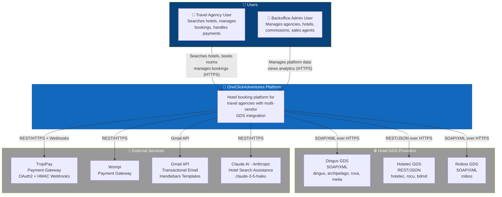

### 2.2 Container Diagram (Level 2)

This diagram breaks down the OneClickAdventures system into its deployable containers and shows how they communicate.

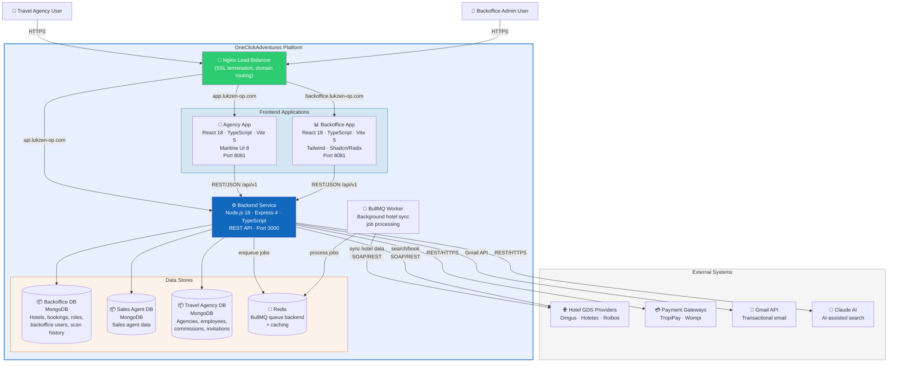

### 2.3 Component Diagram (Level 3) - Backend Service

This diagram shows the internal architecture of the backend-service, the central API.

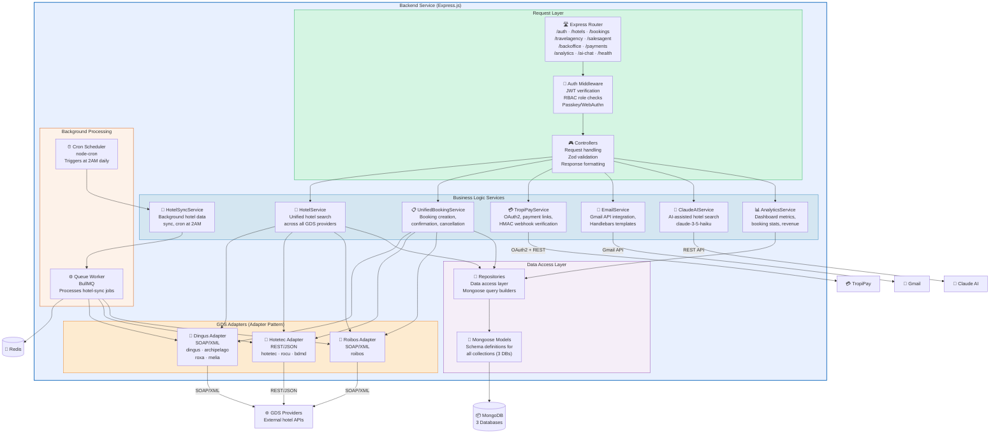

---

## 3. Sequence Diagrams

### 3.1 Hotel Search Flow

This diagram shows how a travel agency user searches for hotels, which fans out across multiple GDS providers.

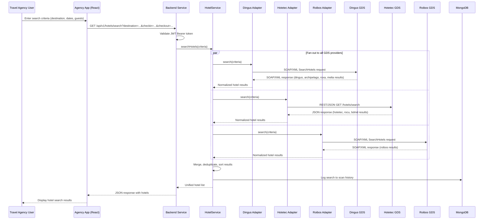

### 3.2 Booking Flow

This diagram shows the complete booking lifecycle from room selection through payment.

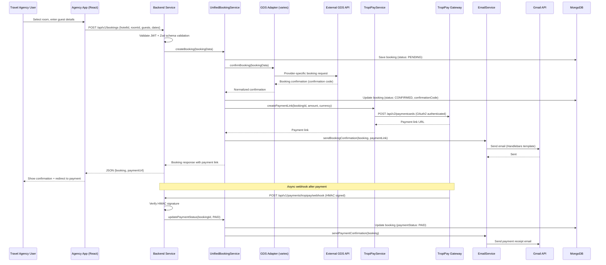

### 3.3 Authentication Flow

This diagram shows the JWT-based authentication flow used across the platform.

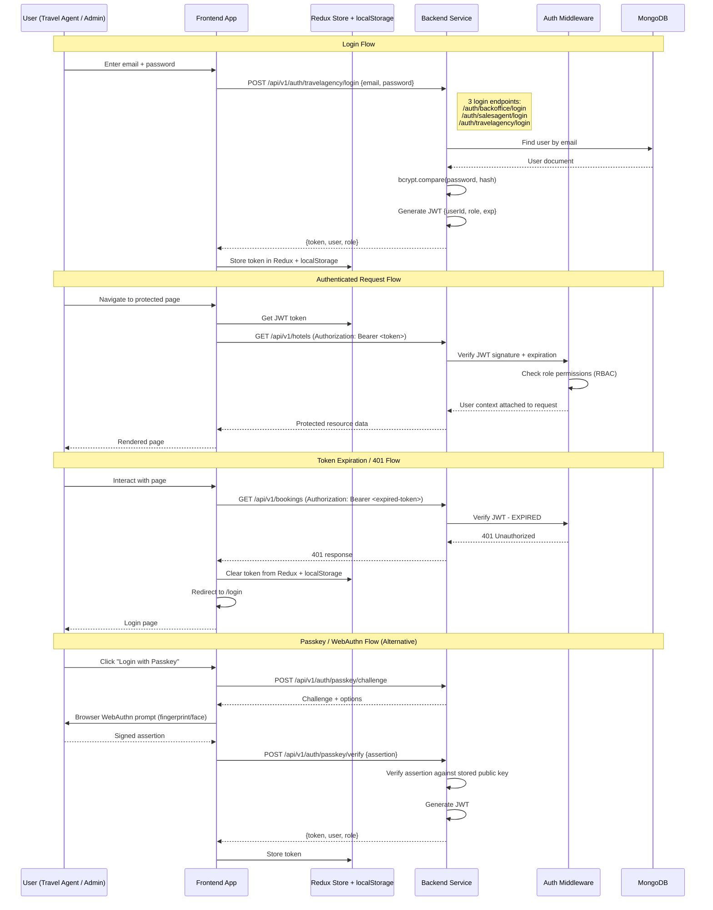

### 3.4 Hotel Sync Flow (Background)

This diagram shows how hotel data is synchronized from GDS providers on a nightly schedule.

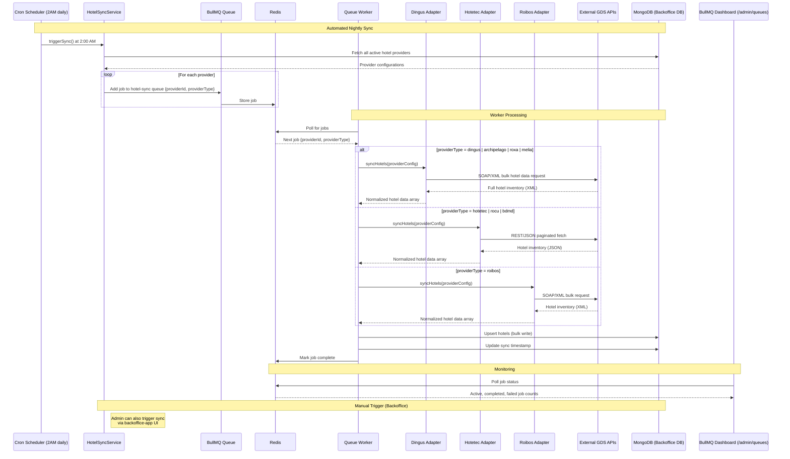

---

## 4. Infrastructure Diagram

### 4.1 Full Infrastructure Overview

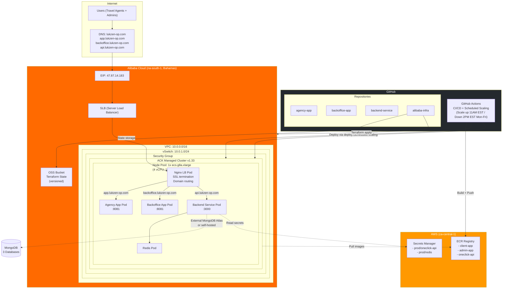

### 4.2 Kubernetes Cluster Detail

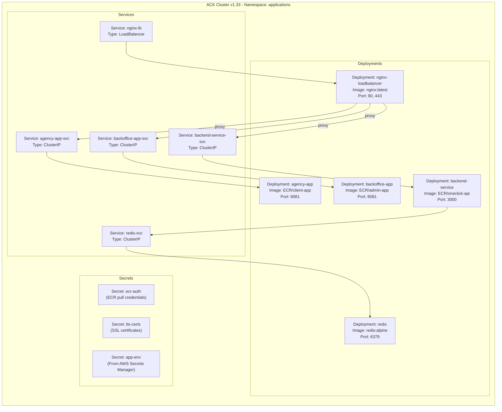

---

## 5. Data Architecture

### 5.1 MongoDB Multi-Tenant Design

The platform uses three separate MongoDB databases to enforce bounded context isolation. Each database maps to a distinct domain.

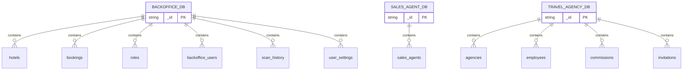

#### Backoffice Database

| Collection | Purpose | Key Fields |
|---|---|---|
| `hotels` | Synced hotel data from all GDS providers | name, provider, providerType, location, rooms, amenities, images, syncedAt |
| `bookings` | All reservations across the platform | hotelId, agencyId, guestDetails, dates, status, confirmationCode, paymentStatus |
| `roles` | RBAC role definitions | name, permissions |
| `backoffice_users` | Admin and internal users | email, passwordHash, role, passkeys |
| `scan_history` | Search query audit log | userId, searchCriteria, resultCount, timestamp |
| `user_settings` | Per-user preferences | userId, language, theme, notifications |

#### Sales Agent Database

| Collection | Purpose | Key Fields |
|---|---|---|
| `sales_agents` | Sales rep profiles and assignments | name, email, assignedAgencies, commissionRate, status |

#### Travel Agency Database

| Collection | Purpose | Key Fields |
|---|---|---|
| `agencies` | Registered travel agency organizations | name, contactInfo, subscription, assignedSalesAgent, status |
| `employees` | Agency staff members | agencyId, name, email, role, passwordHash, passkeys |
| `commissions` | Commission tracking per booking | bookingId, agencyId, salesAgentId, amount, currency, status |
| `invitations` | Pending employee invitations | agencyId, email, role, token, expiresAt |

### 5.2 Redis Usage

| Use Case | Key Pattern | TTL | Description |
|---|---|---|---|
| BullMQ Jobs | `bull:hotel-sync:*` | Varies | Job queue data for hotel synchronization |
| BullMQ Metrics | `bull:hotel-sync:meta` | Persistent | Queue metadata and metrics |
| Session Cache | `session:*` | 24h | Optional session caching |

---

## 6. Deployment Pipeline

### 6.1 CI/CD Flow

Each application repository contains its own `deploy-to-ecr.yml` GitHub Actions workflow. The infrastructure repository contains shared deployment scripts.

```mermaid
flowchart LR
    subgraph Developer
        Code["Code Change"]
    end

    subgraph GitHub
        PR["Pull Request"]
        Merge["Merge to main/promote"]
        GHA["GitHub Actions<br/>deploy-to-ecr.yml"]
    end

    subgraph Build["Build Stage"]
        Lint["Lint + Type Check"]
        Test["Run Tests"]
        Docker["Docker Build"]
    end

    subgraph AWS
        ECR["ECR Push<br/>- client-app:latest<br/>- admin-app:latest<br/>- oneclick-api:latest"]
    end

    subgraph Deploy["Deploy Stage"]
        Script["alibaba-infra/applications/<br/>{app}/deploy.sh"]
        Kubectl["kubectl set image<br/>+ rollout restart"]
    end

    subgraph Alibaba["Alibaba Cloud K8s"]
        Pods["Updated Pods<br/>(Rolling update)"]
    end

    Code --> PR
    PR --> Merge
    Merge --> GHA
    GHA --> Lint
    Lint --> Test
    Test --> Docker
    Docker --> ECR
    ECR --> Script
    Script --> Kubectl
    Kubectl --> Pods
```

### 6.2 Scheduled Scaling

To optimize costs, the Kubernetes cluster scales on a schedule via GitHub Actions.

| Schedule | Action | Time (EST) | Days |
|---|---|---|---|
| Scale Up | Set replicas to operational count | 11:00 AM | Monday - Friday |
| Scale Down | Set replicas to 0 or minimum | 2:00 PM | Monday - Friday |

### 6.3 Deployment Scripts

Each application has a deploy script at `alibaba-infra/applications/{app}/deploy.sh` that:

1. Authenticates to the ACK cluster via kubeconfig
2. Updates the Kubernetes deployment image tag
3. Triggers a rolling restart
4. Waits for rollout to complete

---

## 7. Technology Stack Summary

| Repository | Purpose | Language | Framework | UI Library | Database | Port (Prod) | Port (Dev) | Domain | ECR Image |
|---|---|---|---|---|---|---|---|---|---|
| `agency-app` | Travel agency portal | TypeScript | React 18 + Vite 5 | Mantine UI 8 | -- | 8081 | 3030 | app.lukzen-op.com | client-app |
| `backoffice-app` | Admin dashboard | TypeScript | React 18 + Vite 5 | Tailwind + Shadcn/Radix | -- | 8081 | 3032 | backoffice.lukzen-op.com | admin-app |
| `backend-service` | Central REST API | TypeScript | Node.js 18 + Express 4 | -- | MongoDB + Redis | 3000 | 3001 | api.lukzen-op.com | oneclick-api |
| `alibaba-infra` | Infrastructure | HCL + YAML | Terraform + Helm | -- | -- | -- | -- | -- | -- |

### Shared Technologies

| Technology | Usage |
|---|---|
| TypeScript | All 3 application repos |
| JWT (jsonwebtoken) | Authentication across backend + both frontends |
| Redux Toolkit | State management in both frontend apps |
| Axios | HTTP client in both frontend apps |
| Docker | Containerization for all 3 application repos |
| GitHub Actions | CI/CD for all repos |
| Zod | Schema validation in backend-service |
| BullMQ + Redis | Background job processing in backend-service |
| Mongoose 7 | MongoDB ODM in backend-service |

### GDS Provider Adapters

| Adapter | Protocol | Format | Vendors |
|---|---|---|---|
| Dingus Adapter | SOAP | XML | dingus, archipelago, roxa, melia |
| Hotetec Adapter | REST | JSON | hotetec, rocu, bdmd |
| Roibos Adapter | SOAP | XML | roibos |

---

## Appendix: Architecture Decision Records (ADRs)

### ADR-001: Multi-Repo Over Monorepo

- **Context**: The platform has two frontends, one backend, and infrastructure code. Teams may work on each independently.
- **Decision**: Use a multi-repo structure with four separate repositories.
- **Consequences**: Independent deployment cycles and versioning. Slightly more overhead for cross-repo changes. Each repo has its own CI/CD pipeline.

### ADR-002: Alibaba Cloud as Primary Provider

- **Context**: The target market (Bahamas/Caribbean) requires low-latency access. Alibaba Cloud offers a na-south-1 (Bahamas) region.
- **Decision**: Use Alibaba Cloud for compute and networking, with AWS for container registry (ECR) and secrets management.
- **Consequences**: Multi-cloud complexity. Benefits of geographic proximity. AWS ECR used due to maturity.

### ADR-003: Adapter Pattern for GDS Integrations

- **Context**: Hotel GDS providers use different protocols (SOAP/XML vs REST/JSON) and data formats. New providers may be added over time.
- **Decision**: Implement an adapter pattern where each GDS family has its own adapter that normalizes data into a unified internal model.
- **Consequences**: Adding a new vendor means implementing a new adapter (or extending an existing one). All downstream code works with a single hotel data model. Adapter complexity is isolated.

### ADR-004: Three Separate MongoDB Databases

- **Context**: The platform serves three distinct domains -- backoffice operations, travel agencies, and sales agents -- each with different data access patterns and security requirements.
- **Decision**: Use three separate MongoDB databases rather than one shared database with collection-level separation.
- **Consequences**: Stronger data isolation. Cross-domain queries require application-level joins. Connection pool management across three databases.

### ADR-005: BullMQ for Hotel Synchronization

- **Context**: Hotel data must be synced from 7+ GDS providers nightly. The sync involves long-running HTTP calls and bulk database writes.
- **Decision**: Use BullMQ with Redis for background job processing, with a cron trigger at 2AM and support for manual triggers.
- **Consequences**: Reliable retry mechanism. Job visibility via dashboard at /admin/queues. Redis dependency. Jobs survive process restarts.
