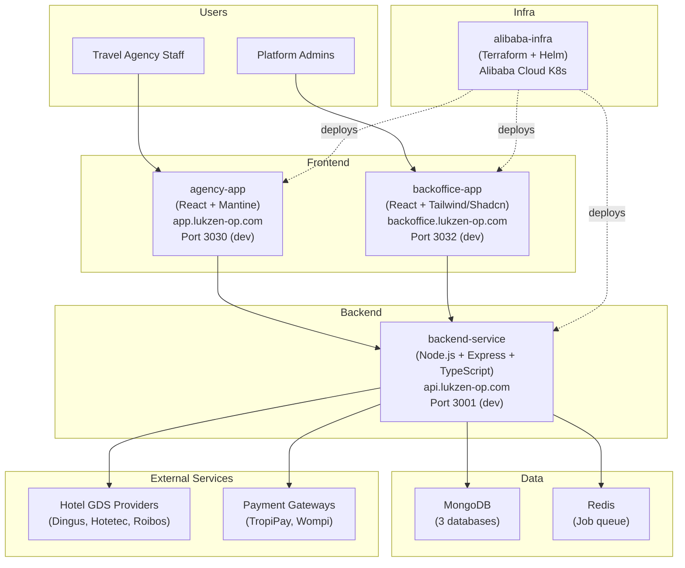

# Ergos Continental - Junior Developer Onboarding Guide

Welcome to the Ergos Continental team. This guide will walk you from zero to productive. Take your time, follow the order, and do not hesitate to ask questions -- that is what the team is here for.

---

## Table of Contents

1. [Welcome and Platform Overview](#1-welcome-and-platform-overview)
2. [Prerequisites](#2-prerequisites)
3. [Getting Started - Cloning the Repos](#3-getting-started---cloning-the-repos)
4. [Running the Project Locally](#4-running-the-project-locally)
5. [Documentation Reading Order (Learning Path)](#5-documentation-reading-order-learning-path)
6. [Key Concepts to Understand](#6-key-concepts-to-understand)
7. [Code Quality Standards](#7-code-quality-standards) — Commit messages, changelog, pre-commit hooks, testing
8. [Common Development Tasks](#8-common-development-tasks)
9. [Useful Commands Cheatsheet](#9-useful-commands-cheatsheet)
10. [Who to Ask for Help](#10-who-to-ask-for-help)
11. [Glossary](#11-glossary)

---

## 1. Welcome and Platform Overview

### What is Ergos Continental?

Ergos Continental is a **hotel booking platform built for travel agencies**. Think of it as a tool that lets travel agencies search across multiple hotel providers at once, compare prices, book rooms for their customers, and manage everything from a single dashboard.

On the other side, our internal team uses a backoffice dashboard to manage agencies, configure hotel providers, track commissions, and monitor the platform.

### How Everything Connects

The platform is built as four separate repositories that work together:



**The short version:**
- **agency-app** is what travel agencies use (search hotels, book rooms, manage bookings)
- **backoffice-app** is what our internal team uses (manage everything)
- **backend-service** is the brain -- it talks to both frontends, all hotel providers, payment systems, and the database
- **alibaba-infra** is the infrastructure code that deploys everything to Alibaba Cloud Kubernetes

For the full architecture details, see [ARCHITECTURE.md](ARCHITECTURE.md).

---

## 2. Prerequisites

### Required Tools

| Tool | Version | Why You Need It |
|---|---|---|
| **bun** | Latest | Fast package manager and JavaScript runtime (replaces npm) |
| **Node.js** | 18+ | JavaScript runtime (needed by ts-node-dev and vite) |
| **Git** | Latest | Version control |
| **Docker** | Latest | Running MongoDB and Redis locally (optional if using Atlas) |
| **Docker Compose** | Latest (included with Docker Desktop) | Orchestrating local database services |
| **VS Code** | Latest | Recommended IDE |
| **kubectl** | Latest | Kubernetes CLI (for infra work) |
| **AWS CLI** | v2 | AWS interactions (ECR, Secrets Manager) |
| **Terraform** | 1.0+ | Infrastructure as code (only for infra work) |

### Recommended VS Code Extensions

- **ESLint** - JavaScript/TypeScript linting
- **Prettier** - Code formatting
- **TypeScript Importer** - Auto-import for TypeScript
- **MongoDB for VS Code** - Browse MongoDB data
- **Thunder Client** or **REST Client** - API testing
- **Docker** - Docker file support
- **Tailwind CSS IntelliSense** - For backoffice-app
- **Mermaid Markdown Syntax Highlighting** - For reading architecture docs
- **GitLens** - Enhanced Git integration

### Access You Will Need

Ask your team lead to set up the following:

- [ ] GitHub access to all 4 repositories
- [ ] `.env` files for backend-service (contains database URLs, API keys, secrets)
- [ ] `.env` files for frontend apps (contains API base URLs)
- [ ] AWS credentials (for ECR and Secrets Manager access)
- [ ] Alibaba Cloud credentials (only if doing infrastructure work)
- [ ] MongoDB connection strings for local/dev databases
- [ ] Access to the team communication channels

---

## 3. Getting Started - Cloning the Repos

### Recommended Directory Structure

Create a parent directory to keep everything organized:

```bash
mkdir -p ~/projects/oneclickadventures
cd ~/projects/oneclickadventures
```

### Clone All Repositories

```bash
# Frontend - Travel Agency Portal
git clone git@github.com:<org>/agency-app.git

# Frontend - Admin Dashboard
git clone git@github.com:<org>/backoffice-app.git

# Backend API
git clone git@github.com:<org>/backend-service.git

# Infrastructure as Code
git clone git@github.com:<org>/alibaba-infra.git
```

> **Note:** Replace `<org>` with the actual GitHub organization name provided by your team lead.

After cloning, your directory should look like:

```
~/projects/oneclickadventures/
  agency-app/
  backoffice-app/
  backend-service/
  alibaba-infra/
```

---

## 4. Running the Project Locally

### Option A: One-Command Setup (Recommended)

The **agency-app** repo contains the orchestrator Makefile that manages all three services from a single location. This is the fastest way to get running.

#### First-time setup

```bash
cd ~/projects/oneclickadventures/agency-app

# Install all tools, npm dependencies, and generate .env files
make setup
```

This will:
1. Check/install system tools (Homebrew, Bun, Node.js, Docker, Git, jq)
2. Run `bun install` in all 3 app repos
3. Generate `.env` files with the correct local defaults

After setup, edit `backend-service/.env` to fill in any secrets your team lead gives you (JWT_SECRET, API keys, etc.).

#### Start everything

```bash
# Start databases + backend + both frontends in one command
make up
```

This starts in order:
1. MongoDB (3 instances on ports 27017, 27018, 27019) + Redis (port 6379)
2. backend-service on port 3001
3. agency-app on port 3030
4. backoffice-app on port 3032

#### Daily commands

```bash
make up                 # Start everything
make down               # Stop everything
make status             # Check what is running

make logs-backend       # Tail backend logs
make logs-agency        # Tail agency-app logs
make logs-backoffice    # Tail backoffice-app logs

make backend            # Start only the backend
make agency             # Start only the agency app
make backoffice         # Start only the backoffice app

make db-up              # Start only the databases
make db-down            # Stop databases
make db-reset           # Wipe all database data and start fresh

make help               # See all available commands
```

#### Verify everything is running

```bash
# Check service status
make status

# Test the backend health endpoint
curl http://localhost:3001/api/v1/health
```

Then open in your browser:
- **Agency App**: http://localhost:3030
- **Backoffice App**: http://localhost:3032
- **BullMQ Dashboard**: http://localhost:3001/admin/queues

---

### Option B: Manual Setup (Step by Step)

If you prefer to understand each step, or the Makefile doesn't work for your setup:

#### Step 1: Start Backend Dependencies (MongoDB + Redis)

```bash
cd ~/projects/oneclickadventures/backend-service

# Start 3 MongoDB instances via Docker Compose
docker compose up -d backoffice-db salesagent-db travelagency-db

# Start Redis separately
docker run -d --name oneclickadventures-redis -p 6379:6379 redis:alpine
```

Verify they are running:

```bash
docker ps
```

You should see 3 MongoDB containers (ports 27017, 27018, 27019) and 1 Redis container (port 6379).

#### Step 2: Start the Backend Service

```bash
cd ~/projects/oneclickadventures/backend-service

# Install dependencies
bun install

# Copy the environment file (ask your team lead for the actual values)
cp .env.example .env
# IMPORTANT: Set PORT=3001 in .env (agency-app dev config expects 3001)
# Edit .env with your DB URLs, JWT_SECRET, and API keys

# Start in development mode
PORT=3001 bun run dev
```

The API should now be running at **http://localhost:3001**.

Test it:

```bash
curl http://localhost:3001/api/v1/health
```

#### Step 3: Start the Agency App (Frontend)

```bash
cd ~/projects/oneclickadventures/agency-app

# Install dependencies
bun install

# Start in development mode
bun run start
```

The agency app should now be running at **http://localhost:3030**.

It connects to the backend at `http://localhost:3001/api/v1` by default in development mode.

#### Step 4: Start the Backoffice App (Frontend)

```bash
cd ~/projects/oneclickadventures/backoffice-app

# Install dependencies
bun install

# Create a .env to point to local backend (otherwise it defaults to production!)
echo "VITE_ADMIN_SERVICE_URL=http://localhost:3001/api/v1" > .env

# Start in development mode
bun run start
```

The backoffice app should now be running at **http://localhost:3032**.

---

### Environment Variables Reference

Each repo requires a `.env` file. The Makefile generates these automatically, but here is what each one contains:

**backend-service/.env**
| Variable | Description | Default |
|---|---|---|
| `PORT` | Server port | `3001` (set by Makefile) |
| `NODE_ENV` | Environment | `development` |
| `BACKOFFICE_DB_URL` | Backoffice MongoDB URL | `mongodb://localhost:27017/backoffice` |
| `SALES_AGENT_DB_URL` | Sales Agent MongoDB URL | `mongodb://localhost:27018/salesagent` |
| `TRAVEL_AGENCY_DB_URL` | Travel Agency MongoDB URL | `mongodb://localhost:27019/travelagency` |
| `JWT_SECRET` | Secret for signing JWT tokens | Ask your team lead |
| `CLAUDE_API_KEY` | Anthropic API key (AI features) | Ask your team lead |
| `TROPIPAY_*` | TropiPay payment credentials | Ask your team lead |
| `DINGUS_*`, `HOTETEC_*`, `ROIBOS_*` | GDS provider credentials | Ask your team lead |

**agency-app/.env**
| Variable | Description | Default |
|---|---|---|
| `VITE_APP_EXECUTION_ENV` | Environment flag | `development` |
| `VITE_API_BASE_URL` | Backend API URL | `http://localhost:3001/api/v1` |

**backoffice-app/.env**
| Variable | Description | Default |
|---|---|---|
| `VITE_ADMIN_SERVICE_URL` | Backend API URL | `http://localhost:3001/api/v1` |

### Troubleshooting First Run

| Problem | Solution |
|---|---|
| `bun install` fails | Ensure bun is installed (`bun --version`). If network errors, retry — bun caches globally |
| MongoDB connection refused | Make sure `make db-up` or `docker compose up -d` ran successfully. Check with `docker ps` |
| Backend starts on 3000 not 3001 | Set `PORT=3001` in `backend-service/.env` or use `make backend` which sets it automatically |
| CORS errors in browser | Make sure the backend is running and the frontend `.env` points to `http://localhost:3001/api/v1` |
| backoffice hits production API | Create/check `backoffice-app/.env` has `VITE_ADMIN_SERVICE_URL=http://localhost:3001/api/v1` |
| 401 Unauthorized | You need to register/login first. Check the auth endpoints |
| Port already in use | Find the process: `lsof -i :3001` and kill it, or `make down` to stop all services |

---

## 5. Documentation Reading Order (Learning Path)

This is a structured 4-week learning path. You do not need to memorize everything -- the goal is to build a mental map of the system.

### Week 1: Get the Big Picture

| Order | What to Read | Focus On |
|---|---|---|
| 1 | This onboarding guide (you are here) | Overall structure, how to run things locally |
| 2 | [ARCHITECTURE.md](ARCHITECTURE.md) - Sections 1-2 | C4 Context and Container diagrams -- understand what talks to what |
| 3 | Each repo's README — [`backend-service`](../../../backend-service/README.md), [`agency-app`](../../../agency-app/README.md), [`backoffice-app`](../../../backoffice-app/README.md) | Setup instructions, available scripts, project-specific notes |
| 4 | Spend time understanding the domain | What is hotel booking? What are GDS providers? How do travel agencies work? |

**Goal for Week 1:** You can explain what Ergos Continental does, name the 4 repos and their purposes, and run the project locally.

### Week 2: Understand the Backend

| Order | What to Read | Focus On |
|---|---|---|
| 1 | [`backend-service/docs/DEVELOPMENT_GUIDE.md`](../../../backend-service/docs/DEVELOPMENT_GUIDE.md) | Day-to-day workflow, adding endpoints, testing, available scripts |
| 2 | `backend-service/docs/ARCHITECTURE.md` | Internal backend architecture |
| 3 | `backend-service/docs/VENDOR_ARCHITECTURE.md` | How GDS adapters work |
| 4 | `backend-service/src/domains/*/routes/` | API endpoints -- read each domain's route file |
| 5 | `backend-service/src/domains/*/models/` | Mongoose schemas -- understand the data model per domain |
| 6 | `backend-service/src/shared/adapters/` | GDS adapter implementations -- adapter pattern in action |
| 7 | [ARCHITECTURE.md](ARCHITECTURE.md) - Sections 3, 5 | Sequence diagrams and data architecture |

**Goal for Week 2:** You can trace a request from an API endpoint through to the database. You understand the adapter pattern and can explain how hotel data flows from GDS providers into MongoDB.

### Week 3: Understand the Frontends

| Order | What to Read | Focus On |
|---|---|---|
| 1 | [`agency-app/README.md`](../../../agency-app/README.md) | Project structure, Makefile orchestrator, available scripts, environment modes |
| 2 | `agency-app/src/routers/index.tsx` | All routes and page structure |
| 3 | `agency-app/src/api/` | How the frontend calls the backend (Axios setup, interceptors) |
| 4 | `agency-app/src/store/` or Redux slices | Redux Toolkit state management |
| 5 | `backoffice-app/src/modules/` | Module-based organization |
| 6 | `backoffice-app` role-based routing | How `getRoutesByRole()` works |
| 7 | Play with both apps in the browser | Click through every page, watch Network tab |

**Goal for Week 3:** You can navigate both frontend codebases. You know where to add a new page, how the API layer works, and how state management is structured.

### Week 4: Understand the Infrastructure

| Order | What to Read | Focus On |
|---|---|---|
| 1 | `alibaba-infra/README.md` | Infrastructure overview |
| 2 | `alibaba-infra/k8s/main.tf` | Terraform resource definitions |
| 3 | `alibaba-infra/applications/` | Helm charts and deploy scripts for each app |
| 4 | `.github/workflows/` in each repo | CI/CD pipeline definitions |
| 5 | [ARCHITECTURE.md](ARCHITECTURE.md) - Sections 4, 6 | Infrastructure and deployment diagrams |

**Goal for Week 4:** You understand how code goes from a Git push to a running container in Kubernetes. You know where infrastructure is configured and how deployments work.

---

## 6. Key Concepts to Understand

These are the concepts you will encounter repeatedly. You do not need to master them all on day one, but keep this list as a reference.

### GDS (Global Distribution System) and Hotel Providers

A GDS is a network that enables travel agencies to access hotel inventory and make reservations. Ergos Continental integrates with multiple GDS providers, each with its own API:

- **Dingus** (SOAP/XML) - Covers vendors: dingus, archipelago, roxa, melia
- **Hotetec** (REST/JSON) - Covers vendors: hotetec, rocu, bdmd
- **Roibos** (SOAP/XML) - Covers vendor: roibos

The **adapter pattern** normalizes all these different APIs into a single internal format so the rest of the backend does not need to know which provider a hotel comes from.

### Multi-Tenant Database Architecture

The backend uses three separate MongoDB databases:
- **Backoffice DB** - Hotels, bookings, admin users, system config
- **Sales Agent DB** - Sales representative data
- **Travel Agency DB** - Agencies, their employees, commissions

This is not "multi-tenancy" in the traditional SaaS sense (one DB per customer). It is domain-based separation -- each bounded context gets its own database.

### JWT Authentication and RBAC

- Users log in and receive a **JWT (JSON Web Token)**
- Every subsequent API request includes this token in the `Authorization: Bearer <token>` header
- The backend verifies the token and checks the user's **role** (RBAC = Role-Based Access Control)
- Roles: `ADMIN`, `SALES_AGENT`, `TRAVEL_AGENT`, `BACKOFFICE_HOTEL_AGENT`
- Three separate login endpoints exist: `/auth/backoffice/login`, `/auth/salesagent/login`, `/auth/travelagency/login`

### Adapter Pattern

The adapter pattern is a design pattern that allows incompatible interfaces to work together. In our codebase:

```
External GDS API (SOAP/XML or REST/JSON)
    |
    v
Adapter (translates to/from internal format)
    |
    v
Internal Service (works with normalized data)
```

Each adapter implements the same interface (search, book, cancel) but handles the protocol-specific details internally.

### BullMQ and Background Jobs

Some operations are too slow or unreliable to run synchronously (like syncing hotel data from 7+ providers). BullMQ provides:
- A job queue backed by Redis
- Automatic retries on failure
- A web dashboard at `/admin/queues` to monitor jobs
- The hotel sync runs on a cron schedule at 2AM daily

### Kubernetes Basics

The platform runs on Kubernetes (Alibaba ACK). Key concepts:
- **Pod** - The smallest deployable unit (runs one container)
- **Deployment** - Manages pods (how many replicas, which image to use)
- **Service** - A stable network endpoint that routes to pods
- **Namespace** - A virtual cluster within the physical cluster (ours is `applications`)
- **Ingress / LoadBalancer** - Routes external traffic to services (we use Nginx for this)

### CI/CD with GitHub Actions

Every code change follows this pipeline:
1. Push code to a branch
2. Create a pull request
3. Merge to main/promote branch
4. GitHub Actions automatically: builds the Docker image, pushes to AWS ECR, deploys to Alibaba K8s

---

## 7. Code Quality Standards

This section explains the automated quality gates enforced across all repositories: commit message format, changelog generation, and testing conventions.

### Conventional Commits

All repositories enforce the [Conventional Commits](https://www.conventionalcommits.org/) format via **commitlint** (configured in `commitlint.config.ts`, enforced by the `.hooks/commit-msg` git hook). Every commit message must follow this structure:

```
<type>(<scope>): <description>

[optional body]

[optional footer(s)]
```

#### Allowed Types

| Type | When to Use | Example |
|------|-------------|---------|
| `feat` | A new feature or user-facing functionality | `feat: add hotel filter by star rating` |
| `fix` | A bug fix | `fix: correct price rounding on checkout` |
| `docs` | Documentation-only changes | `docs: add API endpoint reference for bookings` |
| `style` | Formatting, whitespace, semicolons (no logic change) | `style: fix indentation in hotel service` |
| `refactor` | Code restructuring without changing behavior | `refactor: extract guest validation into shared util` |
| `perf` | Performance improvement | `perf: cache GDS search results in Redis` |
| `test` | Adding or updating tests | `test: add unit tests for cancellation schema` |
| `build` | Build system or dependency changes | `build: upgrade Mantine to v8.2` |
| `ci` | CI/CD pipeline changes | `ci: add coverage report to GitHub Actions` |
| `chore` | Maintenance tasks, tooling, configs | `chore: bump actions/checkout to v4` |
| `revert` | Reverting a previous commit | `revert: revert feat: add hotel filter` |

#### Scope (Optional)

The scope provides extra context about what area of the codebase is affected. It goes in parentheses after the type:

```bash
feat(search): add destination autocomplete
fix(booking): handle empty guest list gracefully
refactor(adapters): simplify Dingus XML parser
ci(changelog): add auto-generation workflow
```

Common scopes: `search`, `booking`, `auth`, `adapters`, `swagger`, `redux`, `ui`, `api`.

#### Rules

- **Subject line must not be empty** and should be lowercase
- **Type must not be empty** and must be one of the allowed types above
- **No period at the end** of the subject line
- **Use imperative mood** in the description ("add" not "added", "fix" not "fixes")

#### What Happens When You Commit

```
$ git commit -m "added new feature"
⧗   input: added new feature
✖   subject may not be empty [subject-empty]
✖   type may not be empty [type-empty]
✖   found 2 problems, 0 warnings

$ git commit -m "feat: add hotel star rating filter"
✔   All good!
```

#### Breaking Changes

For commits that introduce breaking changes, add `!` after the type or use a `BREAKING CHANGE:` footer:

```bash
feat!: redesign booking API response structure

# or

feat: redesign booking API response structure

BREAKING CHANGE: booking response now returns rooms as nested objects instead of flat array
```

---

### Changelog

Both `backend-service` and `agency-app` use [changelogen](https://github.com/unjs/changelogen) to auto-generate a `CHANGELOG.md` from conventional commit history.

#### Manual Commands

```bash
# Preview what the changelog would look like (dry run, no file changes)
bun run changelog:preview

# Generate/update CHANGELOG.md
bun run changelog

# Bump version in package.json + update CHANGELOG.md + create a git tag
bun run release
```

#### Automatic Generation (CI/CD)

A GitHub Actions workflow (`.github/workflows/changelog.yml`) runs automatically when a PR is merged to `master`:

1. Checks out the repo with full git history
2. Runs `bun run changelog` to regenerate `CHANGELOG.md`
3. Commits the updated file back to `master` with the message `docs: update changelog [skip ci]`

The `[skip ci]` tag prevents the commit from triggering the workflow again (avoiding infinite loops).

#### How Commits Map to Changelog Sections

| Commit Type | Changelog Section |
|-------------|-------------------|
| `feat` | 🚀 Enhancements |
| `fix` | 🩹 Fixes |
| `perf` | 🔥 Performance |
| `refactor` | 💅 Refactors |
| `docs` | 📖 Documentation |
| `build` | 📦 Build |
| `test` | ✅ Tests |
| `style` | 🎨 Styles |
| `ci` | 🤖 CI |
| `chore` | 🏡 Chore |

Commits with non-conventional messages are ignored by changelogen and will not appear in the changelog.

---

### Pre-commit Hooks

Both repos have a `.hooks/pre-commit` script that runs automatically before every commit. Git is configured to use this directory via the `prepare` script (`git config core.hooksPath .hooks`), which runs on `bun install`.

#### backend-service Pre-commit

Runs three steps sequentially — if any step fails, the commit is aborted:

1. **Format** — Runs Prettier on all staged `.ts`/`.tsx` files and re-stages them
2. **Type-check** — Runs `tsc --noEmit` to catch TypeScript errors across the entire project
3. **Unit tests** — Runs every `*.test.ts` file individually via `bun test`

#### agency-app Pre-commit

Same structure, three steps:

1. **Format** — Runs Prettier on all staged `.ts`/`.tsx` files and re-stages them
2. **Lint** — Runs ESLint with `--fix` on staged files and re-stages them
3. **Unit tests** — Runs `bun test` (all test files)

---

### Testing Conventions

All tests use the **bun:test** runner (built into Bun). The syntax is identical to Jest: `describe`, `it`, `expect`.

#### Unit Tests

Unit tests live alongside the code they test, inside `__tests__/` directories:

```
src/domains/booking/
  __tests__/
    booking.schema.test.ts     ← tests for the Zod schema
    booking.dto.test.ts        ← tests for the DTO
  schemas/
    booking.schema.ts
  booking.dto.ts
```

**File naming**: `<module-name>.test.ts` (always `.test.ts` suffix).

**Test structure**:

```ts
import { describe, it, expect } from "bun:test"

describe("FunctionOrModuleName", () => {
  it("should do something specific", () => {
    const result = myFunction(input)
    expect(result).toBe(expectedOutput)
  })

  it("should handle edge case", () => {
    expect(() => myFunction(badInput)).toThrow()
  })
})
```

**What to test in unit tests**:
- Pure functions and utilities (date calculations, formatting, parsing)
- Zod schema validation (valid input accepted, invalid input rejected)
- Redux reducers and selectors (state transitions)
- Business logic (guest builders, price calculations, occupancy codes)

**What NOT to test in unit tests**:
- API calls (mock them or use integration tests)
- React component rendering (use E2E tests for UI)
- Database interactions (use integration tests)

#### Running Unit Tests

```bash
# All unit tests
bun test

# Specific file
bun test src/domains/booking/__tests__/booking.schema.test.ts

# With coverage report
bun test --coverage

# Watch mode (re-runs on file changes)
bun test --watch
```

#### Integration Tests (backend-service Only)

Integration tests verify real communication with external GDS providers (Dingus, Hotetec, Roibos). They live in a dedicated directory:

```
src/domains/hotel/__tests__/integration/
  run-all-tests.ts          ← orchestrator that runs all vendor tests
  dingus/
    test-basic.ts           ← basic Dingus API connectivity
    test-e2e.ts             ← full search → book → cancel flow
    test-cancellation.ts
    test-modification.ts
  hotetec/
    test-integration.ts
    test-e2e.ts
    test-cancellation.ts
  roibos/
    test-integration.ts
    test-e2e.ts
```

**File naming**: `test-<description>.ts` (no `.test.ts` suffix — these are NOT picked up by `bun test`).

**Running integration tests**:

```bash
# All vendors
bun run test:integration

# Specific vendor
bun run test:hotetec
```

Integration tests require valid GDS credentials in `.env` and make real API calls to external services. They are **not** part of the pre-commit hook or CI pipeline — run them manually when testing GDS adapter changes.

#### E2E Tests (agency-app Only)

End-to-end tests use Cypress and are configured in `.github/workflows/cypress-e2e.yml`. These run in CI against a real browser.

---

### Summary Table

| Tool | Purpose | Triggered By |
|------|---------|--------------|
| **commitlint** | Validates commit message format | `.hooks/commit-msg` (every commit) |
| **Prettier** | Code formatting | `.hooks/pre-commit` (every commit) |
| **ESLint** | Linting (agency-app) | `.hooks/pre-commit` (every commit) |
| **tsc --noEmit** | Type-checking (backend-service) | `.hooks/pre-commit` (every commit) |
| **bun test** | Unit tests | `.hooks/pre-commit` (every commit) |
| **changelogen** | Changelog generation | CI on merge to master + manual via `bun run changelog` |
| **Cypress** | E2E browser tests (agency-app) | CI workflow |

---

## 8. Common Development Tasks

### How to Add a New API Endpoint

1. **Define the route** in `backend-service/src/routes/` (create a new file or add to existing)
2. **Create a controller** in `backend-service/src/controllers/` that handles the request
3. **Create or update a service** in `backend-service/src/services/` for business logic
4. **Add Zod validation schema** for request body/params validation
5. **Add auth middleware** if the endpoint needs authentication (`authenticateToken`, `authorizeRole`)
6. **Register the route** in the main router file
7. **Test** with Thunder Client, Postman, or curl

Example file flow:
```
routes/myFeature.routes.ts
  -> controllers/myFeature.controller.ts
    -> services/myFeature.service.ts
      -> repositories/myFeature.repository.ts
        -> models/myFeature.model.ts
```

### How to Add a New Page in agency-app

1. **Create the page component** in `agency-app/src/pages/` or the appropriate domain folder
2. **Add the route** in `agency-app/src/routers/index.tsx`
3. **Create API functions** in `agency-app/src/api/` if the page needs backend data
4. **Add Redux slice** if the page needs shared state (in `src/store/` or domain slice)
5. **Add navigation** link in the appropriate layout/sidebar component

### How to Add a New Module in backoffice-app

1. **Create a module folder** in `backoffice-app/src/modules/your-module/`
2. **Create page components** within the module folder
3. **Add routing** -- make sure the module is included in `getRoutesByRole()` for the appropriate roles
4. **Create API functions** for backend communication
5. **Add sidebar navigation** entry

### How to Run Tests

See [Section 7 — Testing Conventions](#testing-conventions) for commands and conventions.

**Quick reference** — run `bun test` from within each repo:

| Repo | Directory |
|------|-----------|
| Backend | `cd ~/projects/oneclickadventures/backend-service` |
| Agency App | `cd ~/projects/oneclickadventures/agency-app` |
| Backoffice App | `cd ~/projects/oneclickadventures/backoffice-app` |

### How to Deploy Changes

For most developers, deployment happens automatically through CI/CD:

1. Push your branch and create a pull request
2. Get code review approval
3. Merge to the promote/main branch
4. GitHub Actions takes over: Build -> Docker -> ECR -> Kubernetes deploy

If you need to manually check a deployment:

```bash
# Check pod status
kubectl get pods -n applications

# Check deployment status
kubectl rollout status deployment/<app-name> -n applications

# View logs
kubectl logs -f deployment/<app-name> -n applications
```

---

## 9. Useful Commands Cheatsheet

### Git Workflow

```bash
# Create a feature branch
git checkout -b feature/my-feature

# Stage and commit
git add .
git commit -m "feat: add hotel filter component"

# Push and create PR
git push -u origin feature/my-feature
# Then create PR on GitHub

# Pull latest from main
git checkout main
git pull origin main

# Rebase your feature branch on latest main
git checkout feature/my-feature
git rebase main
```

### Docker

```bash
# Start local services (MongoDB + Redis)
docker-compose up -d

# Stop local services
docker-compose down

# View running containers
docker ps

# View container logs
docker logs <container-name> -f

# Remove all stopped containers
docker container prune
```

### npm Scripts (per repo)

```bash
# All repos
bun install          # Install dependencies
bun run dev          # Start in dev mode (backend-service)
bun run start        # Start in dev mode (frontend apps)
bun run build        # Build for production
bun run test             # Run tests
bun run lint         # Run linter
```

### kubectl (Kubernetes)

```bash
# View all pods
kubectl get pods -n applications

# View all services
kubectl get svc -n applications

# View all deployments
kubectl get deployments -n applications

# Describe a pod (detailed info + events)
kubectl describe pod <pod-name> -n applications

# View pod logs
kubectl logs <pod-name> -n applications
kubectl logs -f <pod-name> -n applications  # follow/stream

# Execute a command in a pod
kubectl exec -it <pod-name> -n applications -- /bin/sh

# Restart a deployment
kubectl rollout restart deployment/<name> -n applications

# Check rollout status
kubectl rollout status deployment/<name> -n applications

# Scale a deployment
kubectl scale deployment/<name> --replicas=2 -n applications
```

### Useful API Endpoints for Testing

```bash
# Health check
curl http://localhost:3001/api/v1/health

# Login (travel agency)
curl -X POST http://localhost:3001/api/v1/auth/travelagency/login \
  -H "Content-Type: application/json" \
  -d '{"email": "test@example.com", "password": "password"}'

# Search hotels (requires auth token)
curl http://localhost:3001/api/v1/hotels/search?destination=havana&checkin=2026-03-01&checkout=2026-03-05 \
  -H "Authorization: Bearer <your-jwt-token>"

# View BullMQ dashboard (in browser)
open http://localhost:3001/admin/queues
```

---

## 10. Who to Ask for Help

> **Action Required:** Before distributing this guide, replace all _[Name]_ placeholders below with actual team member names.

### Team Contacts

| Area | Contact | Notes |
|---|---|---|
| General questions | _[Team Lead Name]_ | Start here for any questions |
| Backend / API | _[Backend Dev Name]_ | API design, GDS adapters, database |
| Frontend (agency-app) | _[Frontend Dev Name]_ | React, Mantine, Redux |
| Frontend (backoffice) | _[Frontend Dev Name]_ | React, Tailwind, Shadcn |
| Infrastructure / DevOps | _[DevOps Name]_ | Kubernetes, Terraform, CI/CD |
| Product / Domain | _[Product Manager Name]_ | Business logic, requirements |

_Fill in the names above once you have been introduced to the team._

### Communication Channels

- **Slack**: _#ergos-continental-dev_ (main dev channel)
- **Slack**: _#ergos-continental-alerts_ (production alerts)
- **GitHub**: Use PR comments for code-specific discussions
- **Meetings**: _[Add recurring meeting schedule]_

### Code Review Process

1. Create a pull request with a clear description of what changed and why
2. Request review from at least one team member
3. Address feedback and get approval
4. Merge to the promote/main branch
5. Verify the deployment succeeded

---

## 11. Glossary

| Term | Definition |
|---|---|
| **ACK** | Alibaba Cloud Container Service for Kubernetes -- the managed Kubernetes offering from Alibaba Cloud |
| **Adapter** | A design pattern that translates between two incompatible interfaces. Used here to normalize different GDS APIs |
| **Backoffice** | The internal administration side of the platform, used by platform operators (not travel agencies) |
| **BullMQ** | A Node.js library for robust job/message queues, backed by Redis |
| **Commission** | A fee or percentage earned by a sales agent or the platform on each booking |
| **CRUD** | Create, Read, Update, Delete -- the four basic data operations |
| **ECR** | Elastic Container Registry -- AWS service for storing Docker images |
| **EIP** | Elastic IP -- a static public IP address on Alibaba Cloud |
| **GDS** | Global Distribution System -- a network/platform that aggregates hotel (or flight) inventory from multiple providers and makes it searchable via a single API |
| **Helm** | A package manager for Kubernetes that uses "charts" to define, install, and manage applications |
| **HMAC** | Hash-based Message Authentication Code -- used to verify webhook payload authenticity (e.g., TropiPay webhooks) |
| **JWT** | JSON Web Token -- a compact, URL-safe token format used for authentication. Contains encoded user info and a signature |
| **Mongoose** | An ODM (Object Data Modeling) library for MongoDB in Node.js. Defines schemas and provides query helpers |
| **OTA** | Online Travel Agency -- a website or app that allows consumers to book travel services (hotels, flights) directly |
| **Provider** | A hotel data source. In our context, synonymous with a GDS vendor (e.g., Dingus, Hotetec) |
| **RBAC** | Role-Based Access Control -- restricting system access based on the user's assigned role |
| **SLB** | Server Load Balancer -- Alibaba Cloud's load balancing service, similar to AWS ELB |
| **SOAP** | Simple Object Access Protocol -- an XML-based messaging protocol. Used by Dingus and Roibos adapters |
| **Terraform** | An infrastructure-as-code tool by HashiCorp. Defines cloud resources in `.tf` files |
| **Travel Agency** | A business that sells travel services (hotel bookings, tours) to end consumers. Our primary customer type |
| **Vendor** | A specific hotel chain or property management system that provides hotel inventory through a GDS adapter |
| **VPC** | Virtual Private Cloud -- an isolated network within a cloud provider |
| **WebAuthn** | A web standard for passwordless authentication using biometrics or security keys (passkeys) |
| **Zod** | A TypeScript-first schema validation library used in the backend for request validation |

---

## Final Notes

- **Do not be afraid to break things locally.** That is what development environments are for.
- **Read error messages carefully.** They almost always tell you what went wrong.
- **Use the browser DevTools Network tab.** It is the fastest way to understand how the frontend talks to the backend.
- **Ask questions early.** Spending 30 minutes stuck before asking is okay. Spending 3 hours stuck is not.
- **Refer back to [ARCHITECTURE.md](ARCHITECTURE.md)** whenever you need to understand how things fit together at a system level.

Good luck and welcome aboard.
