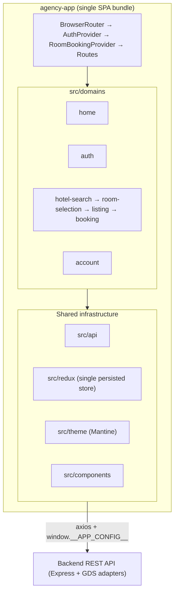
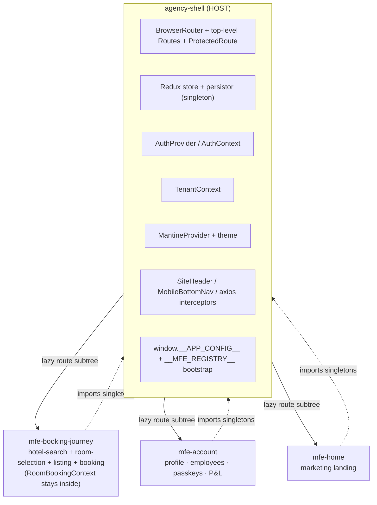
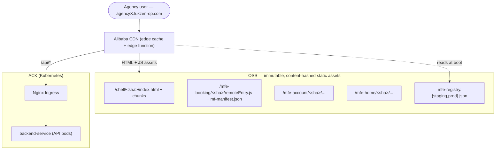
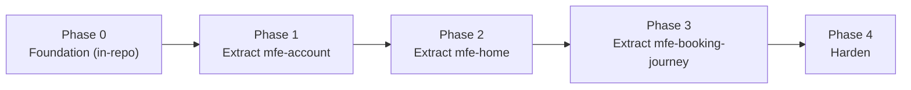

# Micro Frontend Architecture: Agency App

**Repository:** `agency-app`
**Type:** Frontend Architecture Strategy & Decision Record
**Tech Stack:** React 19.2, Vite 5.0, Bun, Redux Toolkit 2.11 + redux-persist 6.0, Mantine 8.2, react-router-dom 7.13
**Status:** 📋 Proposed — Recommendation: *Prepare Now, Federate Later*
**Date:** 2026-06-07
**Author:** Ergos Continental Engineering

---

## Table of Contents

1. [Executive Summary](#executive-summary)
2. [Context & Current Architecture](#1-context--current-architecture)
3. [When Are Micro Frontends Justified?](#2-when-are-micro-frontends-justified)
4. [Decision: Prepare Now, Federate Later](#3-decision-prepare-now-federate-later)
5. [Stepping Stones](#4-stepping-stones-do-these-first)
6. [Readiness Triggers](#5-readiness-triggers-when-to-flip-to-runtime-mfe)
7. [Target Architecture — Runtime Module Federation](#6-target-architecture--runtime-module-federation)
   - [6.1 Decomposition](#61-decomposition-1-host--3-remotes)
   - [6.2 Tooling](#62-tooling-module-federation-on-vite)
   - [6.3 Shared Singletons](#63-shared-dependency-strategy)
   - [6.4 Cross-MFE State](#64-cross-mfe-shared-state)
   - [6.5 Routing](#65-routing-across-host--remotes)
   - [6.6 Repo & Deploy Topology](#66-repo--deploy-topology)
   - [6.7 Multi-Tenancy](#67-multi-tenant-compatibility)
8. [Infrastructure & Hosting Plan (Phase by Phase)](#7-infrastructure--hosting-plan-phase-by-phase)
   - [7.1 Current Hosting Baseline](#71-current-hosting-baseline)
   - [7.2 Target Hosting Model](#72-target-hosting-model)
   - [7.3 Phase H0 — Container-per-MFE in ACK](#73-phase-h0--container-per-mfe-in-ack)
   - [7.4 Phase H1 — Static Remotes on OSS + CDN](#74-phase-h1--static-remotes-on-oss--cdn)
   - [7.5 Phase H2 — Registry, Promotion & Rollback](#75-phase-h2--registry-promotion--rollback)
   - [7.6 Phase H3 — Per-Tenant Edge Delivery](#76-phase-h3--per-tenant-edge-delivery)
   - [7.7 CI/CD Pipeline per Repo](#77-cicd-pipeline-per-repo)
   - [7.8 Infra Phase Summary](#78-infrastructure-phase-summary)
9. [Migration Path (Strangler-Fig)](#8-migration-path-strangler-fig)
10. [Risks & Trade-offs](#9-risks--trade-offs)
11. [References](#10-references)

---

## Executive Summary

Micro frontends (MFE) are the **correct long-term architecture** for the two drivers behind this initiative — **team autonomy** and **independent deployment**. Those are exactly the problems runtime federation solves, and nothing cheaper solves them as completely once the org scales.

However, those drivers are **not yet true today**. The agency-app is built and shipped by what is effectively a single team, its core revenue funnel is tightly coupled by design, and the codebase has not yet adopted even the foundational practices (code-splitting, module-boundary enforcement, route error boundaries) that any MFE migration depends on. Drawing a federation seam through the booking funnel today would fragment an immature foundation and tax its weakest areas (testing, observability) — paying the highest-cost solution before the problem it solves exists.

**Recommendation: *Prepare Now, Federate Later.*** Adopt the lightweight stepping stones in [§4](#4-stepping-stones-do-these-first) — they deliver near-term value (faster loads, enforced ownership boundaries) *and* convert the eventual MFE extraction from a rewrite into a mechanical move. Flip to runtime Module Federation when the [readiness triggers](#5-readiness-triggers-when-to-flip-to-runtime-mfe) fire. The full target blueprint is specified in [§6](#6-target-architecture--runtime-module-federation) so the team can build toward it deliberately.

**Driver scorecard — are we there yet?**

| MFE Driver | What it requires | agency-app today | Verdict |
|---|---|---|---|
| Team autonomy / scaling | 3+ teams owning distinct slices | Effectively one team; no ownership boundaries in code | ⚠️ Not yet |
| Independent deployment | Teams blocked by shared release trains | Multi-repo already isolates *apps* (agency vs backoffice vs service) | ⚠️ Not yet (at this granularity) |
| Tech-stack divergence | A team needs a different framework / React major | Uniform React 19 + Mantine 8 + RTK | ❌ No pressure |
| Conway / org scaling | Org structure demands the architecture mirror it | No current org pressure | ❌ No pressure |

---

## 1. Context & Current Architecture

The agency-app is a **single-page React 19 application** built with Vite 5 and Bun, using Redux Toolkit (with `redux-persist`), Mantine 8, and react-router-dom 7. It is already cleanly **domain-organized** under `src/domains`:

| Domain | Approx. files | Surface |
|---|---|---|
| `booking` | 36 | BookingPage, BookingConfirmation, Bookings, BookingDetails, AddTransfer, VoucherPreview, InvoicePreview |
| `hotel-search` | 21 | Search, filters, results, map |
| `room-selection` | 19 | Room detail, occupancy, `RoomBookingContext` |
| `account` | 10 | Profile, employees, passkeys, password, P&L |
| `home` | 10 | Marketing landing |
| `auth` | 9 | Login, register, forgot/set password, employee invitation, `AuthContext` |
| `listing` | 7 | Stay listing & hotel detail |
| `shared` | 7 | SiteHeader, layout, shared types |

Shared infrastructure sits beside the domains: a centralized API layer (`src/api`, 10 resource modules), the Redux store (`src/redux`), the Mantine theme + design tokens (`src/theme`), and a shared component library (`src/components`).



Two structural facts dominate every decision in this document:

- **The booking funnel is one tightly-coupled bounded context.** The user journey `hotel-search → room-selection → listing → booking → confirmation → voucher/invoice/transfer` shares a single React context, `RoomBookingProvider` (`src/domains/room-selection/context/room-booking-context.tsx`), which today wraps the **entire** `<Routes>` block in `src/routers/index.tsx`. The in-progress booking session is the shared currency of this flow.

- **There is exactly one persisted Redux store.** `src/redux/stores/index.ts` wraps the root reducer with `redux-persist` under a single `key: "root"`, whitelisting `userReducer`, `appReducer`, and `hotelSearchParamsReducer`. There is one `persistor` and one `localStorage` key — this is single-instance by construction.

One property already works *in our favour* for MFE: configuration is **runtime-injected**, not baked at build. `src/config/app.config.ts` reads `window.__APP_CONFIG__` (backend URL, notification URL, payment keys) with a local fallback. A bundle built once can run against any environment or tenant without rebuild — the cleanest MFE-friendly trait in the repo, and one we must preserve.

---

## 2. When Are Micro Frontends Justified?

Micro frontends are an **organizational scaling tool**, not a code-cleanliness tool. They pay off when the *cost of coordinating teams in one deployable* exceeds the *cost of runtime integration*. The legitimate drivers — all trending true, not just one:

| Driver | Real-world signal | agency-app reality |
|---|---|---|
| **Multiple autonomous teams** | 3+ teams stepping on each other in one repo / release | Effectively one team; no team-ownership boundaries encoded |
| **Independent deploy cadence** | Teams blocked waiting on each other's release train | The org already deploys agency-app / backoffice-app / backend independently (multi-repo) — independence exists at the *app* boundary |
| **Tech-stack divergence** | A team needs Vue/Angular or an incompatible React major | Uniform React 19.2 + Mantine 8 + RTK; no divergence pressure |
| **Conway's-law scaling** | Org structure demands the architecture mirror it | No current org pressure |

The user's stated drivers — **team autonomy** and **independent deployment** — are the *right* reasons to adopt MFE. The honest finding is that the open question is purely **timing**: the team count is one today. MFE adopted before the second and third teams exist buys coordination benefits for coordination that isn't happening yet, while imposing its full runtime tax immediately.

**Anti-patterns to avoid** (each of which this app could fall into):

- *"Our domains are already clean, so let's federate them."* Clean domains are an argument **against** needing *runtime* federation — you already have the isolation at compile time. Lock it in with linting ([§4b](#4-stepping-stones-do-these-first)) before reaching for federation.
- *"It'll make bundles smaller / builds faster."* That is a code-splitting problem ([§4a](#4-stepping-stones-do-these-first)), not an MFE problem. For an app that hasn't code-split yet, MFE would likely make first load **worse** (multiple bundles, remote-entry waterfalls).
- *Premature adoption.* ~120 domain files across 8 already-clean domains is a small-to-medium SPA, not a 50-engineer estate.

---

## 3. Decision: Prepare Now, Federate Later

**Decision.** Do **not** adopt runtime micro frontends now. Instead, invest in the stepping stones ([§4](#4-stepping-stones-do-these-first)) that (a) deliver standalone value today and (b) are the literal on-ramp to federation. Adopt runtime Module Federation per the target blueprint ([§6](#6-target-architecture--runtime-module-federation)) only when the readiness triggers ([§5](#5-readiness-triggers-when-to-flip-to-runtime-mfe)) fire.

**Rationale.**
- The drivers (team autonomy, independent deploy) are correct but not yet present — the team count is one.
- The booking funnel cannot be split without serializing `RoomBookingContext` and `hotelSearchParams` across a network seam — the single most expensive and bug-prone thing MFE asks for. **A seam drawn through the funnel is a disqualifier.**
- The foundation is immature (no code-splitting, no boundary linting, no route error boundaries; code quality assessed at 58/100 in [`3-PRODUCTION_READINESS_AGENCY_APP.md`](./3-PRODUCTION_READINESS_AGENCY_APP.md)). MFE would multiply each of these gaps across N independently-deployed bundles.

**Consequences.**
- ✅ Near-term wins (faster loads, enforced ownership) without runtime risk.
- ✅ When triggers fire, extraction is mechanical, not a rewrite — the boundaries are already drawn.
- ⚠️ Requires discipline: the stepping stones must be enforced (lint gates, CODEOWNERS), not aspirational.
- ⚠️ The team must measure the trigger signals ([§5](#5-readiness-triggers-when-to-flip-to-runtime-mfe)) rather than adopt MFE on instinct.

---

## 4. Stepping Stones (do these first)

Each stepping stone delivers value on its own **and** pays down the MFE migration. They are ordered by leverage.

### (a) Route-based code-splitting — *driver: load performance*
Effort ~1–3 days. The app today has **no** `React.lazy`, **no** `Suspense` route boundaries, and **no** `manualChunks`. Introduce `React.lazy` per route in `src/routers/routes.ts`, wrap remote-mounting points in `Suspense`, and configure `build.rollupOptions.output.manualChunks` in `vite.config.ts` to split the heavy, independent libraries (Mantine, Google Maps, framer-motion) and the funnel from the shell. This captures the entire "bundle perf" goal at near-zero architectural cost and establishes the lazy-loading muscle MFE relies on.

### (b) Enforced module boundaries — *driver: team autonomy without runtime cost*
Effort ~3–7 days. Encode the `src/domains/*` dependency graph with `eslint-plugin-boundaries` or `dependency-cruiser`, and add `CODEOWNERS` per domain. This gives the *ownership and isolation* benefit of MFE — teams cannot reach into each other's domains, violations fail CI — with zero runtime overhead. This is the correct first response to "we want autonomous-feeling domains."

### (c) Bun workspace packages — *driver: shared contract, direct MFE on-ramp*
Effort ~1–2 weeks. Extract `shared`, `theme`, `components`, `api`, and `redux` into versioned internal packages within a Bun workspace, and convert the static `combineReducers` in `src/redux/stores/index.ts` into a **reducer manager** supporting `injectReducer(key, reducer)`. This makes the future host/remote split a packaging change rather than a code change — same boundaries, compile-time first. The reducer manager is a hard prerequisite for remote-owned Redux slices ([§6.4](#64-cross-mfe-shared-state)).

### (d) Route-level error boundaries + observability — *driver: de-risk any future remote*
Effort ~3–5 days. Add per-route error boundaries (none exist today) and client-side error/observability hooks. These are prerequisites for federation — a failed remote must degrade gracefully — and improve resilience standalone.

---

## 5. Readiness Triggers (when to flip to runtime MFE)

Adopt runtime Module Federation only when **≥ 2 structural triggers AND ≥ 1 pain trigger** hold simultaneously. The `AND` matters: pain alone is almost always cheaper to solve with [§4](#4-stepping-stones-do-these-first).

**Structural triggers (org/team shape):**
- [ ] **Team count ≥ 3** distinct teams with separate roadmaps and on-call, each owning a coherent slice.
- [ ] **Deploy-conflict frequency ≥ 2–3/month** — release-train blocks where one team's unready change holds another's deploy (*measure this; it is the canonical signal*).
- [ ] **Sanctioned tech-stack divergence** — a concrete, approved need for a different framework or incompatible React major.

**Pain triggers (signals the alternatives are exhausted):**
- [ ] **Build/CI time past a painful threshold** (e.g. >5–8 min cold build) *after* code-splitting is already in place.
- [ ] **Boundary violations keep recurring despite enforcement** — compile-time isolation ([§4b](#4-stepping-stones-do-these-first)) is no longer enough to keep teams apart.

**Disqualifiers — do not adopt regardless of triggers if any hold:**
- The seam you would draw **cuts through** the `hotel-search → room-selection → booking` funnel and its shared `RoomBookingContext` / `hotelSearchParams` state.
- Test coverage and observability gaps are unaddressed — fix the foundation before fragmenting it.
- The only justification on the table is bundle size or build speed.

---

## 6. Target Architecture — Runtime Module Federation

The blueprint to build toward. Everything here assumes the [readiness triggers](#5-readiness-triggers-when-to-flip-to-runtime-mfe) have fired.

### 6.1 Decomposition: 1 host + 3 remotes

Group by **user-journey cohesion and team ownership**, not by folder. Mapping each `src/domains/*` folder to its own remote would force the booking session to cross a federation seam on every step of the funnel — the exact place a seam must not be. Three teams (Booking, Admin, Growth) → three remotes.



| Unit | Owns | Notes |
|---|---|---|
| **`agency-shell` (host)** | Router, Redux store + persistor, `MantineProvider`/theme, `AuthProvider`, `TenantContext`, SiteHeader/layout, axios interceptors, `window.__APP_CONFIG__` + `__MFE_REGISTRY__` bootstrap | Auth **pages** stay here too (tiny, and `AuthContext` is consumed everywhere) |
| **`mfe-booking-journey`** | hotel-search + room-selection + listing + booking, collapsed into ONE remote | `RoomBookingContext` / booking session never cross a seam — this is the whole point |
| **`mfe-account`** | profile, employees, passkeys, password, P&L | Lowest coupling → **first extraction** |
| **`mfe-home`** | marketing landing | Lowest risk; independent marketing cadence |

**Why not 7 remotes:** a remote is justified only by an independent *team* + independent *deploy*. More remotes = more version-negotiation surface and more duplicate-singleton risk with no autonomy benefit unless a separate team owns each.

### 6.2 Tooling: Module Federation on Vite

Use **`@module-federation/vite`** (Module Federation 2.0), not `@originjs/vite-plugin-federation`.

| | `@module-federation/vite` (MF 2.0) | `@originjs/vite-plugin-federation` |
|---|---|---|
| Maintenance | Official MF org, active | Community, lagging |
| Runtime version negotiation | ✅ Manifest-based runtime | ❌ None meaningful |
| Shared singleton enforcement | ✅ `requiredVersion` + `singleton` honored at runtime | ⚠️ Weaker; known duplicate-React issues |
| Dev mode | ✅ Works in `vite dev` (with caveats) | ❌ Historically needs build + preview |
| Type / manifest sharing | ✅ `mf-manifest.json`, federated DTS | ❌ None |

**React 19 + Vite 5 caveats (call these out explicitly):**
- `react/jsx-runtime` must be a shared singleton too, not just `react` — a JSX-runtime mismatch produces the same "two Reacts / invalid hook call" failures.
- Only the **host** calls `createRoot` (`react-dom/client`). Remotes export components / route elements; they never mount their own root.
- Cross-remote HMR is imperfect. Practical rule: develop a remote in isolation against a stub host; run the integrated view via `vite build && vite preview` of remotes against a `vite dev` host.
- Set `build.target: "esnext"` — the MF runtime uses top-level `await`.
- `optimizeDeps` (esbuild pre-bundle) and the MF shared scope can conflict; reconcile the existing `optimizeDeps` entries with the `shared` list.

**Host federation config (sketch):**
```ts
// agency-shell/vite.config.ts
import { federation } from "@module-federation/vite"

const sharedSingletons = {
  react:               { singleton: true, requiredVersion: "19.2.4", strictVersion: false },
  "react-dom":         { singleton: true, requiredVersion: "19.2.4", strictVersion: false },
  "react/jsx-runtime": { singleton: true, requiredVersion: "19.2.4" },
  "react-router-dom":  { singleton: true, requiredVersion: "7.13.0", strictVersion: false },
  "react-redux":       { singleton: true, requiredVersion: "9.2.0" },
  "@reduxjs/toolkit":  { singleton: true, requiredVersion: "2.11.2" },
  "redux-persist":     { singleton: true, requiredVersion: "6.0.0" },
  "@mantine/core":     { singleton: true, requiredVersion: "8.2.8" },
  "@mantine/hooks":    { singleton: true, requiredVersion: "8.2.8" },
  "styled-components": { singleton: true, requiredVersion: "6.1.8" },
  "framer-motion":     { singleton: true, requiredVersion: "12.38.0" },
  axios:               { singleton: true, requiredVersion: "1.6.7" },
  i18next:             { singleton: true },
  "react-i18next":     { singleton: true },
}

federation({
  name: "agency_shell",
  remotes: {
    mfe_booking_journey: { type: "module", entry: "<runtime-manifest-url>" },
    mfe_account:         { type: "module", entry: "<runtime-manifest-url>" },
    mfe_home:            { type: "module", entry: "<runtime-manifest-url>" },
  },
  exposes: {
    "./store":       "./src/redux/stores/index.ts",
    "./authContext": "./src/domains/auth/context/AuthContext.tsx",
    "./tenant":      "./src/tenant/TenantContext.tsx",
    "./paths":       "./src/routers/paths.ts",
    "./theme":       "./src/theme/index.ts",
    "./api":         "./src/api/index.ts",
  },
  shared: sharedSingletons,
})
```

**Remote federation config (sketch):**
```ts
// mfe-booking-journey/vite.config.ts
federation({
  name: "mfe_booking_journey",
  filename: "remoteEntry.js",
  remotes: { agency_shell: { type: "module", entry: "<runtime-manifest-url>" } },
  exposes: { "./routes": "./src/routes.tsx" },
  shared: sharedSingletons, // SAME object — versions must match the host
})
// build.target must be "esnext"
```

### 6.3 Shared dependency strategy

Context-bearing or registry-bearing libraries **must** be shared singletons — duplicating them is the #1 cause of MFE breakage:

- **Singletons:** the React family (`react`, `react-dom`, `react/jsx-runtime`), `react-router-dom`, `react-redux` + `@reduxjs/toolkit` + `redux-persist`, all `@mantine/*`, `styled-components`, `framer-motion`, `axios`, `i18next`/`react-i18next`.
- **Eager vs lazy:** exactly **one app (the host) is eager** for each context-bearing singleton — the providers (`MantineProvider`, redux `Provider`, `BrowserRouter`) live at host bootstrap and must be the version everyone shares. Remotes consume lazily from the populated shared scope. A remote that eager-loads React defeats the singleton.
- **Version policy:** `singleton: true` + pinned `requiredVersion`, `strictVersion: false` — a minor drift logs a warning and resolves to the host version rather than hard-crashing, which is what independent deploy cadences need.

**Duplicate-React avoidance checklist:** (1) host is the only eager React; (2) `react/jsx-runtime` is shared (React-19 specific); (3) remotes never `createRoot`; (4) publish the `sharedSingletons` object as `@agency/mfe-shared-config` so teams cannot drift; (5) CI gate fails any remote whose resolved `react`/`react-dom`/`@mantine/core` major differs from the host manifest.

### 6.4 Cross-MFE shared state

Three distinct mechanisms, three strategies:

- **(a) Persisted Redux (`user`, `app`, `hotelSearchParams`) — host-owned singleton store.** `redux-persist` is fundamentally single-instance (one `root` `localStorage` key, one rehydration lifecycle), so per-remote persisted stores are impossible. The host owns the store + persistor and is the root `Provider`; remotes use `useSelector`/`useDispatch` from the shared `react-redux` singleton. Remote-owned slices register via the `injectReducer` reducer manager ([§4c](#4-stepping-stones-do-these-first)), preserving team autonomy without the host knowing every slice at build time.
- **(b) `RoomBookingContext` — wholly inside `mfe-booking-journey`.** This is the reason search/room/listing/booking are one remote. Relocate `RoomBookingProvider` from wrapping all `<Routes>` (`src/routers/index.tsx`) to wrapping only the journey's exposed route subtree. No seam, no serialization.
- **(c) `AuthContext` — host-owned, exposed as `./authContext`.** Cross-cutting (every remote may need `isAuthenticated`/`user`). Because `react` is a singleton, `useContext(AuthContext)` resolves correctly across the boundary — this works *only* because of the React-singleton guarantee in [§6.3](#63-shared-dependency-strategy).

**Reject** a bespoke event bus as the primary transport — the persisted store is already the source of truth; the URL encodes shareable funnel position. An event bus reintroduces untyped, race-prone coordination that Redux already solves.

### 6.5 Routing across host + remotes

`react-router-dom` 7.13 is a shared singleton, so host and remotes share one router context. The host owns `BrowserRouter`, the top-level path prefixes, and `ProtectedRoute`; each remote exposes a relative-path `<Routes>` subtree mounted under a splat (`/*`).

```tsx
// agency-shell — route composition (conceptual)
const BookingJourney = lazy(() => import("mfe_booking_journey/routes"))
const AccountRoutes  = lazy(() => import("mfe_account/routes"))

<BrowserRouter>
  <AuthProvider>
    <TenantProvider>
      <SiteHeader />
      <Routes>
        <Route path="/login" element={<PageLogin />} />          {/* host-owned auth pages */}
        <Route path="/hotels/*"   element={<Suspense fallback={<Loader/>}><BookingJourney/></Suspense>} />
        <Route path="/rooms/*"    element={<Suspense><BookingJourney/></Suspense>} />
        <Route path="/booking/*"  element={<Suspense><BookingJourney/></Suspense>} />
        <Route path="/bookings/*" element={<ProtectedRoute><Suspense><BookingJourney/></Suspense></ProtectedRoute>} />
        <Route path="/profile/*"  element={<ProtectedRoute><Suspense><AccountRoutes/></Suspense></ProtectedRoute>} />
      </Routes>
    </TenantProvider>
  </AuthProvider>
</BrowserRouter>
```

Keep `ProtectedRoute` (currently `src/candidates/ProtectedRoute`) in the host so auth gating is not re-implemented per team, and keep `paths.ts` host-exposed as the single source of route constants. **Caveat:** the current routes use absolute paths; remote subtrees must convert to relative paths under a parent `/*` splat.

### 6.6 Repo & deploy topology

Honor the org's multi-repo philosophy (it rejects monorepo precisely for independent deploys — see [`1-onboarding/ARCHITECTURE.md`](../1-onboarding/ARCHITECTURE.md)), which is exactly aligned with MFE's value proposition:

- **4 repos:** `agency-shell`, `mfe-booking-journey`, `mfe-account`, `mfe-home`.
- **1 published contract package:** `@agency/mfe-shared-config` — the `sharedSingletons` object plus the TS types for `RootState`, `TravelAgencyType`, and the booking-session shape. This is the single thing that must be coordinated; versioning it gives cross-repo type safety without a monorepo.
- **Deploy:** each repo builds content-hashed `remoteEntry.js` + `mf-manifest.json` to its own CDN path (`cdn.lukzen-op.com/mfe-booking/<gitSha>/`). A per-environment `mfe-registry.json` maps remote → current manifest URL; deploying = upload artifacts + atomically flip the registry entry; rollback = flip back. The host reads the registry at boot (injected alongside `window.__APP_CONFIG__`) and wires remotes via the MF 2.0 runtime API. Runtime version negotiation makes "Booking deploys Tuesday, Shell deploys Thursday" safe. `bun` remains the per-repo package manager.

### 6.7 Multi-tenant compatibility

Preserve and formalize the existing runtime-config pattern so **remotes are built once and stay tenant-agnostic**:

- **Per-tenant runtime config:** an edge worker keyed on the wildcard subdomain (`agencyX.lukzen-op.com`) or custom domain injects `window.__APP_CONFIG__` and `window.__MFE_REGISTRY__` (enables per-tenant version pinning / canary). Remotes read backend URLs through the host-exposed `./api`/config.
- **Host `TenantContext`** (new, exposed as `./tenant`) resolves tenant from subdomain (pre-auth branding) and the authenticated `agencyId` (existing). Remotes call `useTenant()` for the many `?agencyId=` API calls.
- **Axios interceptor in the host** attaches auth + tenant headers; all remotes inherit tenant-scoped requests via the shared `axios` singleton.
- **Per-tenant theme:** `MantineProvider` becomes tenant-driven (logo/colors from the agency profile); remotes inherit via the shared Mantine singleton.

See [`2.2-ARCHITECTURE_MULTI_TENANT_AGENCIES.md`](./2.2-ARCHITECTURE_MULTI_TENANT_AGENCIES.md) for the tenancy model this builds on.

---

## 7. Infrastructure & Hosting Plan (Phase by Phase)

[§6](#6-target-architecture--runtime-module-federation) describes *how the code is federated*; this section describes *how the bundles are actually served* on our Alibaba Cloud infrastructure, evolving from the current single-container model to true independent, atomic, edge-delivered remote deployments. The infra phases (**H0–H3**) run alongside the application-extraction phases in [§8](#8-migration-path-strangler-fig). Infra context and the gaps referenced here come from [`2-PRODUCTION_READINESS_ALIBABA_INFRA.md`](./2-PRODUCTION_READINESS_ALIBABA_INFRA.md).

### 7.1 Current Hosting Baseline

The agency-app today is a **single Nginx container** running in **Alibaba Cloud Kubernetes (ACK, K8s 1.32.7)**:

- One `Deployment` (`agency-app`, 3 replicas, zero-downtime rolling update) serving the built SPA from an Nginx container.
- Image built and pushed to **ACR** (`registry.na-south-1.aliyuncs.com/oneclick/agency-app`).
- Runtime config injected via a **ConfigMap** (`agency-app-config`) that populates `window.__APP_CONFIG__` (`src/config/app.config.ts`) — backend URL, notification URL, payment keys — *without rebuilding the image*. This pattern is the backbone of the MFE hosting model and is preserved throughout.
- Traffic flows **SLB → Nginx Ingress Controller → Service → Pods**.

Known gaps (from the infra assessment) that this plan must address: **no CDN in front of static assets**, **single-AZ** deployment, and **manual DNS/TLS** with **no GitOps**.

### 7.2 Target Hosting Model



- **Remotes are immutable static assets** (`remoteEntry.js`, code-split chunks, `mf-manifest.json`) under content-hashed OSS paths, fronted by **Alibaba CDN** — built once, cached at the edge, deployed by upload (no pod roll).
- **The host shell** serves `index.html` + the shell bundle; it can remain a small ACK container during transition or also move to OSS+CDN.
- **A per-environment `mfe-registry.json`** in OSS maps each remote name → its current manifest URL. The shell reads it (alongside `__APP_CONFIG__`) at boot and wires remotes via the MF 2.0 runtime.
- **`/api/*`** continues to route through Nginx Ingress to the backend pods in ACK.

### 7.3 Phase H0 — Container-per-MFE in ACK

*Pairs with extraction Phase 1 ([§8](#8-migration-path-strangler-fig)). Goal: independent deploys with the least new infrastructure.*

- Each extracted MFE gets its **own `Deployment` + `Service` + ACR image**, cloned from the existing `agency-app` manifest (same security context, anti-affinity, probes). First mover: `mfe-account`.
- The shell's Ingress routes remote paths to remote Services; the shell loads `remoteEntry.js` from the remote's in-cluster Service URL (injected via ConfigMap).
- ✅ Reuses the proven ACK pattern; each team deploys its own image on its own cadence. ⚠️ Still container overhead per remote, still no CDN — an interim step, not the destination.

### 7.4 Phase H1 — Static Remotes on OSS + CDN

*Pairs with extraction Phases 2–3. Closes the documented CDN gap.*

- Provision (via Terraform in `alibaba-infra`) **one OSS bucket** for static MFE assets and an **Alibaba CDN** distribution in front of it, with TLS and long-lived `Cache-Control: immutable` on content-hashed paths and **no-cache** on `index.html` + `mfe-registry.json`.
- Remote CI uploads build artifacts to `oss://<bucket>/mfe-<name>/<gitSha>/` — immutable, never overwritten. A deploy is an **upload**, not a pod roll: no ACK container per remote.
- The shell container shrinks to serving `index.html` (or also moves to OSS+CDN). `/api/*` still proxies to ACK.
- ✅ Cheapest and fastest hosting, global edge caching, atomic + instant deploys, independent per remote. This is the **destination** for remotes.

### 7.5 Phase H2 — Registry, Promotion & Rollback

*Pairs with extraction Phase 4 (harden).*

- **`mfe-registry.<env>.json`** (in OSS) is the source of truth for which remote version each environment serves. **Deploy = upload immutable artifacts, then atomically flip the registry entry.** **Rollback = flip the entry back** to the prior SHA — no rebuild, near-instant.
- **Promotion**: `staging` registry validated by smoke tests → copy entry to `prod` registry. The artifacts are identical (same SHA), only the pointer moves.
- **Canary**: the registry entry can carry a weighted/percentage or cohort rule; combined with MF 2.0 **runtime version negotiation**, the shell resolves shared singletons to the host version even when a remote is a slightly newer build — making "Booking deploys Tuesday, Shell Thursday" safe.

### 7.6 Phase H3 — Per-Tenant Edge Delivery

*Builds on [§6.7](#67-multi-tenant-compatibility) (multi-tenancy).*

- An **edge function** (Alibaba CDN EdgeRoutine) keyed on the wildcard subdomain (`agencyX.lukzen-op.com`) or custom domain injects per-tenant `window.__APP_CONFIG__` **and** `window.__MFE_REGISTRY__` into `index.html` at the edge.
- This enables **per-tenant version pinning and canary** (roll a remote to one agency first) and **per-tenant branding** (Mantine theme + logo) — while remotes remain **built once and tenant-agnostic**, the key property preserved from [§7.1](#71-current-hosting-baseline).
- DNS/TLS for new tenant subdomains should be automated here (the infra assessment flags these as currently manual) via Terraform + cert-manager / Alibaba certificate automation.

### 7.7 CI/CD Pipeline per Repo

Each of the 4 repos ([§6.6](#66-repo--deploy-topology)) runs an independent pipeline (GitHub Actions; the infra assessment flags **no GitOps today** — this introduces it):

1. **Build** — `bun install` → MF production build (`build.target: esnext`), content-hashed output.
2. **Drift gate** — fail if resolved `react` / `react-dom` / `@mantine/core` major/minor diverge from the host manifest published in `@agency/mfe-shared-config` ([§6.3](#63-shared-dependency-strategy)).
3. **Publish** — H0: build + push image to ACR; H1+: upload artifacts to `oss://.../mfe-<name>/<gitSha>/`.
4. **Smoke test** — load the shell against the staging registry pointed at the new remote; assert routes mount and no duplicate-React error.
5. **Promote** — flip the `staging` then `prod` registry entry ([§7.5](#75-phase-h2--registry-promotion--rollback)); rollback = revert the entry.

### 7.8 Infrastructure Phase Summary

| Infra phase | Hosting model | New infra | Deploy unit | Rollback | Pairs with |
|---|---|---|---|---|---|
| **H0** | Container per MFE in ACK | ACR images + Deployments | Pod roll (image) | Redeploy prior image | Extraction Phase 1 |
| **H1** | Static remotes on OSS + CDN | OSS bucket + CDN (Terraform) | OSS upload | Re-point to prior SHA | Extraction Phases 2–3 |
| **H2** | Registry-driven promotion | `mfe-registry.<env>.json` | Registry flip | Registry flip back | Extraction Phase 4 |
| **H3** | Per-tenant edge delivery | CDN edge function + DNS/TLS automation | Per-tenant registry/config | Per-tenant flip | [§6.7](#67-multi-tenant-compatibility) |

---

## 8. Migration Path (Strangler-Fig)

Keep the app shippable at every step. Start with the lowest-coupling cut, not the funnel.



- **Phase 0 — Foundation (no extraction; current repo).** Add `@module-federation/vite`, turn the app into a host that exposes `./store`, `./authContext`, `./tenant`, `./paths`, `./api`, `./theme` and declares `sharedSingletons` — still ships as one bundle, validating the plumbing (incl. React-19 `jsx-runtime` and `build.target: esnext`) with zero behavioral change. Convert `combineReducers` to a reducer manager. Scope `RoomBookingProvider` to the funnel route group only. Publish `@agency/mfe-shared-config`. *(This phase overlaps the stepping stones in [§4](#4-stepping-stones-do-these-first).)*
- **Phase 1 — Extract `mfe-account`** (first real remote, lowest coupling). New repo; host lazy-loads `mfe_account/routes` behind `ProtectedRoute`. Ship behind a registry flag with in-shell fallback so the app stays deployable. Validate an account-only deploy without rebuilding the shell.
- **Phase 2 — Extract `mfe-home`.** Validates the marketing-cadence deploy and the unauthenticated / tenant-branding path.
- **Phase 3 — Extract `mfe-booking-journey`** (hardest, done last). Combine hotel-search + room-selection + listing + booking with `RoomBookingContext` fully inside; convert absolute routes to relative splat routes. Largest move, but no internal seams — the only risk (host boundary: auth/store/tenant) was already hardened in Phases 1–2.
- **Phase 4 — Harden.** Version-negotiation monitoring, per-tenant canary via the registry, CI shared-dep drift gate, federated DTS type-sharing, per-route-group remote-failure error boundaries.

**Shippability guarantee:** at every phase the host can fall back to a locally-bundled version of any not-yet-extracted or failed remote, so `main` is always deployable.

---

## 9. Risks & Trade-offs

The tax MFE imposes, ordered by how hard it lands on *this* app:

| Cost | Why it bites here | Mitigation |
|---|---|---|
| Duplicate React / context bugs | `AuthContext` + `RoomBookingContext` assume one React tree | Singleton discipline ([§6.3](#63-shared-dependency-strategy)); CI drift gate |
| Cross-MFE state coordination | Funnel state is one persisted store + one context | Keep funnel in one remote; host-owned store |
| Shared-dependency version management | Large pinned surface (Mantine ×N, RTK, router, framer-motion) | `@agency/mfe-shared-config` + CI gate |
| Performance regression | Multiple bundles + remote-entry waterfalls vs one bundle | Do code-splitting first; eager shared scope; HTTP/2 |
| Deployment orchestration | Version skew between host and remotes in prod | Registry + atomic flip + runtime negotiation + contract tests |
| Testing across boundaries | New integration/contract test categories on a 58/100 base | Add error boundaries + contract tests *before* extracting |
| Observability fragmentation | Errors now span N independently-deployed versions | Build observability in Phase 0 ([§4d](#4-stepping-stones-do-these-first)) |

**Non-negotiables once federated:**
- `styled-components` and `framer-motion` **must** be singletons — the second-most-common breakage after React.
- `redux-persist` forces a single store — any per-remote persisted store corrupts the `root` key.
- React-19 `jsx-runtime` must be shared (the subtle one when porting React-18 MFE guides).
- **Do not over-decompose the booking funnel** — `RoomBookingContext` is the proof it is one bounded context.

---

## 10. References

**Onboarding & system overview**
- [`1-onboarding/ARCHITECTURE.md`](../1-onboarding/ARCHITECTURE.md) — C4 system overview and the deliberate **multi-repo (not monorepo)** decision that this architecture aligns with.
- [`1-onboarding/ONBOARDING_GUIDE.md`](../1-onboarding/ONBOARDING_GUIDE.md) — developer onboarding context.
- [`README.md`](../../README.md) — documentation root index.

**Architecture & strategy**
- [`1-CODE_QUALITY_ASSESSMENT.md`](./1-CODE_QUALITY_ASSESSMENT.md) — cross-repo code-quality baseline; agency-app scored 58/100.
- [`1.1-PRODUCTION_READINESS_OUTLINES.md`](./1.1-PRODUCTION_READINESS_OUTLINES.md) — master outline of the production-readiness document set.
- [`2-PRODUCTION_READINESS_ALIBABA_INFRA.md`](./2-PRODUCTION_READINESS_ALIBABA_INFRA.md) — infra/CDN deployment context for hosting host + remote bundles.
- [`2.1-DOMAIN_STRATEGY_OPTIONS.md`](./2.1-DOMAIN_STRATEGY_OPTIONS.md) — domain strategy options for the platform.
- [`2.2-ARCHITECTURE_MULTI_TENANT_AGENCIES.md`](./2.2-ARCHITECTURE_MULTI_TENANT_AGENCIES.md) — multi-tenant model (subdomains / custom domains) this architecture preserves ([§6.7](#67-multi-tenant-compatibility)).
- [`3-PRODUCTION_READINESS_AGENCY_APP.md`](./3-PRODUCTION_READINESS_AGENCY_APP.md) — agency-app baseline (58/100); code-splitting, error-boundary, and observability gaps that [§4](#4-stepping-stones-do-these-first) addresses.
- [`4-PRODUCTION_READINESS_BACKEND_SERVICE.md`](./4-PRODUCTION_READINESS_BACKEND_SERVICE.md) — backend service the federated frontends consume via the shared API layer.
- [`5-PRODUCTION_READINESS_BACKOFFICE_APP.md`](./5-PRODUCTION_READINESS_BACKOFFICE_APP.md) — sibling React SPA; the existing app-level deploy boundary.
- [`6-RESERVATION_SYSTEM_MULTI_GDS_ANALYSIS.md`](./6-RESERVATION_SYSTEM_MULTI_GDS_ANALYSIS.md) — reservation flow through the GDS adapters behind the booking journey.
- [`8-BACKEND_DDD_CQRS_MIGRATION.md`](./8-BACKEND_DDD_CQRS_MIGRATION.md) — backend counterpart: phased DDD + CQRS migration ("prepare now, split later").

**Decision records (ADR)**
- [`adr/001-cqrs-architecture-refactor.md`](./adr/001-cqrs-architecture-refactor.md) — related backend architecture direction (CQRS); executed by [`8-BACKEND_DDD_CQRS_MIGRATION.md`](./8-BACKEND_DDD_CQRS_MIGRATION.md).
- [`adr/transfer-flow-comparison.md`](./adr/transfer-flow-comparison.md) — transfer booking flow decision affecting the booking-journey remote.
