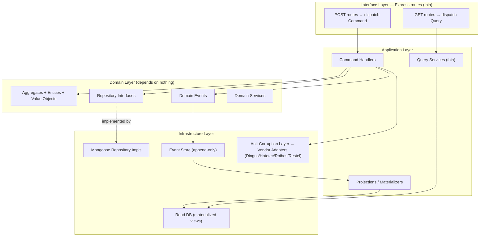
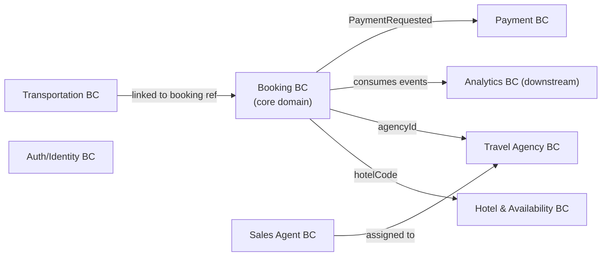
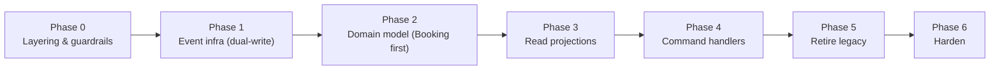

# Backend Service — DDD + CQRS Migration Plan

**Repository:** `backend-service`
**Type:** Backend Architecture Migration Plan (execution companion to ADR-001)
**Tech Stack:** Express 4.21, TypeScript 5.1, MongoDB 6.20 + Mongoose, InversifyJS (DI), Zod, BullMQ, Winston
**Status:** 📋 Proposed — phased, non-breaking migration
**Date:** 2026-06-07
**Author:** Ergos Continental Engineering
**Decision of record:** [`adr/001-cqrs-architecture-refactor.md`](./adr/001-cqrs-architecture-refactor.md)

---

## Table of Contents

1. [Context & Motivation](#1-context--motivation)
2. [Why DDD and Why CQRS](#2-why-ddd-and-why-cqrs)
3. [Target Architecture](#3-target-architecture)
4. [Bounded Contexts & Domain Model](#4-bounded-contexts--domain-model)
5. [Phase-by-Phase Migration Plan](#5-phase-by-phase-migration-plan)
   - [Phase 0 — DDD Layering & Guardrails](#phase-0--ddd-layering--guardrails-non-breaking)
   - [Phase 1 — Event Infrastructure](#phase-1--event-infrastructure-non-breaking)
   - [Phase 2 — Domain Model Extraction](#phase-2--domain-model-extraction-per-bounded-context)
   - [Phase 3 — Read-Side Projections](#phase-3--read-side-projections-query-model)
   - [Phase 4 — Command Handlers](#phase-4--command-handlers-write-model)
   - [Phase 5 — Retire Legacy Paths](#phase-5--retire-legacy-paths)
   - [Phase 6 — Harden & Future-Proof](#phase-6--harden--future-proof)
6. [Advantages Summary](#6-advantages-summary)
7. [Risks & Mitigations](#7-risks--mitigations)
8. [Sequencing with Other Initiatives](#8-sequencing-with-other-initiatives)
9. [References](#9-references)

---

## 1. Context & Motivation

The `backend-service` is a monolithic Express/TypeScript API that serves both the agency-app and backoffice-app. It is architecturally sound (the assessment in [`4-PRODUCTION_READINESS_BACKEND_SERVICE.md`](./4-PRODUCTION_READINESS_BACKEND_SERVICE.md) scores its architecture 80/100, with a well-isolated **vendor adapter pattern** for the GDS integrations) but it routes **all reads and writes through the same service layer and Mongoose models**. As captured in [ADR-001](./adr/001-cqrs-architecture-refactor.md), this produces concrete pain:

- **Read/write contention in the booking domain** — `UnifiedBookingService` mixes complex multi-phase, multi-GDS write orchestration with simple read queries; write-path complexity bleeds into reads.
- **Ad-hoc query patterns** — reads hit MongoDB directly with queries scattered across services; no read model shaped to the UI's needs.
- **Search fan-out tangled with caching** — `search-orchestrator.service.ts` fans out to 4+ GDS adapters and manages Redis caching (a read concern) next to write-side sync.
- **Cross-database query complexity** — three MongoDB databases (backoffice, sales-agent, travel-agency) force application-level joins.
- **No event history** — state changes mutate documents in place; nothing to audit, replay, or derive analytics from.
- **Analytics computed at read time** — dashboards run expensive aggregation pipelines over live booking documents.

ADR-001 **decides** to adopt CQRS. This document is the **execution plan**: it pairs CQRS with **Domain-Driven Design (DDD)** so the separation is built on an explicit domain model (bounded contexts, aggregates, domain events) rather than just split service files — and lays out a granular, **non-breaking, phase-by-phase** migration with reasons, advantages, and exit criteria for each phase.

---

## 2. Why DDD and Why CQRS

The two are complementary, not the same decision. DDD organizes the **domain**; CQRS organizes the **data flow**. Adopting them together is what makes the refactor durable.

| | What it is | What it buys us here |
|---|---|---|
| **DDD** | Model the business in explicit *bounded contexts* with *aggregates*, *value objects*, *domain events*, and a *ubiquitous language*; enforce a strict dependency rule (domain depends on nothing) | Booking rules (multi-room orchestration, cancellation penalties, vendor quirks) live in one testable place; GDS vendor APIs are quarantined behind an **anti-corruption layer**; contexts get clean seams that are far easier to extract into services later |
| **CQRS** | Separate the **write model** (commands → handlers → domain → events) from the **read model** (denormalized projections → thin queries) | Write complexity is isolated from read simplicity; reads are pre-joined and fast (no cross-DB joins); analytics derive from an **event log** instead of live aggregation; read and write scale independently |

**Advantages (combined):**
- **Separation of concerns** — multi-phase GDS booking, rollback, and retry are isolated from read queries.
- **Optimized reads** — denormalized `*_view` read models eliminate cross-database joins; agency/guest/hotel names are pre-joined at write time.
- **Event history & auditability** — an append-only event store enables replay, debugging, and compliance.
- **Analytics from events** — pre-aggregated daily stats replace expensive read-time pipelines.
- **Testability** — command handlers are pure business logic with explicit inputs/outputs; projections are deterministic event→state transformers; aggregates are unit-testable with zero infrastructure.
- **A stepping stone to services** — bounded contexts with clean command/query seams are the natural units to extract into independent services *if and when* that's justified (deliberately deferred — see [§8](#8-sequencing-with-other-initiatives)).

**Why not the alternatives** (from ADR-001): query optimization alone treats symptoms, not the root cause; full **event sourcing** is too large a leap for current team/codebase maturity (CQRS captures ~80% of the benefit at ~40% of the complexity); **microservice decomposition** is premature — the monolith with bounded contexts is the right granularity now.

---

## 3. Target Architecture

DDD layering with a strict **dependency rule** (arrows point inward; the domain layer depends on nothing), overlaid with the CQRS command/query split from [ADR-001](./adr/001-cqrs-architecture-refactor.md).



Target folder structure (extends ADR-001's layout with an explicit **domain** layer):

```
src/
├── domain/                       # pure business model — NO framework/db imports
│   ├── booking/
│   │   ├── booking.aggregate.ts          # invariants: rooms, status transitions, penalties
│   │   ├── value-objects/                 # Money, DateRange, Locator, GuestInfo
│   │   ├── booking.events.ts              # BookingCreated, Confirmed, Cancelled...
│   │   └── booking.repository.ts          # INTERFACE only
│   ├── hotel/  travel-agency/  sales-agent/  payment/  transportation/
├── application/
│   ├── commands/booking/                  # book-room.command.ts + .handler.ts
│   ├── queries/booking/                   # booking-list.query.ts (read-model only)
│   └── projections/                       # booking-list.projection.ts ...
├── infrastructure/
│   ├── persistence/                       # Mongoose repository implementations
│   ├── events/                            # event-store.ts, event-bus.ts
│   ├── read-models/                       # materialized view collections
│   └── vendors/                           # anti-corruption layer over existing adapters
└── interface/http/                        # thin Express routes → dispatch
```

The existing **`VendorAdapter` interface and its Dingus/Hotetec/Roibos/Restel implementations stay unchanged** — they are already well-isolated and become the infrastructure side of the anti-corruption layer. **InversifyJS** continues to wire dependencies, now binding repository *interfaces* (domain) to Mongoose *implementations* (infrastructure).

---

## 4. Bounded Contexts & Domain Model

Map the eight current domains to bounded contexts, each owning an aggregate root and its events.



| Bounded context | Aggregate root | Key value objects | Domain events |
|---|---|---|---|
| **Booking** *(core)* | `Booking` | `Money`, `DateRange`, `Locator`, `RoomSelection`, `GuestInfo` | `BookingCreated`, `BookingConfirmed`, `BookingCancelled`, `BookingModified`, `CancellationPenaltyCalculated` |
| **Hotel & Availability** | `Hotel` / `AvailabilityResult` | `HotelCode`, `RatePlan`, `Occupancy` | `HotelSynced`, `AvailabilitySearched`, `RatesCached` |
| **Transportation** | `Transfer` | `Route`, `TransferTime` | `TransferBooked`, `TransferCancelled`, `TransferAmended` |
| **Travel Agency** | `Agency` | `VendorAccessConfig`, `Contact` | `AgencyCreated`, `AgencyUpdated`, `VendorAccessGranted/Revoked` |
| **Sales Agent** | `SalesAgent` | `AgentMetrics` | `AgentCreated`, `AgentAssignedToAgency`, `AgentMetricsUpdated` |
| **Payment** | `Payment` | `Money`, `TransactionRef` | `PaymentProcessed`, `PaymentRefunded`, `PaymentFailed` |
| **Analytics** *(downstream)* | — (read-only projections) | — | *(consumes all events)* |
| **Auth / Identity** | `Session` | `Token`, `PasskeyCredential` | `LoggedIn`, `TokenRefreshed`, `PasskeyRegistered` |

**Booking is the core domain** — the deepest invariants and the most write complexity live there, so it is modeled first and most carefully. Auth and Analytics are intentionally light: Auth is supporting infrastructure; Analytics is a pure downstream consumer of events.

---

## 5. Phase-by-Phase Migration Plan

Every phase is **additive and non-breaking** — the running system keeps working at each step. Phases 1–5 follow ADR-001's strategy, expanded with explicit DDD steps and a dedicated **Phase 0** (layering) and **Phase 6** (harden).



### Phase 0 — DDD Layering & Guardrails *(non-breaking)*
- **Goal:** establish the four-layer structure and the dependency rule before moving logic.
- **Steps:** create `domain/`, `application/`, `infrastructure/`, `interface/` folders; add an **ESLint dependency-boundary rule** (or `dependency-cruiser`) forbidding `domain → infrastructure/express/mongoose` imports; wrap existing GDS adapters behind an **anti-corruption layer** facade; document the ubiquitous language (glossary) per context.
- **Reason / advantage:** the dependency rule is what keeps the domain pure and testable; encoding it as a CI gate prevents regression while the rest of the migration proceeds.
- **Exit criteria:** lint gate green; no behavior change; adapters reachable only via the ACL facade.

### Phase 1 — Event Infrastructure *(non-breaking)*
- **Goal:** introduce the event backbone with zero read-side change.
- **Steps:** add the `events` collection (in the backoffice DB) and `DomainEvent` type (`aggregateId + version` unique index, `eventType + timestamp` index); add an in-process `EventBus` (Node.js `EventEmitter`); existing services **emit events *after* their current writes** (dual-write); version events from day one.
- **Reason / advantage:** additive only — eases the team into the model; immediately yields an audit trail; sets up Phase 3 projections.
- **Exit criteria:** every write path emits a correctly-versioned event; events observable; no consumer depends on them yet.

### Phase 2 — Domain Model Extraction *(per bounded context)*
- **Goal:** move business rules out of services into aggregates/value objects, **starting with the Booking context**.
- **Steps:** model the `Booking` aggregate (status-transition invariants, room rules, penalty calc) and its value objects; define the `BookingRepository` interface in `domain/`, implement it with Mongoose in `infrastructure/`; route existing service methods through the aggregate (still called by the legacy service for now). Repeat per context in priority order: Booking → Transportation → Payment → Travel Agency → Sales Agent → Hotel.
- **Reason / advantage:** centralizes and unit-tests the rules that are today scattered; the repository interface inverts the dependency so the domain no longer knows about Mongoose.
- **Exit criteria:** Booking invariants enforced by the aggregate and covered by unit tests with no DB; legacy callers unchanged in behavior.

### Phase 3 — Read-Side Projections *(query model)*
- **Goal:** build denormalized read models and serve new reads from them.
- **Steps:** implement projections (`booking_list_view`, `booking_detail_view`, `agency_dashboard_view`, `analytics_daily_view`; formalize the existing Redis `hotel_search_cache`); **backfill** read models from existing data with a verifiable one-time script; add thin query services and new read endpoints; keep old read endpoints alive for gradual cutover.
- **Reason / advantage:** eliminates cross-DB joins and read-time aggregation; reads become cache-friendly; analytics shift to pre-aggregation.
- **Exit criteria:** new read endpoints serve from views; backfill verified against source; old endpoints still pass.

### Phase 4 — Command Handlers *(write model)*
- **Goal:** make writes explicit commands dispatched to handlers.
- **Steps:** extract write logic into command handlers (`BookRoomHandler`, `CancelBookingHandler`, `BookMultiRoomHandler`, `BookTransferHandler`, …); services become thin dispatchers, then routes dispatch commands directly; handlers orchestrate aggregate + repository + ACL and emit events as the **single** write (replacing dual-write within each cutover).
- **Reason / advantage:** completes the write/read split; handlers are pure, explicit, and individually testable.
- **Exit criteria:** all writes flow through handlers; per-handler dual-write removed once its projection is authoritative.

### Phase 5 — Retire Legacy Paths
- **Goal:** remove the old shapes once nothing depends on them.
- **Steps:** delete legacy query paths after all consumers use read models; remove remaining dual-write once projections are the source of truth; delete dead service code.
- **Reason / advantage:** pays down the transition debt; leaves a clean CQRS codebase.
- **Exit criteria:** no legacy read/write paths remain; consumers fully migrated.

### Phase 6 — Harden & Future-Proof
- **Goal:** make the event-driven system operable and evolvable.
- **Steps:** event-schema **versioning + upcasters**; **projection replay** tooling (rebuild a view from the event log); consistency monitoring (projection lag dashboards); consider moving the in-process `EventBus` to a durable transport (e.g. BullMQ/Redis stream) if cross-process projections are needed; document which bounded contexts are extraction-ready for a possible future service split.
- **Reason / advantage:** turns eventual consistency from a risk into a managed property; preserves the path to services without committing to it.
- **Exit criteria:** any read model rebuildable from events; lag observable and alerting; runbooks in place.

---

## 6. Advantages Summary

| Advantage | Delivered by | Realized in |
|---|---|---|
| Write complexity isolated from reads | CQRS command/query split | Phases 3–4 |
| Fast, join-free reads | Denormalized projections | Phase 3 |
| Full audit trail / replay | Append-only event store | Phases 1, 6 |
| Analytics from events, not live aggregation | `analytics_daily_view` projection | Phase 3 |
| Centralized, unit-testable business rules | DDD aggregates + value objects | Phase 2 |
| Vendor APIs quarantined | Anti-corruption layer over adapters | Phase 0 |
| Independent read/write scaling | Separate read DB + cacheable views | Phases 3, 6 |
| Future service-extraction seams | Bounded contexts | Phases 2, 6 |

---

## 7. Risks & Mitigations

| Risk | Mitigation |
|---|---|
| **Eventual consistency** confuses users ("just booked, not in list") | Optimistic UI updates; polling on the booking confirmation page (coordinate with frontend) |
| **Event schema evolution** breaks projections | Version events from Phase 1; upcasters + replay in Phase 6 |
| **Dual-write drift** during Phases 1–4 | Keep dual-write per path only until its projection is authoritative; reconciliation checks |
| **Migration data inconsistency** | Backfill with verification; run old and new paths in parallel before cutover |
| **Team unfamiliarity with DDD/CQRS** | Phase 0–1 are additive; introduce concepts incrementally; glossary + the core Booking context as the worked example |
| **Increased file/concept count** | Strict folder + dependency-rule conventions; the layering pays for itself in testability |
| **No immediate perf win** (this is an investment) | Frame and measure against maintainability and read-latency goals, not a one-off speedup |

---

## 8. Sequencing with Other Initiatives

- **Microservices are deliberately deferred.** This plan keeps a single deployable monolith with bounded contexts — the right granularity now. The contexts become clean extraction seams *if* trigger conditions later justify services (mirroring the "prepare now, split later" stance taken for the frontend in [`7-MICRO_FRONTEND_ARCHITECTURE.md`](./7-MICRO_FRONTEND_ARCHITECTURE.md)).
- **Frontend coordination.** Eventual consistency (Phase 3+) requires the agency-app to handle read-after-write lag — align with the booking-journey flow and confirmation-page polling.
- **Vendor adapters unchanged.** The GDS adapter pattern ([`6-RESERVATION_SYSTEM_MULTI_GDS_ANALYSIS.md`](./6-RESERVATION_SYSTEM_MULTI_GDS_ANALYSIS.md)) is preserved and simply wrapped by the anti-corruption layer.
- **Infra.** No new infra is required for Phases 0–5 (same ACK deployment); Phase 6's durable event transport may add a Redis stream / BullMQ usage already present in the stack.

---

## 9. References

- [`adr/001-cqrs-architecture-refactor.md`](./adr/001-cqrs-architecture-refactor.md) — the CQRS **decision** this plan executes.
- [`4-PRODUCTION_READINESS_BACKEND_SERVICE.md`](./4-PRODUCTION_READINESS_BACKEND_SERVICE.md) — backend code-quality baseline (architecture 80/100; DI, repository pattern, error handling).
- [`6-RESERVATION_SYSTEM_MULTI_GDS_ANALYSIS.md`](./6-RESERVATION_SYSTEM_MULTI_GDS_ANALYSIS.md) — current booking flow and the `VendorAdapter` contract.
- [`7-MICRO_FRONTEND_ARCHITECTURE.md`](./7-MICRO_FRONTEND_ARCHITECTURE.md) — frontend counterpart ("prepare now, split later").
- [`2.2-ARCHITECTURE_MULTI_TENANT_AGENCIES.md`](./2.2-ARCHITECTURE_MULTI_TENANT_AGENCIES.md) — multi-tenant data model the read models must respect.
- Martin Fowler — [CQRS](https://martinfowler.com/bliki/CQRS.html) · [Bounded Context](https://martinfowler.com/bliki/BoundedContext.html)
- Eric Evans — *Domain-Driven Design* · Greg Young — [CQRS Documents](https://cqrs.files.wordpress.com/2010/11/cqrs_documents.pdf)
