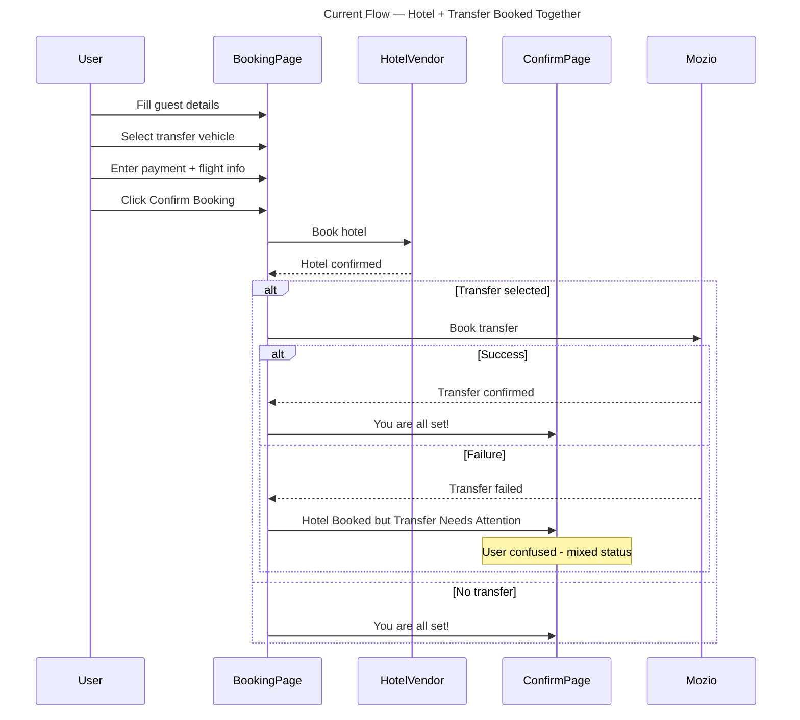
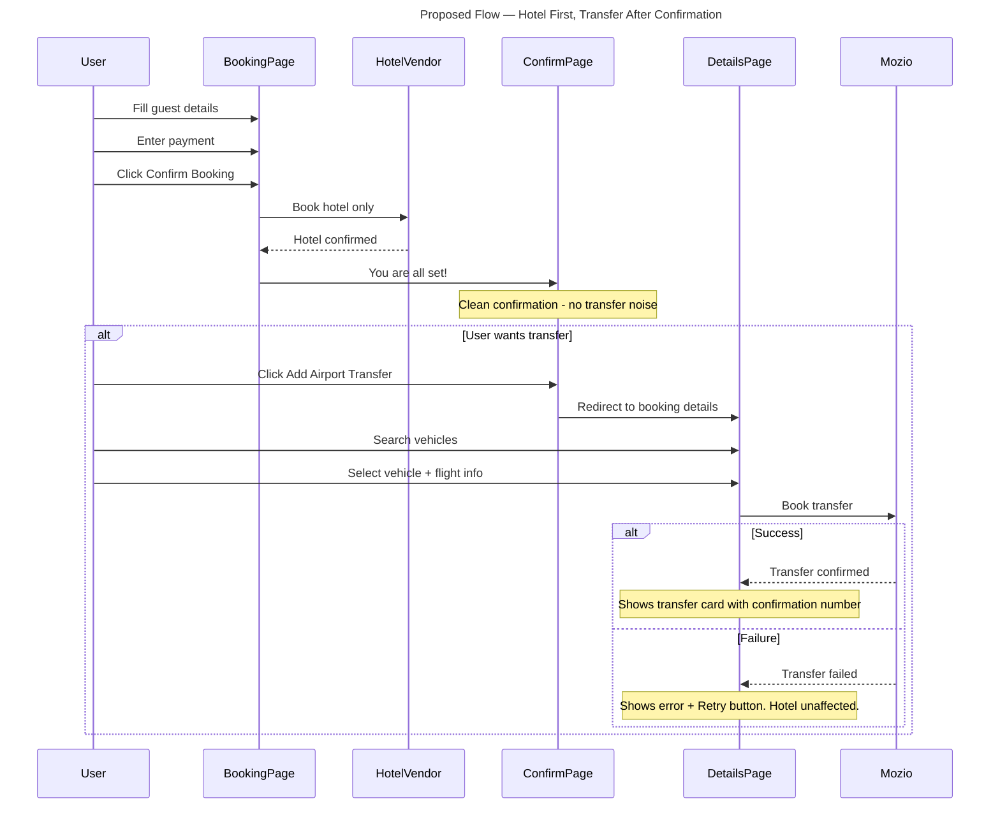

# Transfer Booking Flow — Current vs Proposed

## Current Flow

## Proposed Flow

## Key Differences

| Aspect | Current | Proposed |
|---|---|---|
| Hotel + Transfer | Booked together | Hotel first, transfer after |
| Partial failure | Confusing mixed status | Clean separation |
| Flight info | Required before hotel booking | Only when adding transfer |
| Confirmation page | 3 possible states | Always clean |
| Transfer management | Built but underused | Primary flow |
| Complexity | High (2 vendors in 1 flow) | Low (1 vendor per step) |
