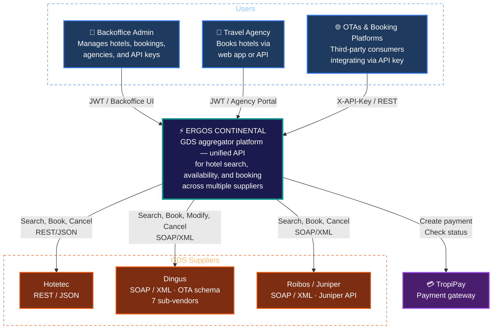
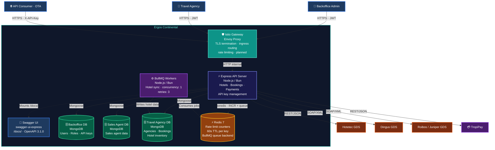
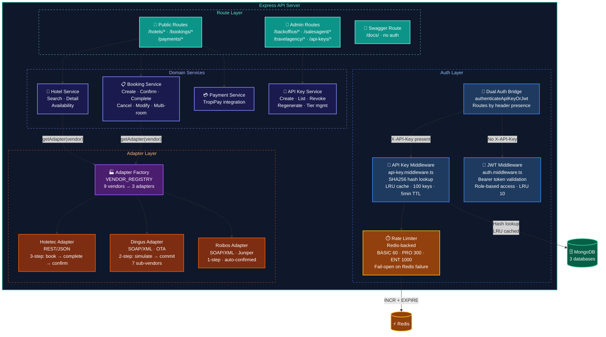
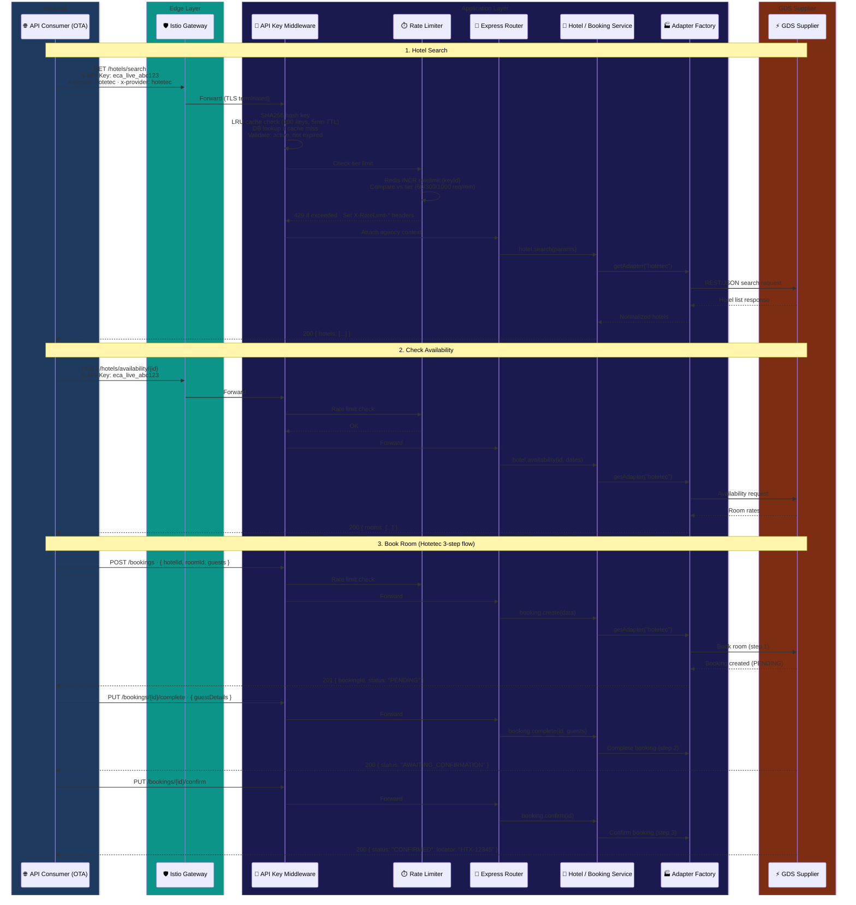
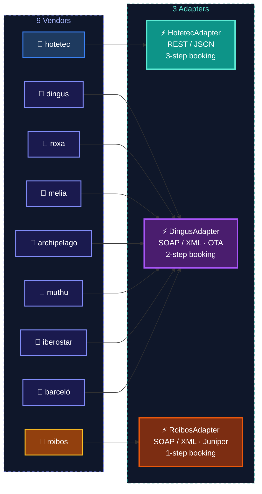

# Ergos Continental — API Architecture & Integration Infrastructure

## Table of Contents

- [C4 Architecture Diagrams](#c4-architecture-diagrams)
  - [Level 1 — System Context](#level-1--system-context)
  - [Level 2 — Container](#level-2--container)
  - [Level 3 — Component (API Server)](#level-3--component-api-server)
  - [Level 4 — Integration Sequence](#level-4--integration-sequence)
- [API Management Infrastructure](#api-management-infrastructure)
  - [Current State](#current-state)
  - [API Gateway Options](#api-gateway-options)
  - [Primary: Istio Gateway](#primary-istio-gateway)
  - [Alternative: Alibaba Cloud API Gateway](#alternative-alibaba-cloud-api-gateway)
  - [Alternative: GCP Apigee](#alternative-gcp-apigee)
  - [Alternative: AWS API Gateway](#alternative-aws-api-gateway)
  - [What Stays in Express Regardless of Gateway Choice](#what-stays-in-express-regardless-of-gateway-choice)
- [Developer Portal](#developer-portal)
- [API Key Lifecycle](#api-key-lifecycle)
- [Monitoring & Observability](#monitoring--observability)
- [Security Hardening](#security-hardening)

---

## C4 Architecture Diagrams

### Level 1 — System Context

Who interacts with Ergos Continental, and how.



### Level 2 — Container

What runs inside Ergos Continental.



### Level 3 — Component (API Server)

Internal structure of the Express API server.



### Level 4 — Integration Sequence

Full API call flow: third-party consumer searches for hotels and books a room.



#### Vendor-to-Adapter Mapping



---

## API Management Infrastructure

### Current State

What is deployed and running today.

| Component | Implementation | Details |
|-----------|---------------|---------|
| API key format | `eca_live_` prefix + 32 random hex bytes | Single prefix today — environment scoping pending provider environment config |
| Key storage | SHA256 hash in MongoDB | `crypto.createHash("sha256").update(rawKey).digest("hex")` |
| Key tiers | BASIC, PROFESSIONAL, ENTERPRISE | Default: BASIC |
| Rate limiting | Redis counters | Fixed 60s window per API key ID, fail-open on Redis failure |
| Rate limit headers | `X-RateLimit-Limit`, `X-RateLimit-Remaining`, `X-RateLimit-Reset` | Sent on every authenticated response |
| LRU cache | 100 keys, 5min TTL | In-memory API key lookup cache in `api-key.middleware.ts` |
| Vendor access | Whitelist model | Per-agency allowed vendor list, LRU cache (10 entries) in `auth.middleware.ts` |
| API docs | Swagger UI + OpenAPI 3.1.0 | `/docs/` (interactive), `/docs/spec.json` (raw spec for SDK generation) |
| General cache | node-cache (in-process) | `stdTTL: 300` (5min), `checkperiod: 60` — NOT Redis-backed |

#### Rate Limit Tiers

| Tier | Requests / Minute | Use Case |
|------|-------------------|----------|
| **BASIC** | 60 | Default tier, small agencies |
| **PROFESSIONAL** | 300 | Medium-volume consumers |
| **ENTERPRISE** | 1,000 | High-volume OTAs and platforms |

---

### API Gateway Options

Comparison of gateway solutions for Ergos Continental's infrastructure.

| | **Istio Gateway** (Recommended) | **Alibaba Cloud API Gateway** | **GCP Apigee** | **AWS API Gateway** |
|---|---|---|---|---|
| **Fits current infra** | Already on Alibaba K8s | Native to Alibaba Cloud | Requires GCP | Requires AWS (have ECR only) |
| **Rate limiting** | Envoy filters + Rate Limit Service | Built-in per-app/API | Built-in per-product | Built-in per-key |
| **Developer portal** | DIY (current Swagger UI) | Built-in API marketplace | Built-in managed portal | None (separate build) |
| **API key management** | Custom (current Express code) | Built-in app/key model | Built-in key/app/product | Built-in usage plans |
| **Analytics** | Prometheus + Grafana (deployed) | Built-in dashboard | Built-in analytics | CloudWatch |
| **Cost** | Free (already running) | ~$0.30 / million requests | ~$500+ / month | ~$3.50 / million requests |
| **Vendor lock-in** | None | Medium (Alibaba) | High (GCP) | High (AWS) |
| **Multi-cloud** | Yes | No | No | No |

---

### Primary: Istio Gateway

Recommended path — moves edge concerns (TLS, routing, rate limiting) to the service mesh layer already deployed on Alibaba K8s.

**Gateway resource** — TLS termination, host-based routing:
- `api.lukzen-op.com` → API server
- `test-api.lukzen-op.com` → Sandbox API server

**VirtualService** — Path routing, traffic splitting, retries, timeouts:
- Retry policy: 2 retries on 5xx from GDS adapters
- Timeout: 30s for GDS-proxied endpoints

**EnvoyFilter / Rate Limit Service** — Replaces Redis rate limiting in `api-key.middleware.ts`:
- Per-API-key rate limiting at the mesh edge
- Tier-aware limits: BASIC 60/min, PROFESSIONAL 300/min, ENTERPRISE 1000/min
- Redis rate limit counters in Express middleware removed
- API key tier resolved via descriptor headers set by Express

**AuthorizationPolicy** — Access control:
- IP whitelisting per consumer
- Deny-by-default for internal admin endpoints (`/backoffice/*`, `/salesagent/*`)

**DestinationRule** — Circuit breaking for upstream GDS calls:
- Max connections, pending requests, retries per GDS adapter
- Outlier detection: consecutive 5xx errors trigger ejection

**PeerAuthentication** — mTLS between services:
- Strict mode for all services in the mesh
- Optional mTLS for high-value partner connections

---

### Alternative: Alibaba Cloud API Gateway

Native to the current infrastructure. Best fit if:

- API marketplace for consumer onboarding is a priority
- Built-in API key management reduces custom code
- Low cost (~$0.30/million requests) is acceptable

Trade-off: medium vendor lock-in to Alibaba Cloud.

---

### Alternative: GCP Apigee

Best fit if:

- Managed developer portal + API product management justifies the ~$500+/mo cost
- Full API lifecycle management (versioning, deprecation, monetization) is needed
- Moving to GCP is on the roadmap

Trade-off: high vendor lock-in, requires GCP infrastructure.

---

### Alternative: AWS API Gateway

Best fit if:

- Migrating to AWS (currently only use ECR for container images)
- Need managed usage plans without GCP dependency
- WebSocket support needed for real-time features

Trade-off: high vendor lock-in, no built-in developer portal.

---

### What Stays in Express Regardless of Gateway Choice

These concerns remain in the application layer no matter which gateway is deployed:

| Concern | Why it stays | File |
|---------|-------------|------|
| API key validation | SHA256 hash lookup, tier resolution, active/expired checks, agency context | `api-key.middleware.ts` |
| API key LRU cache | 100-key in-memory cache for DB lookup performance | `api-key.middleware.ts` |
| Vendor access control | Per-agency whitelist logic, business rules | `auth.middleware.ts` |
| JWT authentication | Internal admin auth, role-based access | `auth.middleware.ts` |
| BullMQ job queues | Hotel sync workers (Redis as queue backend, not API management) | `sync-queue.service.ts` |
| node-cache | In-process general caching (stdTTL: 300s) | `cache.service.ts` |

---

## Developer Portal

### Current

- Swagger UI at `/docs/` — interactive API explorer
- OpenAPI 3.1.0 spec at `/docs/spec.json` — for SDK generation, Postman import
- 25 documented endpoints across 6 tags

### Planned

- **Self-service onboarding**: Consumer signs up → receives API key → explores docs
- **SDK downloads**: Auto-generated via OpenAPI codegen (TypeScript, Python, Java, PHP)
- **Usage dashboards**: Per-consumer request volume, error rates, latency
- **Sandbox environment**: `test-api.lukzen-op.com` with test data (no real GDS charges)
- **Rate limit visibility**: Consumers see their current tier, usage, and remaining quota

---

## API Key Lifecycle

### Current Implementation

```
eca_live_<64-char hex>   →   All keys use this single prefix today
```

- Format: `eca_live_` + `crypto.randomBytes(32).toString("hex")` (defined in `api-key.repository.ts`)
- Keys are SHA256-hashed before storage — raw key shown only at creation
- `keyPrefix` (first 16 chars) stored alongside hash for identification in UI
- 3 tiers: BASIC (default), PROFESSIONAL, ENTERPRISE
- Keys can be revoked and regenerated via admin API (`/api-keys/*`)

> **Note:** Environment-scoped keys (`eca_test_*` vs `eca_live_*`) are not yet implemented.
> The test vs production boundary varies by GDS provider — Hotetec, Dingus, and Roibos
> each handle test/prod environments differently (separate endpoints, separate credentials,
> or flag-based). Environment scoping for API keys will be designed once provider
> environment configuration is finalized.

### Planned Enhancements

| Feature | Description |
|---------|-------------|
| **Environment-scoped keys** | `eca_test_*` vs `eca_live_*` prefix — blocked on provider environment config alignment |
| **Key rotation** | Grace period where old and new keys both work during rotation window |
| **Webhook notifications** | Notify consumers on key events (approaching expiry, rate limit warnings) |
| **Read-only scoping** | `hotel-read` scope vs `full-booking` scope per key |
| **IP binding** | Optional IP allowlist per API key |
| **Expiry policies** | Auto-expire keys after configurable period, renewal flow |

---

## Monitoring & Observability

### Current

| Tool | Purpose | Status |
|------|---------|--------|
| Redis rate limit counters | Per-key request tracking | Deployed |
| `X-RateLimit-*` headers | Consumer-visible rate info | Deployed |
| Express request logging | Request/response logging | Deployed |

### Planned (with Istio)

| Tool | Purpose |
|------|---------|
| **Istio telemetry** | Per-consumer metrics, per-GDS health, request volume |
| **Jaeger** | Distributed tracing: Consumer → API → Adapter → GDS |
| **Grafana + Kiali** | Dashboards for API health, service mesh topology |
| **Prometheus** | Metrics collection, alerting rules |
| **Alerting** | Rate limit breaches, GDS failures (consecutive 5xx), error rate spikes |

### Key Metrics to Track

- **Per consumer**: Request volume, error rate, latency P50/P95/P99, rate limit hits
- **Per GDS supplier**: Availability, response time, error rate, timeout frequency
- **Per endpoint**: Request volume, error distribution, payload sizes
- **System**: Redis memory, MongoDB connections, BullMQ queue depth

---

## Security Hardening

### Current

| Measure | Status |
|---------|--------|
| SHA256 key hashing | Deployed |
| JWT + API Key dual auth | Deployed |
| Vendor access whitelist | Deployed |
| Rate limiting (per-key, tier-aware) | Deployed |
| Fail-open on Redis down | Deployed (trade-off: availability over strict limiting) |

### Planned

| Measure | Description |
|---------|-------------|
| **CORS origin whitelisting** | Restrict API access to registered origins |
| **mTLS for partners** | Mutual TLS for high-value/enterprise consumers |
| **Request signing** | HMAC signing for webhook payloads |
| **API key scoping** | Granular permissions: `hotel-read`, `booking-write`, `full-access` |
| **IP allowlisting** | Per-API-key IP restrictions |
| **Istio AuthorizationPolicy** | Deny-by-default for internal endpoints at mesh level |
| **Audit logging** | Track all API key operations, admin actions |
